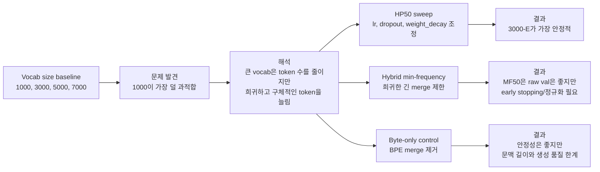
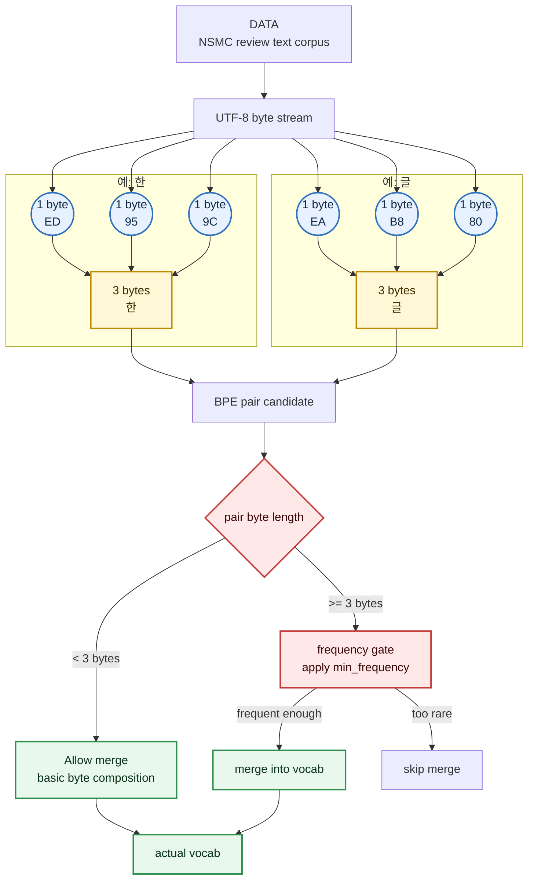

# Experiment Reasoning Summary

작성일: 2026-06-04 KST

이 문서는 지금까지의 vocab 실험을 "왜 이런 실험을 했는가" 중심으로 정리한 기록이다. 숫자 비교표 중심의 결과 문서는 `local/COMPLETED_EXPERIMENT_COMPARISON.md`에 따로 둔다.

## 전체 문제의식

처음 질문은 단순했다.

```text
vocab size가 50 epoch 학습에서 어떤 영향을 주는가?
```

vocab은 한 번 만들어 저장해두면 여러 학습에서 재사용할 수 있다. 그래서 어떤 vocab 크기가 안정적이고 가용성이 높은지 먼저 확인할 가치가 있었다.



## Chapter 1. Vocab Size Baseline

### 목적

vocab 단위별 차이가 궁금했다.

처음에는 vocab을 크게 만들면 더 긴 단어 조각을 담을 수 있고, 저장 후 재활용하기도 좋아서 유리할 것이라고 예상했다. 그래서 모델 구조와 학습 설정은 고정하고 vocab 크기만 바꿨다.

비교한 vocab:

- `1000`
- `3000`
- `5000`
- `7000`

### 발견한 문제

예상과 달리 baseline 50 epoch에서는 `vocab_1000`이 가장 덜 과적합됐다.

`3000`, `5000`, `7000`은 epoch 8 근처에서 validation loss가 가장 낮았고, 이후 train loss는 계속 내려가는데 validation loss는 다시 올라갔다.

### 해석

큰 vocab은 문장을 더 적은 token으로 압축한다. 이 점은 속도 면에서는 유리하다.

하지만 큰 vocab에서는 더 구체적이고 희귀한 token이 늘어난다. 작은 vocab에서는 여러 문장이 byte 또는 subword 조각을 공유하면서 학습되지만, 큰 vocab에서는 이런 공유가 줄어든다.

현재 데이터 규모와 baseline 설정에서는 큰 vocab이 일반화된 subword 구조를 배우기보다 train set에서 본 token 조합을 더 빨리 외우는 방향으로 갔다.

따라서 1챕터의 결론은 다음과 같다.

```text
baseline 설정은 vocab 1000에 유리했다.
큰 vocab을 공정하게 평가하려면 learning rate와 정규화를 다시 맞춰야 한다.
또한 vocab이 다르면 token-level perplexity를 그대로 비교하면 안 된다.
```

## Chapter 2. HP50 Regularization Sweep

### 목적

`1000`은 안정적이었지만 표현 단위가 너무 작을 수 있다고 봤다. 한글은 byte 단위가 쪼개지기 쉬우므로, `1000` vocab만으로는 단어 간 결합이 충분하지 않을 가능성이 있었다.

그래서 `3000`, `5000`, `7000` vocab을 유지한 채, 하이퍼파라미터를 바꿔 50 epoch 끝까지 버티는 조합을 찾았다.

### 가설

큰 vocab 자체가 무조건 나쁜 것은 아니다.

다만 baseline의 `lr=0.0005`, `drop_rate=0.1`, `weight_decay=0.01`이 큰 vocab에는 너무 빠르고 약한 정규화였을 수 있다.

### 테스트 그룹

- `B`: learning rate만 낮춰서 학습 속도를 늦춘다.
- `C`: learning rate를 낮추고 dropout을 올려 과적합을 줄인다.
- `D`: dropout과 weight decay를 함께 강화한다.
- `E`: learning rate를 더 낮추고 dropout/weight decay를 강하게 걸어 50 epoch 안정성을 우선한다.

용어:

- `lr`: 한 번 업데이트할 때 파라미터를 얼마나 크게 움직일지 정하는 학습 보폭
- `dropout`: 일부 뉴런 출력을 랜덤하게 꺼서 특정 패턴에 과하게 의존하지 않게 만드는 정규화
- `weight_decay`: 가중치가 너무 커지지 않도록 패널티를 주는 정규화

### 결과

`3000`, `5000`, `7000` 모두에서 group E가 가장 안정적이었다.

특히 `3000-E`는 raw validation loss, overfit gap, final-best drift가 모두 좋았다. `5000-E`는 byte-normalized 점수와 속도는 좋았지만, 안정성 기준에서는 `3000-E`보다 살짝 불리했다.

### 결론

50 epoch 고정 조건에서는 `3000-E`가 가장 안정적인 후보로 보인다.

큰 vocab을 쓰려면 더 낮은 learning rate와 강한 정규화가 필요하다.

## Chapter 3. Hybrid Min-Frequency Merge Rule

### 목적

큰 vocab에서 과적합이 빨리 온 이유가 희귀하고 긴 BPE merge 때문일 수 있다고 봤다.

그래서 vocab 목표 크기를 억지로 끝까지 채우기보다, 한글 문자 구성에 필요한 기본 byte 결합은 살리고, 드물게 등장하는 긴 표현은 vocab에 덜 들어가게 하는 방향을 테스트했다.

### 아이디어

한글은 UTF-8에서 보통 한 글자가 3바이트로 표현된다.

예를 들어 `한`은 UTF-8 byte 3개로 표현된다.

```text
한 ~= ED 95 9C
```

그래서 1-2바이트 pair는 한글 한 글자를 구성하기 위한 중간 조각일 가능성이 높다. 이런 조각까지 강하게 제한하면, 한글 글자 자체를 구성하는 기본 결합이 충분히 만들어지지 않을 수 있다.

반대로 3바이트 이상 pair는 한 글자 또는 여러 글자 단위의 조각일 가능성이 커진다. 이 단계부터는 빈도가 낮은 merge를 제한하는 것이 과적합 완화에 도움이 될 수 있다.



### 적용한 규칙

```text
pair_byte_len < 3  -> min_frequency 제한 없이 병합 후보로 허용
pair_byte_len >= 3 -> min_frequency 적용
```

`MF10`, `MF30`, `MF50`을 테스트했다.

### 결과

`MF50`은 actual vocab 2328에서 멈췄다.

이 방식은 `1000`보다 표현 단위를 조금 키우면서도, `3000/5000/7000`처럼 희귀 token이 과하게 늘어나는 상황은 줄이는 중간 지점으로 볼 수 있다.

학습 결과 `MF50`은 raw validation loss가 꽤 좋았고, 큰 vocab baseline보다 훨씬 덜 무너졌다.

하지만 best epoch가 9라서 50 epoch 끝까지 안정적으로 버틴다기보다는, 초반에 좋은 성능을 찍고 이후 조금씩 과적합되는 패턴이었다.

### 결론

병합 조건을 조절하는 방향은 유효해 보인다.

다만 `MF50`은 그대로 최종 후보라기보다, 더 낮은 learning rate나 group E식 강한 정규화를 붙여 다시 테스트할 후보로 보는 것이 좋다.

## Chapter 4. Byte-Only Vocab

### 목적

희귀 token 과적합의 원인이 BPE merge 자체일 수 있다고 봤다.

그래서 BPE merge를 완전히 제거한 byte-only vocab을 기준점으로 테스트했다.

### 설정

- 특수 토큰 + 256개 raw byte 사용
- actual vocab: 260
- BPE merge count: 0
- 50 epoch와 300 epoch를 비교

### 결과

byte-only는 50 epoch와 300 epoch 모두에서 overfit gap이 작았다. 장기 학습 안정성은 좋아 보였다.

하지만 token 수가 너무 많아 학습 시간이 길어졌다. 또한 `context_length=64`가 byte 단위에서는 실제 문맥 기준으로 매우 짧아진다.

생성 품질도 다른 조건보다 빈약했다.

### 결론

byte-only는 최종 후보라기보다는 기준 실험이다.

BPE merge를 줄이는 방향이 과적합 완화에 도움이 될 수 있다는 신호는 줬지만, 표현력과 문맥 길이 문제가 커서 그대로 쓰기에는 어렵다.

## 최종 요약

전체 실험은 다음 흐름으로 정리할 수 있다.

```text
vocab을 크게 만들면 재사용성과 표현 단위는 좋아질 수 있다.
하지만 현재 데이터 규모와 baseline 설정에서는 큰 vocab이 희귀하고 구체적인 token을 늘려 과적합이 빨라졌다.
그래서 강한 정규화와 병합 조건 제한을 통해 안정적인 중간 vocab을 찾는 방향으로 실험이 발전했다.
```

현재 안정성 기준의 1순위는 `vocab_3000/group_E`다.

다음으로 볼 만한 후보는 `hybrid MF50 + 강한 정규화`다.
