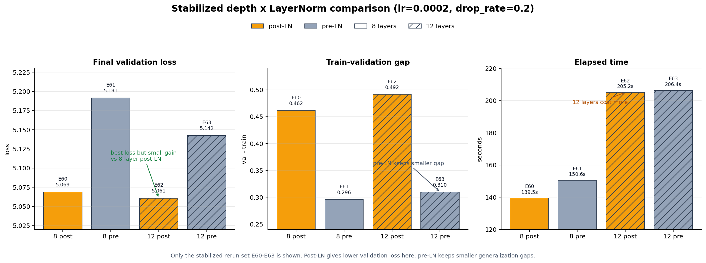
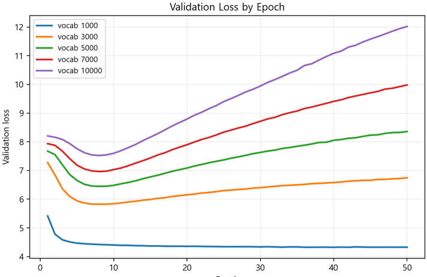
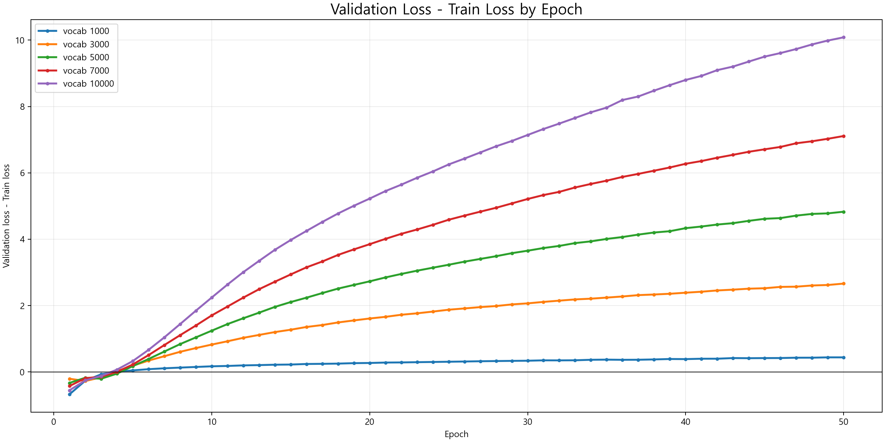
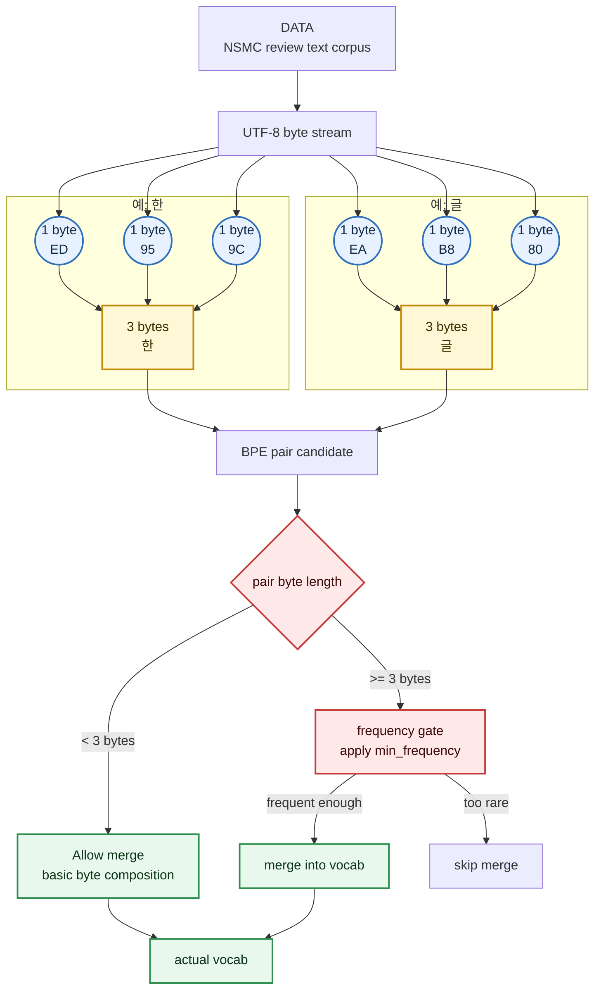
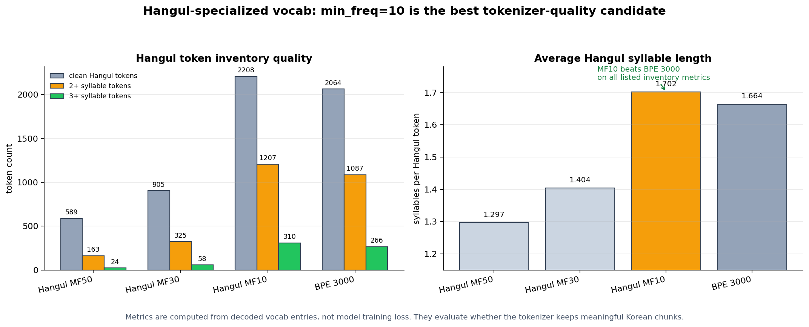

# mini GPT 구현 및 LLM 하이퍼파라미터 실험 보고서

## 0. 팀 정보

| 항목 | 내용              |
| -- | --------------- |
| 과정 | AI 과정           |
| 팀명 | Week13/14 Team6 |
| 팀원 | 최우녕, 이창원, 이혜연   |

## 1. 보고서 목적

이 보고서는 직접 구현한 mini GPT 모델에서 LLM 구조와 관련된 하이퍼파라미터가 validation loss, perplexity, 학습 효율, 과적합에 어떤 영향을 주는지 확인하기 위한 실험 보고서다.

MNIST 수준의 기본 신경망 실험에서 이미 다뤘던 단순한 `batch_size`, `lr` 중심 실험이 아니라, Transformer 기반 LLM에서 특히 의미가 큰 `context_length`, `vocab_size`, `emb_dim`, `n_heads`, `n_layers`, `ffn_multiplier`, `drop_rate`, `activation`, `norm_first`, `qkv_bias`, `weight_tying`, `stride`를 중심으로 분석했다.

실험 결과 md 파일은 다음 경로에 저장되어 있다.

```text
docs/HY/testresult/*.md
```

그래프는 다음 경로에 저장되어 있다.

```text
docs/HY/figures/*.png
```

## 2. 구현 및 테스트 현황

| 단계 | 구현 내용                                                              | 구현 파일                                                                                                      |
| -- | ------------------------------------------------------------------ | ---------------------------------------------------------------------------------------------------------- |
| 1  | UTF-8 byte-level BPE tokenizer                                     | `src/bpe.py`                                                                                               |
| 2  | GPTDataset, DataLoader, token/position embedding                   | `src/dataset.py`, `src/embeddings.py`                                                                      |
| 3  | MultiHeadAttention, causal mask                                    | `src/attention.py`                                                                                         |
| 4  | LayerNorm, GELU/ReLU/SiLU, FeedForward, TransformerBlock, GPTModel | `src/model.py`                                                                                             |
| 5  | loss 계산, generation, checkpoint, training utility                  | `src/train.py`                                                                                             |
| 6  | NSMC 감성 분류 Dataset과 classifier                                     | `src/finetune.py`                                                                                          |
| 7  | 실험 실행 및 Markdown 결과 저장 루프                                          | `scripts/run_lm_experiment.py`, `scripts/run_all_lm_experiments.py`, `scripts/run_followup_experiments.py` |
| 8  | 보고서 그래프 생성                                                         | `scripts/generate_report_figures.py`                                                                       |

테스트 결과:

```text
python -m pytest tests/ -q
28 passed
```

## 3. 실험 기준

### 3.1 데이터

| 항목                    | 내용                                               |
| --------------------- | ------------------------------------------------ |
| 원본 데이터                | NSMC                                             |
| 사전 학습 데이터             | `data/nsmc_lm_train.txt`, `data/nsmc_lm_val.txt` |
| tokenizer             | 직접 구현한 UTF-8 byte-level BPE                      |
| baseline vocab_size   | 3000                                             |
| baseline train_tokens | 805,021                                          |
| baseline val_tokens   | 70,386                                           |
| seed                  | 123                                              |
| GPU                   | NVIDIA GeForce RTX 5070 Ti                       |

### 3.2 baseline 모델

| 항목               | 5 epoch baseline E00 | 10 epoch baseline E28 |
| ---------------- | -------------------- | --------------------- |
| vocab_size       | 3000                 | 3000                  |
| context_length   | 128                  | 128                   |
| emb_dim          | 192                  | 192                   |
| n_heads          | 4                    | 4                     |
| n_layers         | 4                    | 4                     |
| ffn_multiplier   | 4                    | 4                     |
| activation       | GELU                 | GELU                  |
| drop_rate        | 0.1                  | 0.1                   |
| qkv_bias         | False                | False                 |
| weight_tying     | False                | False                 |
| norm_first       | False, post-LN       | False, post-LN        |
| parameter_count  | 2,954,112            | 2,954,112             |
| num_epochs       | 5                    | 10                    |
| batch_size       | 32                   | 32                    |
| lr               | 0.0004               | 0.0004                |
| weight_decay     | 0.1                  | 0.1                   |
| final_train_loss | 5.081426             | 4.619696              |
| final_val_loss   | 5.301974             | 5.102722              |
| final_perplexity | 200.732742           | 164.469061            |

5 epoch 실험은 `E00`을 기준으로 비교하고, activation, norm, n_heads 재실험, FFN 재실험, qkv_bias 재실험, weight_tying 재실험처럼 10 epoch 이상으로 다시 돌린 실험은 `E28`을 기준으로 비교한다.

baseline 생성 샘플은 수치만으로 보이지 않는 학습 수준을 보여준다. 두 기준 모델 모두 완전한 문장 생성까지는 아니지만, NSMC 리뷰에서 자주 나오는 긍정/부정 표현과 짧은 감상문 패턴은 어느 정도 따라 하기 시작했다. 동시에 문장 연결, 의미 일관성, 긴 문맥 유지에는 아직 한계가 분명하다.

5 epoch baseline `E00`, prompt: `이 영화는`

```text
이 영화는 아닌가 아니였다고 할수가 없었음. 정말 재밌게 봤는데 완전히 재미잠까?
정말 잼있게봤으면좋은 영화였다.
내놔
가 좋아요 ....
추억지금봐도 재밋어~♥
카드로서는 좋았으나, 이러지,.ㅡ,이코메디.,아가,2편한 이야기,2,2편까지,2의 OST도는,2편의 반복을 더 좋았다. 다 보고있다.
굿굿굿
다 진짜 재미없고 재미도 없고 감동받아서 낮
```

10 epoch baseline `E28`, prompt: `이 영화는`

```text
이 영화는 아닌가
내 인생 최악의 영화
별 10개도 아깝다. 진짜 뭐랄까?? 왜? 이런거냐?
정말 재미있게 봤어요
전투씬만 잔뜨거면 안되는 영화네요..
지루함의 감동을 담겨주는 영화입니다. 정말 좋았음
죽기서진이 다르고 재미는 없었다. 하지만 뭔가 감동과감은 있다.
너무 좋아하지만, 금바어지는, 한편의 연예산으로는 그녀. 영화보다 더 많은생각들.
난 재밌었어요!
미스터보고있는데
내가 볼때 극장에서 봤는데 너무 지루해요
```

## 4. 하이퍼파라미터별 분석

### 4.1 context_length: 모델이 볼 수 있는 문맥 길이

`context_length`는 한 번에 모델이 볼 수 있는 token 수다. 길게 잡으면 더 긴 문맥을 사용할 수 있지만, 짧은 리뷰 데이터에서는 불필요한 위치 패턴까지 학습해야 할 수 있다.


위 그래프에서 baseline은 `context_length=128` 위치에 있고, best는 `64`다. 즉 baseline이 왼쪽에 있어서 좋아 보였던 것이 아니라, 실제 설정값 순서대로 봐도 `64 < 128 < 192 < 256` 순서에서 가장 짧은 문맥이 가장 낮은 validation loss를 냈다.

| 실험  | context_length | final_val_loss | final_perplexity |
| --- | -------------- | -------------- | ---------------- |
| E01 | 64             | 5.146068       | 171.754751       |
| E00 | 128 baseline   | 5.301974       | 200.732742       |
| E02 | 192            | 5.388636       | 218.904658       |
| E03 | 256            | 5.447002       | 232.061290       |

해석: NSMC 리뷰는 짧은 문장이 많기 때문에, 이번 데이터에서는 긴 문맥보다 짧고 밀도 있는 문맥이 더 유리했다. 과적합 신호보다는 데이터 길이와 context 길이의 불일치가 성능 차이를 만든 것으로 보인다.

### 4.2 vocab_size: token loss와 bits/char는 다른 결론을 낸다

`vocab_size`는 BPE vocabulary 크기다. 작으면 문장을 더 잘게 쪼개고, 크면 더 긴 token을 만들 수 있다. 이때 `final_val_loss`는 token 하나를 맞히는 cross entropy라서, vocab 크기가 달라지면 예측 단위와 class 수가 동시에 바뀐다. 따라서 vocab 실험은 token 단위 loss만으로 결론을 내리면 안 되고, 문자 기준으로 정규화한 `bits/char`를 같이 봐야 한다.


위 그래프에서 파란 선인 `token-level val loss`는 `vocab_size=2000`에서 가장 낮다. 하지만 주황 선인 `val bits/char`는 `vocab_size=5000`에서 가장 낮다. 즉 `vocab=2000`은 token 하나를 맞히기는 쉬웠지만, 문장을 더 많은 token으로 쪼개기 때문에 문자 하나를 설명하는 비용은 더 컸다.

| 실험  | vocab_size    | parameter_count | val_tokens | val_tokens/char | chars/token | final_val_loss | val_bits/char |
| --- | ------------- | --------------- | ---------- | --------------- | ----------- | -------------- | ------------- |
| E04 | 2000          | 2,570,112       | 78,686     | 0.652671        | 1.532166    | 4.811352       | 4.530393      |
| E00 | 3000 baseline | 2,954,112       | 70,386     | 0.583825        | 1.712841    | 5.301974       | 4.465758      |
| E05 | 4000          | 3,338,112       | 65,634     | 0.544409        | 1.836853    | 5.638393       | 4.428488      |
| E06 | 5000          | 3,722,112       | 62,493     | 0.518356        | 1.929176    | 5.882533       | 4.399133      |

해석: token loss 기준으로는 `vocab_size=2000`이 가장 좋지만, tokenizer가 달라진 실험에서는 이 비교가 공정하지 않다. `val_bits/char` 기준으로는 `vocab_size=5000`이 가장 낮아 문자 단위 언어모델 품질은 더 좋게 나온다. 다만 `vocab_size=5000`은 baseline보다 파라미터 수가 약 26.0% 많고 token 처리량도 낮아질 수 있으므로, 최종 선택은 `bits/char` 개선과 계산 비용을 함께 본 trade-off로 해석해야 한다.

### 4.3 emb_dim: 토큰 표현 벡터의 폭

`emb_dim`은 각 token을 표현하는 hidden vector 차원이다. 값을 키우면 표현 공간이 넓어지지만 파라미터 수도 크게 증가한다.


위 그래프에서 baseline은 `emb_dim=192`이고 best는 `256`이다. `128`로 줄이면 손실이 커지고, `256`으로 키우면 소폭 개선된다.

| 실험  | emb_dim      | parameter_count | final_val_loss | final_perplexity |
| --- | ------------ | --------------- | -------------- | ---------------- |
| E07 | 128          | 1,576,192       | 5.392111       | 219.666568       |
| E00 | 192 baseline | 2,954,112       | 5.301974       | 200.732742       |
| E08 | 256          | 4,725,248       | 5.229174       | 186.638487       |

해석: 이번 모델에서는 폭을 줄이면 표현력이 부족해지고, 폭을 키우면 성능이 좋아졌다. 다만 파라미터 수 증가에 비해 loss 개선 폭은 제한적이며, 5 epoch 탐색에서는 과적합보다 표현력 차이가 더 두드러진다.

### 4.4 n_heads: attention을 나누어 보는 관점 수

초기 `n_heads=3,4,6` 5 epoch 실험은 차이가 너무 작아 head 수의 의미를 보기 어려웠다. 그래서 10 epoch baseline `E28`을 기준으로 `n_heads=1,2,4,8,12`를 다시 돌렸다. `emb_dim=192`는 고정했으므로 head 수가 늘수록 head당 차원은 작아진다.


위 그래프에서 baseline은 `n_heads=4`, best는 `n_heads=2`다. 설정값 오름차순으로 보면 `1 -> 2`에서는 좋아지지만, `4 -> 8 -> 12`로 늘릴수록 손실이 다시 커진다.


위 곡선에서도 `n_heads=2`가 마지막까지 가장 낮고, `8`, `12`는 학습 후반에도 baseline보다 낮아지지 않는다. 단순히 head 수를 많이 늘리는 것이 이 모델 규모에서는 이득이 아니었다.

| 실험  | n_heads    | head_dim | final_train_loss | final_val_loss | loss_gap |
| --- | ---------- | -------- | ---------------- | -------------- | -------- |
| E31 | 1          | 192      | 4.639138         | 5.109888       | 0.470751 |
| E32 | 2          | 96       | 4.621203         | 5.097077       | 0.475874 |
| E28 | 4 baseline | 48       | 4.619696         | 5.102722       | 0.483027 |
| E33 | 8          | 24       | 4.624903         | 5.113287       | 0.488385 |
| E34 | 12         | 16       | 4.633036         | 5.122543       | 0.489507 |

해석: `n_heads`는 유의미한 파라미터다. 같은 `emb_dim`에서 head 수는 “관점 수”뿐 아니라 “head당 표현 차원”을 같이 바꾼다. 이번 결과는 많은 head보다 적당한 head 수와 충분한 head dimension이 중요하다는 쪽에 가깝다. loss gap은 모두 0.5 미만이라 과적합은 약한 편이고, 이 모델에서는 `n_heads=2`가 가장 좋았으며 `8` 이상은 head당 차원이 너무 작아진 영향이 보인다.

### 4.5 n_layers x norm_first: 깊이와 LayerNorm 위치

`n_layers`는 Transformer block을 몇 층 쌓을지 정하고, `norm_first`는 LayerNorm을 attention/FFN 앞에 둘지 뒤에 둘지 정한다. 두 옵션은 따로 해석하기보다 같이 봐야 한다. 깊이가 커질수록 residual 경로를 타고 흐르는 gradient와 activation 분포가 달라지고, 이때 LayerNorm 위치가 학습 안정성에 직접 영향을 주기 때문이다.

깊은 모델의 효과를 보려면 학습 안정화 조건을 맞춘 상태에서 비교해야 한다. 그래서 `lr=0.0002`, `drop_rate=0.2`, `weight_decay=0.1`로 학습 강도와 정규화를 조정한 뒤 `8-layer/12-layer x post-LN/pre-LN` 2x2 실험을 수행했다. 이 비교 실험이 n_layers 판단의 주 근거다.



위 그래프는 안정화 조건에서 `n_layers`와 `norm_first`를 함께 비교한 것이다. validation loss 기준으로는 `12-layer post-LN(E62)`이 가장 낮고, gap 기준으로는 pre-LN 계열인 `E61`, `E63`이 더 작다. 즉 post-LN은 더 낮은 validation loss를 만들었고, pre-LN은 더 보수적인 일반화 성향을 보였다.


| 실험  | n_layers | norm 위치 | drop_rate | lr     | final_train_loss | final_val_loss | loss_gap | 실행 시간  |
| --- | -------- | ------- | --------- | ------ | ---------------- | -------------- | -------- | ------ |
| E60 | 8        | post-LN | 0.2       | 0.0002 | 4.606819         | 5.068817       | 0.461998 | 139.5초 |
| E61 | 8        | pre-LN  | 0.2       | 0.0002 | 4.895616         | 5.191477       | 0.295861 | 150.6초 |
| E62 | 12       | post-LN | 0.2       | 0.0002 | 4.569018         | 5.060854       | 0.491836 | 205.2초 |
| E63 | 12       | pre-LN  | 0.2       | 0.0002 | 4.832398         | 5.142445       | 0.310047 | 206.4초 |

비교 결과 `12-layer post-LN(E62)`은 네 조건 중 가장 낮은 validation loss인 `5.060854`를 냈다.

다만 `E62`가 `8-layer post-LN(E60)`보다 낮춘 validation loss는 약 `0.008`에 불과한 반면, 실행 시간은 `139.5초`에서 `205.2초`로 크게 늘었다. 즉 12-layer는 안정화 조건에서 학습 가능하지만, 현재 데이터와 모델 크기에서는 비용 대비 개선 폭이 작다.

또한 안정화 조건에서 pre-LN은 8-layer와 12-layer 모두 post-LN보다 validation loss는 높았지만 loss gap은 더 작았다. 따라서 결론은 “깊은 모델이면 무조건 pre-LN”도 아니고 “post-LN이 항상 좋다”도 아니다. 현재 mini GPT에서는 낮은 lr과 충분한 dropout을 주면 post-LN도 12-layer까지 학습 가능하고, pre-LN은 더 보수적인 일반화 성향을 보인다. 깊이를 늘릴 때는 `n_layers`, `norm_first`, `lr`, `drop_rate`를 한 묶음으로 실험해야 한다.

### 4.6 ffn_multiplier: FFN 내부 계산 공간의 크기

`ffn_multiplier`는 Transformer block의 Feed Forward Network 중간 차원을 `emb_dim`의 몇 배로 키울지 정한다.

```text
hidden_dim = emb_dim * ffn_multiplier
```

초기 5 epoch 실험에서는 차이가 작았기 때문에, 10 epoch baseline `E28`을 기준으로 `ffn_multiplier=2,4,6`을 다시 돌렸다.


위 그래프에서 baseline은 `ffn_multiplier=4`, best는 `6`이다. 5 epoch에서는 `2`가 소폭 좋아 보였지만, 10 epoch로 늘리니 더 큰 FFN이 validation loss를 조금 더 낮췄다.


위 곡선에서도 `ffn_multiplier=6`은 후반부에 baseline보다 조금 낮게 끝난다. 차이는 크지 않지만, “FFN을 크게 키워도 의미가 없다”는 기존 결론은 너무 강했다.

| 실험  | ffn_multiplier | parameter_count | final_train_loss | final_val_loss | loss_gap |
| --- | -------------- | --------------- | ---------------- | -------------- | -------- |
| E35 | 2              | 2,362,752       | 4.616791         | 5.110428       | 0.493636 |
| E28 | 4 baseline     | 2,954,112       | 4.619696         | 5.102722       | 0.483027 |
| E36 | 6              | 3,545,472       | 4.624130         | 5.095633       | 0.471503 |

해석: FFN 크기는 attention 이후 각 token 표현을 비선형적으로 가공하는 공간의 크기다. 이번 10 epoch 결과에서는 `6`이 가장 좋았지만 개선 폭은 `0.007089`로 작다. loss gap은 모두 0.5 안팎이라 과적합 차이는 크지 않고, “FFN 증가는 소폭 이득이 있으나 비용 대비 효과는 제한적”이 적절하다.

### 4.7 FFN activation: 비선형 변환 방식

`ReLU`, `GELU`, `SiLU`는 Transformer block의 FFN 안에서 `Linear -> Activation -> Linear` 구조의 비선형 변환을 담당한다.

초기 4-layer 10 epoch 단일 seed 실험에서는 activation 간 차이가 매우 작아 결론을 내리기 어려웠다. 그래서 activation 비교는 더 깊은 8-layer pre-LN 모델에서 20 epoch까지 학습하고, seed 3개를 반복한 후속 실험을 중심으로 판단했다.


위 그래프는 `n_layers=8`, `pre-LN`, `20 epoch` 조건에서 seed `42`, `123`, `2026`을 반복한 결과의 평균과 표준편차다. 이 조건에서는 GELU가 평균 final validation loss가 가장 낮고, ReLU는 train loss는 가장 낮지만 train-validation gap이 가장 크다.


위 곡선은 seed 3개의 평균 validation loss와 평균 gap을 보여준다. ReLU는 학습 데이터에는 더 빠르게 맞지만 gap이 꾸준히 크게 벌어진다. GELU는 ReLU보다 train loss는 높지만 validation loss 평균이 더 낮고, SiLU는 gap은 작지만 underfit 성향으로 validation loss가 높다.

| activation | seed 수 | final_val_loss 평균 | final_val_loss 표준편차 | best_val_loss 평균 | final_train_loss 평균 | loss_gap 평균 |
| ---------- | ------ | ----------------- | ------------------- | ---------------- | ------------------- | ----------- |
| GELU       | 3      | 5.014631          | 0.010777            | 5.014631         | 4.201402            | 0.813229    |
| ReLU       | 3      | 5.056711          | 0.004298            | 5.049802         | 4.003249            | 1.053462    |
| SiLU       | 3      | 5.126724          | 0.011430            | 5.126724         | 4.484840            | 0.641883    |

해석: 8-layer pre-LN 20 epoch seed 반복에서는 GELU가 가장 좋은 평균 validation loss를 냈다. ReLU는 train loss를 가장 낮게 만들지만 gap이 커서 일반화가 나빠졌고, SiLU는 gap은 작지만 train/validation loss가 모두 높아 underfit에 가깝다. 따라서 이번 모델에서는 Transformer FFN activation으로 GELU가 가장 적합하다고 볼 수 있다.

### 4.8 drop_rate: 과적합을 막는 정규화 강도

`drop_rate`는 dropout 비율이다. 학습 중 일부 activation을 무작위로 제거해 모델이 특정 패턴을 외우는 것을 줄인다.


위 5 epoch 그래프에서는 `drop_rate=0.0`이 가장 낮다. 하지만 이것만 보고 dropout이 불필요하다고 결론 내리면 안 된다. 짧은 학습에서는 dropout이 학습 신호를 약하게 만들어 손해처럼 보일 수 있기 때문이다.


위 장기 dropout 그래프에서는 epoch를 20으로 늘렸을 때 dropout이 train-test gap을 줄이는 방향으로 작동한다. `drop_rate=0.0`은 train loss가 가장 낮지만 test loss와 gap이 커진다.


위 곡선은 dropout이 학습 후반의 과적합 양상을 완화하는지 보기 위한 그래프다. `drop_rate=0.1`, `0.2`는 train loss를 덜 낮추는 대신 test loss를 안정적으로 유지한다.

| 실험  | drop_rate    | final_train_loss | final_test_loss | loss_gap | best_val_loss |
| --- | ------------ | ---------------- | --------------- | -------- | ------------- |
| E21 | 0.0          | 3.406094         | 5.454686        | 2.048592 | 5.064496      |
| E22 | 0.05         | 3.808032         | 5.143097        | 1.335065 | 5.056303      |
| E23 | 0.1 baseline | 4.040717         | 5.059713        | 1.018996 | 5.044847      |
| E24 | 0.2          | 4.331211         | 5.047123        | 0.715912 | 5.047123      |

해석: dropout은 단기 loss를 낮추기 위한 장치가 아니라, 긴 학습에서 train-test gap을 줄이는 정규화 장치다. 이번 장기 실험에서는 `drop_rate=0.2`가 final test loss와 gap 기준으로 가장 안정적이었다.

### 4.9 norm_first: LayerNorm 위치

`norm_first`는 Transformer block에서 LayerNorm을 attention/FFN 앞에 둘지 뒤에 둘지 정한다.

```yaml
post-LN: x = norm(x + sublayer(x))
pre-LN : x = x + sublayer(norm(x))
```

norm 위치는 깊이가 커질수록 효과가 달라질 수 있으므로, 핵심 결과는 4.5의 안정화 비교 실험처럼 `n_layers`와 함께 해석하는 편이 더 정확하다.

안정화 조건에서는 post-LN 8-layer `E60`과 post-LN 12-layer `E62`가 각각 pre-LN `E61`, `E63`보다 validation loss가 낮다. 대신 pre-LN은 두 깊이 모두 train-validation gap이 더 작다. 따라서 `norm_first`는 단독으로 “성능을 올리는 옵션”이라기보다, 깊이와 학습 안정화 조건에 따라 최적화 안정성/일반화 성향을 바꾸는 옵션으로 봐야 한다.

### 4.10 qkv_bias: attention projection의 offset

`qkv_bias`는 attention에서 Query, Key, Value를 만드는 Linear layer에 bias를 둘지 정한다.

```typescript
qkv_bias=False: Q = xW
qkv_bias=True : Q = xW + b
```

5 epoch에서 효과가 매우 작았기 때문에, 10 epoch baseline과 8-layer 설정에서 다시 비교했다.


위 그래프에서 4-layer에서는 `qkv_bias=True`가 baseline보다 아주 조금 좋고, 8-layer에서는 오히려 `False`가 더 좋다.


위 곡선에서도 qkv_bias의 방향성은 일관되지 않다. 4-layer에서는 차이가 거의 붙어 있고, 8-layer에서는 bias를 추가한 쪽이 더 높은 loss로 끝난다.

| 비교      | 실험  | qkv_bias       | n_layers | parameter_count | final_val_loss | 차이        |
| ------- | --- | -------------- | -------- | --------------- | -------------- | --------- |
| 4-layer | E28 | False baseline | 4        | 2,954,112       | 5.102722       | 기준        |
| 4-layer | E39 | True           | 4        | 2,956,416       | 5.101716       | -0.001006 |
| 8-layer | E37 | False baseline | 8        | 4,731,264       | 5.070909       | 기준        |
| 8-layer | E40 | True           | 8        | 4,735,872       | 5.112977       | +0.042068 |

해석: qkv_bias는 이번 모델에서 핵심 하이퍼파라미터로 보기 어렵다. 4-layer에서는 거의 무시 가능한 개선이고, 8-layer에서는 악화됐다. 이 결과는 과적합 패턴보다는 효과 크기 자체가 작고 조건별 방향이 일관되지 않는 문제에 가깝다.

### 4.11 weight_tying: 입력 embedding과 출력 projection 공유

`weight_tying`은 입력 token embedding과 출력 LM head weight를 공유하는 기법이다. 파라미터 수를 줄이고 입력/출력 token 공간을 묶어 일반화에 도움을 줄 수 있지만, 충분히 안정화된 학습 설정에서 비교해야 한다.

초기 5~20 epoch 비교는 weight tying의 결론을 내리기에는 학습이 짧거나 중간 관찰에 가까웠다. 최종 판단에는 장기 학습에서 과적합 차이가 분명하게 드러난 50 epoch 비교만 사용한다.


위 그래프에서 `weight_tying=True`는 `False`보다 final validation loss가 낮다. 중요한 점은 `True`가 train loss를 더 빠르게 낮춘 것이 아니라, 긴 학습에서 validation loss 악화를 덜 만들었다는 것이다.


위 그래프는 왼쪽에 train/validation loss를 함께 그리고, 오른쪽에 `validation loss - train loss` gap을 따로 그린 것이다. `weight_tying=False`는 train loss가 훨씬 빠르게 내려가지만 validation loss는 후반에 크게 올라가고 gap도 2.27까지 커진다. 반대로 `weight_tying=True`는 train loss가 덜 내려가지만 validation loss 상승과 gap 증가가 더 작다. 즉 weight tying의 효과는 빠른 fitting이 아니라 과적합 완화로 봐야 한다.

| 실험  | weight_tying   | num_epochs | parameter_count | final_train_loss | final_val_loss | loss_gap |
| --- | -------------- | ---------- | --------------- | ---------------- | -------------- | -------- |
| E43 | False baseline | 50         | 2,954,112       | 3.117082         | 5.390571       | 2.273488 |
| E44 | True           | 50         | 2,378,112       | 3.672257         | 5.077142       | 1.404885 |

| 실험             | best_val_loss | best_step | final_val_loss | best 대비 final 악화 |
| -------------- | ------------- | --------- | -------------- | ---------------- |
| E43 False 50ep | 5.044847      | 3136      | 5.390571       | +0.345724        |
| E44 True 50ep  | 4.977708      | 4900      | 5.077142       | +0.099434        |

해석: weight tying은 loss를 더 빨리 줄이는 옵션이 아니다. `False`가 train loss를 더 낮게 줄였지만, 그 빠른 fitting은 validation loss 개선으로 이어지지 않았고 50 epoch에서는 과적합으로 크게 악화됐다. `True`는 파라미터를 약 57.6만 개 줄이고 train loss 감소는 느리지만, 입력 embedding과 출력 projection을 공유하게 만들어 출력층 자유도를 제한한다. 이번 결과에서는 이 제한이 구조적 정규화처럼 작동해 train-validation gap을 줄이고 장기 일반화를 더 좋게 만들었다.

### 4.12 stride: overlapping sample 수

`stride`는 language modeling dataset을 만들 때 window를 얼마나 겹치게 이동할지 정한다. baseline은 `stride=context_length=128`이라 겹침이 없고, `stride=64`는 절반씩 겹치므로 학습 sample 수가 늘어난다.


위 그래프에서 `stride=64`는 final validation loss를 낮췄지만, 실행 시간이 크게 늘고 loss gap도 커졌다. 따라서 stride는 단순 성능 개선 파라미터라기보다, 중복 샘플을 늘려 더 많이 학습시키는 대신 비용과 과적합 위험을 함께 키우는 설정이다.

| 실험  | stride       | final_train_loss | final_val_loss | loss_gap | elapsed_sec |
| --- | ------------ | ---------------- | -------------- | -------- | ----------- |
| E28 | 128 baseline | 4.619696         | 5.102722       | 0.483027 | 43.508      |
| E29 | 64           | 4.139527         | 5.004077       | 0.864550 | 81.775      |

해석: `stride=64`는 validation loss를 낮췄지만, 같은 corpus를 더 많이 겹쳐 보게 하므로 학습 시간이 거의 2배가 되고 train-val gap도 커졌다. 성능만 보면 이득이지만, 데이터 중복에 의한 과적합 가능성도 같이 봐야 한다.

## 5. 결론

1. `n_heads`는 10 epoch 재실험 결과 `n_heads=2`가 가장 좋았고, head 수가 너무 많아지면 head당 차원이 작아져 손해가 났다.
2. `ffn_multiplier`는 10 epoch 기준 `6`이 가장 좋았지만 개선 폭은 작다. FFN 용량 증가는 효과가 있으나 비용 대비 제한적이다.
3. `norm_first`는 `n_layers`, `lr`, `drop_rate`와 함께 봐야 한다. 안정화 비교 실험 E60~E63에서는 post-LN이 더 낮은 validation loss를 냈고, pre-LN은 더 작은 train-validation gap을 보였다.
4. `qkv_bias`는 4-layer에서는 효과가 거의 없고 8-layer에서는 악화되어, 현재 실험 우선순위가 낮다.
5. `weight_tying`은 loss를 더 빨리 줄이는 옵션이 아니다. train loss는 `False`가 더 빨리 줄지만, 50 epoch에서는 과적합이 커졌다. `True`는 파라미터 절감과 장기 일반화 정규화 관점에서 의미 있는 옵션이다.
6. dropout은 짧은 학습에서는 손해처럼 보이지만, 긴 학습에서는 train-test gap을 줄이는 정규화 역할이 분명하게 나타났다.
7. activation은 8-layer pre-LN 20 epoch seed 3개 반복에서 GELU가 가장 낮은 평균 validation loss를 냈다. ReLU는 train loss를 더 낮추는 대신 gap이 커졌고, SiLU는 underfit 성향이 컸다.

최종적으로 현재 mini GPT에서는 `context_length=64`, `emb_dim=256`, `n_heads=2`, `ffn_multiplier=6`, `activation=GELU`, `drop_rate=0.1~0.2`, `weight_tying=True`를 조합 후보로 두는 것이 합리적이다. 깊은 모델의 LayerNorm 위치는 단순히 pre-LN으로 고정하기보다, 낮은 lr과 충분한 dropout을 적용한 조건에서 post-LN/pre-LN을 함께 비교해야 한다.

## 6. vocab 심화 탐구

### 6.1 왜 vocab 단위를 더 봤는가

`vocab_size`는 한 번 만들어두면 같은 tokenizer를 저장해서 계속 재활용할 수 있다. 그래서 좋은 vocab 단위를 찾으면 이후 실험에서도 가용성이 높다고 판단했다.

처음 궁금했던 것은 vocab 단위가 달라질 때 validation loss와 과적합 양상이 어떻게 달라지는지였다. 특히 1000, 3000, 5000, 7000, 10000 vocab을 50 epoch까지 비교했을 때, 예상과 다르게 1000 vocab의 overfit gap이 가장 작았다.



위 그래프는 vocab 크기별 validation loss 변화를 보여준다. 1000 vocab은 초반부터 낮은 validation loss를 유지하고, 큰 vocab일수록 후반 validation loss가 빠르게 상승한다. 3000 vocab은 5000, 7000, 10000보다 훨씬 안정적이지만, 1000 vocab보다는 표현 단위가 크기 때문에 loss 자체는 더 높게 출발한다.



위 그래프는 `validation loss - train loss` gap이다. 1000 vocab은 gap이 작게 유지되지만, 5000 이상에서는 epoch가 진행될수록 gap이 크게 벌어진다. 큰 vocab 사전에서는 희귀 token이 많아지고, 현재 데이터 규모에서는 이런 token을 충분히 일반화해서 배우기 어렵다. 그 결과 train에 자주 등장한 조각은 빠르게 외우지만 validation에서는 같은 방식으로 재사용되지 않아 gap이 커진다. 즉 데이터 간 공유가 줄어 일반화는 약해지고, train에서 반복되는 조각에는 더 쉽게 과적합된다.

### 6.2 큰 vocab을 안정적으로 쓰기 위한 설정

1000 vocab은 안정적이지만 단어를 너무 잘게 쪼갤 가능성이 크다. 특히 한글에서는 너무 작은 vocab이 byte 수준 결합을 과도하게 많이 만들 수 있고, 실제 단어 또는 형태소 단위 표현력이 부족할 수 있다. 그래서 3000, 5000, 7000 vocab을 유지한 채 학습 설정만 바꿔 더 효율적인 조합을 찾는 방향으로 봤다.

가설은 다음과 같다. vocab을 3000 이상으로 키우면 표현 단위는 좋아질 수 있지만, baseline 학습률과 정규화로는 50 epoch 동안 train 데이터에 너무 빨리 맞춰질 수 있다. 따라서 vocab size 자체를 줄이는 대신 `lr`, `dropout`, `weight_decay`를 조정해 50 epoch 끝까지 버티는 조합을 찾는 것이 목표였다.

| 그룹 | 조정 방향 | 의도 |
| --- | --- | --- |
| B | lr만 낮춤 | 학습 속도를 늦춰 train memorization을 완화 |
| C | lr을 낮추고 dropout을 올림 | 학습 속도와 activation 의존도를 함께 낮춤 |
| D | dropout과 weight_decay를 함께 강화 | activation 과적합과 가중치 과대화를 함께 제어 |
| E | lr을 더 낮추고 dropout/weight_decay를 강하게 적용 | 50 epoch 장기 안정성을 우선 |

결과적으로 3000, 5000, 7000 모두 E 그룹이 가장 안정적이었다. 큰 vocab 자체가 무조건 나쁜 것은 아니지만, 큰 vocab일수록 기존처럼 빠르게 학습시키면 train 쪽을 먼저 외워버린다. 따라서 큰 vocab에는 더 낮은 learning rate와 강한 정규화가 필요하다.

이때 각 설정의 의미는 다음과 같다.

| 항목 | 의미 |
| --- | --- |
| lr | learning rate. loss가 낮아지는 방향으로 이동할 때 한 번에 얼마나 크게 움직일지 정한다. 너무 크면 train에 빠르게 맞고 불안정해질 수 있다. |
| dropout | 과적합 방지용 mask. 학습 중 일부 activation을 무작위로 제거해 특정 패턴에 과하게 의존하지 않게 한다. |
| weight_decay | 가중치가 지나치게 커지는 것을 억제하는 정규화. 모델이 train 데이터에 과하게 날카롭게 맞는 것을 줄인다. |

50 epoch 고정 조건에서는 3000-E가 가장 안정적으로 보였다. 5000-E는 효율과 byte-normalized 점수 측면에서 장점이 있지만, 안정성 기준에서는 3000-E보다 살짝 불리했다.

### 6.3 BPE 병합 조건 조정: MF50 vocab

다음으로는 vocab 크기뿐 아니라 BPE 병합 조건도 조절했다. 한글은 UTF-8에서 보통 한 글자가 3바이트로 표현된다.

예를 들어 `한`은 UTF-8 byte 3개로 표현된다.

```text
한 ~= ED 95 9C
```

그래서 1~2바이트 pair는 한글 한 글자를 구성하기 위한 중간 조각일 가능성이 높다. 이런 조각까지 강하게 제한하면, 한글 글자 자체를 구성하는 기본 결합이 충분히 만들어지지 않을 수 있다.

반대로 3바이트 이상 pair는 한 글자 또는 여러 글자 단위의 조각일 가능성이 커진다. 이 단계부터는 빈도가 낮은 merge를 제한하는 것이 과적합 완화에 도움이 될 수 있다.



그래서 3바이트 미만 pair는 빈도와 상관없이 병합을 허용하고, 3바이트 이상 pair에만 `min_frequency=50`을 적용하는 방식으로 전환했다.

| pair 후보 | byte 길이 기준 | 병합 규칙 | 이유 | 기대 효과 |
| --- | --- | --- | --- | --- |
| 한글 글자 내부 byte 조각 | `< 3 bytes` | `min_frequency` 제한 없이 병합 후보로 허용 | 한글 한 글자는 UTF-8에서 보통 3바이트이므로, 1~2바이트 pair는 글자 구성 중간 단계일 가능성이 높다. | 한글 글자 자체가 byte 단위로 과도하게 쪼개지는 것을 줄인다. |
| 한 글자 이상 의미 조각 | `>= 3 bytes` | `min_frequency` 기준 적용 | 3바이트 이상부터는 한글 한 글자 또는 여러 글자 표현이므로, 드문 표현까지 무조건 vocab에 넣으면 희귀 token이 늘 수 있다. | 자주 등장하는 한국어 chunk는 살리고, 희귀한 긴 merge는 제한한다. |
| 빈도 높은 긴 조각 | `>= 3 bytes`이고 빈도 기준 통과 | vocab에 merge token으로 추가 | 반복적으로 등장하는 표현은 문장을 덜 잘게 쪼개는 데 도움이 된다. | 의미 있는 다글자 token을 확보한다. |
| 빈도 낮은 긴 조각 | `>= 3 bytes`이고 빈도 기준 미달 | 병합하지 않고 작은 조각으로 유지 | train set에만 드물게 등장한 긴 표현은 외우기 쉬운 token이 될 수 있다. | 과적합 위험이 큰 희귀 token 증가를 막는다. |

이 목적은 한글 문자 구성에 필요한 기본 byte 결합은 살리면서, 데이터에 적게 등장하는 긴 표현이 vocab에 과하게 들어가는 것을 막는 것이다. 결과적으로 목표 vocab을 억지로 끝까지 채우지 않고 actual vocab 2328에서 멈추는 MF50 vocab이 만들어졌다.

MF50은 1000 vocab보다는 표현 단위를 조금 더 키우면서도, 3000/5000/7000처럼 희귀 token이 과하게 늘어나는 상황을 줄이는 중간 지점이다. 학습 결과 raw validation loss는 꽤 좋았고 큰 vocab baseline보다 훨씬 덜 무너졌다. 다만 best epoch가 9 근처라서 50 epoch 끝까지 안정적으로 버틴다기보다는, 초반에 좋은 성능을 찍고 이후 조금씩 과적합되는 패턴이었다. 따라서 MF50은 병합 조건 조절 방향이 유효하다는 후보이며, 더 낮은 learning rate나 강한 정규화와 함께 다시 테스트할 가치가 있다.

### 6.4 한글 특화 vocab 품질 평가

추가로 `hangul_vocab_evaluation.md`에서는 vocab 목록 자체를 기준으로 한글 특화 vocab을 평가했다. 이 평가는 모델 학습 loss가 아니라 tokenizer가 한국어를 얼마나 의미 있는 단위로 자르는지 보는 분석이다. 즉 “학습이 잘 됐는가”가 아니라 “vocab 안에 쓸 만한 한글 chunk가 얼마나 들어 있는가”를 보는 별도의 축이다.

좋은 한글 tokenizer라면 byte 단위로 지나치게 쪼개지지 않고, `영화`, `재미`, `합니다`, `개인적으로`처럼 다글자 chunk를 많이 가져야 한다. 또한 조사, 어미, 자주 나오는 표현이 자연스럽게 묶이고, UTF-8 byte fallback 의존이 적어야 한다.



위 그래프는 decoded vocab entry 기준으로 한글 token 품질을 비교한 것이다. `한글 특화 vocab(min_freq=10)`은 깨끗한 한글 토큰 수, 2글자 이상 한글 토큰 수, 3글자 이상 한글 토큰 수, 평균 한글 음절 길이에서 모두 기본 BPE 3000보다 높다.

| vocab | 깨끗한 한글 토큰 수 | 2글자 이상 한글 토큰 | 3글자 이상 한글 토큰 | 평균 한글 음절 길이 |
| --- | ---: | ---: | ---: | ---: |
| 한글 특화 vocab(min_freq=50) | 589 | 163 | 24 | 1.297 |
| 한글 특화 vocab(min_freq=30) | 905 | 325 | 58 | 1.404 |
| 한글 특화 vocab(min_freq=10) | 2,208 | 1,207 | 310 | 1.702 |
| 기본 BPE 3000 | 2,064 | 1,087 | 266 | 1.664 |

특히 `min_freq=10` vocab은 기본 BPE 3000에 들어 있는 깨끗한 한글 토큰 2064개를 모두 포함하면서, 추가로 더 많은 한글 토큰을 가지고 있었다. 기본 BPE 3000에는 없고 `min_freq=10`에만 있는 예시는 `킬링타임용`, `이라고 생각`, `대한민국`, `배우들이`, `보는내내`, `사람들은`, `재미가 없`, `마지막에`, `최악의`, `충분히` 같은 표현이다. 이들은 한국어 리뷰에서 실제 의미 단위로 자주 등장할 수 있는 chunk라서, 문장을 덜 잘게 쪼갤 가능성이 높다.

반대로 `min_freq=30`, `min_freq=50`은 병합 기준이 너무 강해 다글자 한글 토큰이 충분히 만들어지지 않았다. 한글 토큰은 존재하지만 한 글자 단위에 가까운 조각이 많아, 기본 BPE 3000보다 낫다고 보기 어렵다. vocab 목록 품질만 보면 순위는 다음처럼 정리할 수 있다.

```text
한글 특화 vocab(min_freq=10) > 기본 BPE 3000 > 한글 특화 vocab(min_freq=30) > 한글 특화 vocab(min_freq=50)
```

다만 이 평가는 vocab 목록 자체를 본 것이다. 최종 판단에는 같은 한국어 평가 문장을 직접 encode해서 문장당 평균 token 수, byte fallback 발생 횟수, decode 복원 정확도, 조사/어미 분리 비율을 함께 확인해야 한다. 현재 단계에서는 `min_freq=10` 설계가 한글 친화 tokenizer 후보로 가장 흥미롭고, 학습 안정화 실험까지 이어갈 가치가 있다.

### 6.5 byte-only vocab

마지막으로 BPE 병합을 아예 제거한 byte-only vocab도 테스트했다. 희귀 token 과적합의 원인이 BPE merge 자체일 수 있다고 봤기 때문에, merge가 전혀 없는 기준점을 확인하고 싶었다.

byte-only는 특수 token과 256개 raw byte만 사용하므로 actual vocab이 260이다. 어떤 한글 문장도 byte 단위로 표현할 수 있고, 희귀한 긴 token이 생기지 않는다. 결과적으로 50 epoch와 300 epoch 모두에서 overfit gap은 작았고 장기 학습 안정성은 좋아 보였다.

하지만 token 수가 너무 많아 학습 시간이 길어지고, `context_length=64`가 실제 문자/단어 기준으로는 매우 짧아지는 문제가 있었다. 또 의미 있는 문장 구사력이 다른 조건보다 빈약해 생성 품질도 좋지 않았다. 따라서 byte-only는 최종 후보라기보다, BPE merge를 줄이는 방향이 과적합 완화에 도움이 된다는 기준 실험으로 보는 것이 적절하다.

### 6.6 최종 vocab 선택

최종적으로 3000 vocab을 선택한 이유는 균형이 가장 좋았기 때문이다. 1000 vocab은 안정적이지만 단어를 너무 잘게 쪼갤 수 있고, 5000 이상은 표현 단위는 좋아지지만 현재 데이터 규모에서는 과적합이 더 빨리 나타났다.

반면 3000 vocab은 표현 단위를 어느 정도 확보하면서도 여러 학습 설정에서 안정적으로 유지됐다. 특히 50 epoch 고정 조건에서 3000-E가 안정성 기준으로 가장 납득 가능한 선택이었다. 따라서 현재 mini GPT와 NSMC 규모에서는 3000 vocab이 표현력, 안정성, 학습 비용 사이의 가장 현실적인 절충점이다.

다만 tokenizer 품질만 따로 보면 한글 특화 `min_freq=10` vocab이 기본 BPE 3000보다 더 좋아 보인다. 따라서 최종 모델용 tokenizer는 당장 3000 vocab을 쓰되, 후속 실험에서는 `한글 특화 min_freq=10 + 3000-E 스타일의 낮은 lr/강한 정규화` 조합을 가장 우선적으로 검증하는 것이 좋다.
