# mini GPT 구현 및 LLM 하이퍼파라미터 실험 보고서

## 0. 팀 정보

| 항목 | 내용              |
| -- | --------------- |
| 과정 | AI 과정           |
| 팀명 | Week13/14 Team6 |
| 팀원 | 최우녕, 이창원, 이혜연   |

## 1. 보고서 목적

이 보고서는 직접 구현한 mini GPT 모델에서 LLM 구조와 관련된 하이퍼파라미터가 validation loss, perplexity, 학습 효율, 과적합에 어떤 영향을 주는지 확인하기 위한 실험 보고서다.

MNIST 수준의 기본 신경망 실험에서 이미 다뤘던 단순한 `batch_size`, `lr` 중심 실험이 아니라, Transformer 기반 LLM에서 특히 의미가 큰 `context_length`, `vocab_size`, `emb_dim`, `n_heads`, `n_layers`, `ffn_multiplier`, `drop_rate`, `activation`, `norm_first`, `qkv_bias`, `weight_tying`, `stride`를 중심으로 분석했다.

실험 결과 md 파일은 다음 경로에 저장되어 있다.

```text
docs/HY/testresult/*.md
```

그래프는 다음 경로에 저장되어 있다.

```text
docs/HY/figures/*.png
```

## 2. 구현 및 테스트 현황

| 단계 | 구현 내용                                                              | 구현 파일                                                                                                      |
| -- | ------------------------------------------------------------------ | ---------------------------------------------------------------------------------------------------------- |
| 1  | UTF-8 byte-level BPE tokenizer                                     | `src/bpe.py`                                                                                               |
| 2  | GPTDataset, DataLoader, token/position embedding                   | `src/dataset.py`, `src/embeddings.py`                                                                      |
| 3  | MultiHeadAttention, causal mask                                    | `src/attention.py`                                                                                         |
| 4  | LayerNorm, GELU/ReLU/SiLU, FeedForward, TransformerBlock, GPTModel | `src/model.py`                                                                                             |
| 5  | loss 계산, generation, checkpoint, training utility                  | `src/train.py`                                                                                             |
| 6  | NSMC 감성 분류 Dataset과 classifier                                     | `src/finetune.py`                                                                                          |
| 7  | 실험 실행 및 Markdown 결과 저장 루프                                          | `scripts/run_lm_experiment.py`, `scripts/run_all_lm_experiments.py`, `scripts/run_followup_experiments.py` |
| 8  | 보고서 그래프 생성                                                         | `scripts/generate_report_figures.py`                                                                       |

테스트 결과:

```text
python -m pytest tests/ -q
28 passed
```

## 3. 실험 기준

### 3.1 데이터

| 항목                    | 내용                                               |
| --------------------- | ------------------------------------------------ |
| 원본 데이터                | NSMC                                             |
| 사전 학습 데이터             | `data/nsmc_lm_train.txt`, `data/nsmc_lm_val.txt` |
| tokenizer             | 직접 구현한 UTF-8 byte-level BPE                      |
| baseline vocab_size   | 3000                                             |
| baseline train_tokens | 805,021                                          |
| baseline val_tokens   | 70,386                                           |
| seed                  | 123                                              |
| GPU                   | NVIDIA GeForce RTX 5070 Ti                       |

### 3.2 baseline 모델

| 항목               | 5 epoch baseline E00 | 10 epoch baseline E28 |
| ---------------- | -------------------- | --------------------- |
| vocab_size       | 3000                 | 3000                  |
| context_length   | 128                  | 128                   |
| emb_dim          | 192                  | 192                   |
| n_heads          | 4                    | 4                     |
| n_layers         | 4                    | 4                     |
| ffn_multiplier   | 4                    | 4                     |
| activation       | GELU                 | GELU                  |
| drop_rate        | 0.1                  | 0.1                   |
| qkv_bias         | False                | False                 |
| weight_tying     | False                | False                 |
| norm_first       | False, post-LN       | False, post-LN        |
| parameter_count  | 2,954,112            | 2,954,112             |
| num_epochs       | 5                    | 10                    |
| batch_size       | 32                   | 32                    |
| lr               | 0.0004               | 0.0004                |
| weight_decay     | 0.1                  | 0.1                   |
| final_train_loss | 5.081426             | 4.619696              |
| final_val_loss   | 5.301974             | 5.102722              |
| final_perplexity | 200.732742           | 164.469061            |

5 epoch 실험은 `E00`을 기준으로 비교하고, activation, norm, n_heads 재실험, FFN 재실험, qkv_bias 재실험, weight_tying 재실험처럼 10 epoch 이상으로 다시 돌린 실험은 `E28`을 기준으로 비교한다.

baseline 생성 샘플은 수치만으로 보이지 않는 학습 수준을 보여준다. 두 기준 모델 모두 완전한 문장 생성까지는 아니지만, NSMC 리뷰에서 자주 나오는 긍정/부정 표현과 짧은 감상문 패턴은 어느 정도 따라 하기 시작했다. 동시에 문장 연결, 의미 일관성, 긴 문맥 유지에는 아직 한계가 분명하다.

5 epoch baseline `E00`, prompt: `이 영화는`

```text
이 영화는 아닌가 아니였다고 할수가 없었음. 정말 재밌게 봤는데 완전히 재미잠까?
정말 잼있게봤으면좋은 영화였다.
내놔
가 좋아요 ....
추억지금봐도 재밋어~♥
카드로서는 좋았으나, 이러지,.ㅡ,이코메디.,아가,2편한 이야기,2,2편까지,2의 OST도는,2편의 반복을 더 좋았다. 다 보고있다.
굿굿굿
다 진짜 재미없고 재미도 없고 감동받아서 낮
```

10 epoch baseline `E28`, prompt: `이 영화는`

```text
이 영화는 아닌가
내 인생 최악의 영화
별 10개도 아깝다. 진짜 뭐랄까?? 왜? 이런거냐?
정말 재미있게 봤어요
전투씬만 잔뜨거면 안되는 영화네요..
지루함의 감동을 담겨주는 영화입니다. 정말 좋았음
죽기서진이 다르고 재미는 없었다. 하지만 뭔가 감동과감은 있다.
너무 좋아하지만, 금바어지는, 한편의 연예산으로는 그녀. 영화보다 더 많은생각들.
난 재밌었어요!
미스터보고있는데
내가 볼때 극장에서 봤는데 너무 지루해요
```

## 4. 하이퍼파라미터별 분석

### 4.1 context_length: 모델이 볼 수 있는 문맥 길이

`context_length`는 한 번에 모델이 볼 수 있는 token 수다. 길게 잡으면 더 긴 문맥을 사용할 수 있지만, 짧은 리뷰 데이터에서는 불필요한 위치 패턴까지 학습해야 할 수 있다.

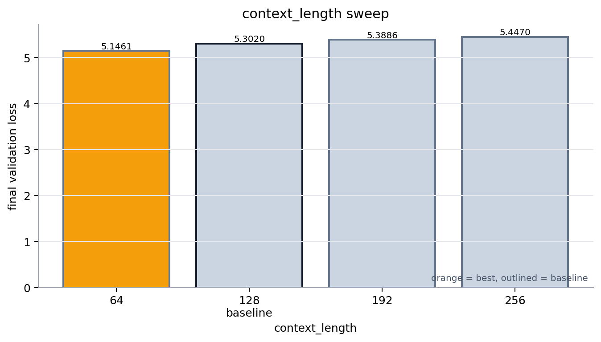

위 그래프에서 baseline은 `context_length=128` 위치에 있고, best는 `64`다. 즉 baseline이 왼쪽에 있어서 좋아 보였던 것이 아니라, 실제 설정값 순서대로 봐도 `64 < 128 < 192 < 256` 순서에서 가장 짧은 문맥이 가장 낮은 validation loss를 냈다.

| 실험  | context_length | final_val_loss | final_perplexity |
| --- | -------------- | -------------- | ---------------- |
| E01 | 64             | 5.146068       | 171.754751       |
| E00 | 128 baseline   | 5.301974       | 200.732742       |
| E02 | 192            | 5.388636       | 218.904658       |
| E03 | 256            | 5.447002       | 232.061290       |

해석: NSMC 리뷰는 짧은 문장이 많기 때문에, 이번 데이터에서는 긴 문맥보다 짧고 밀도 있는 문맥이 더 유리했다. 과적합 신호보다는 데이터 길이와 context 길이의 불일치가 성능 차이를 만든 것으로 보인다.

### 4.2 vocab_size: token loss와 bits/char는 다른 결론을 낸다

`vocab_size`는 BPE vocabulary 크기다. 작으면 문장을 더 잘게 쪼개고, 크면 더 긴 token을 만들 수 있다. 이때 `final_val_loss`는 token 하나를 맞히는 cross entropy라서, vocab 크기가 달라지면 예측 단위와 class 수가 동시에 바뀐다. 따라서 vocab 실험은 token 단위 loss만으로 결론을 내리면 안 되고, 문자 기준으로 정규화한 `bits/char`를 같이 봐야 한다.

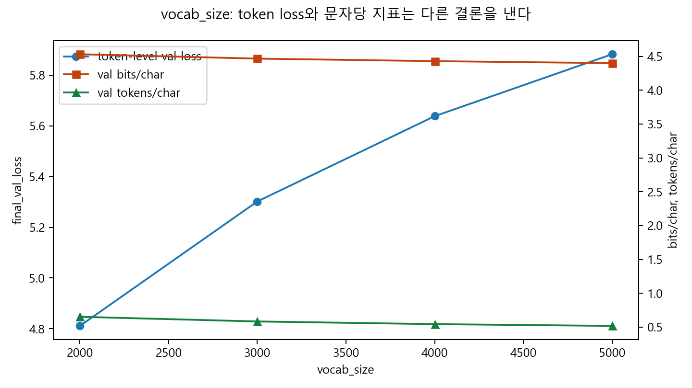

위 그래프에서 파란 선인 `token-level val loss`는 `vocab_size=2000`에서 가장 낮다. 하지만 주황 선인 `val bits/char`는 `vocab_size=5000`에서 가장 낮다. 즉 `vocab=2000`은 token 하나를 맞히기는 쉬웠지만, 문장을 더 많은 token으로 쪼개기 때문에 문자 하나를 설명하는 비용은 더 컸다.

| 실험  | vocab_size    | parameter_count | val_tokens | val_tokens/char | chars/token | final_val_loss | val_bits/char |
| --- | ------------- | --------------- | ---------- | --------------- | ----------- | -------------- | ------------- |
| E04 | 2000          | 2,570,112       | 78,686     | 0.652671        | 1.532166    | 4.811352       | 4.530393      |
| E00 | 3000 baseline | 2,954,112       | 70,386     | 0.583825        | 1.712841    | 5.301974       | 4.465758      |
| E05 | 4000          | 3,338,112       | 65,634     | 0.544409        | 1.836853    | 5.638393       | 4.428488      |
| E06 | 5000          | 3,722,112       | 62,493     | 0.518356        | 1.929176    | 5.882533       | 4.399133      |

해석: token loss 기준으로는 `vocab_size=2000`이 가장 좋지만, tokenizer가 달라진 실험에서는 이 비교가 공정하지 않다. `val_bits/char` 기준으로는 `vocab_size=5000`이 가장 낮아 문자 단위 언어모델 품질은 더 좋게 나온다. 다만 `vocab_size=5000`은 baseline보다 파라미터 수가 약 26.0% 많고 token 처리량도 낮아질 수 있으므로, 최종 선택은 `bits/char` 개선과 계산 비용을 함께 본 trade-off로 해석해야 한다.

### 4.3 emb_dim: 토큰 표현 벡터의 폭

`emb_dim`은 각 token을 표현하는 hidden vector 차원이다. 값을 키우면 표현 공간이 넓어지지만 파라미터 수도 크게 증가한다.

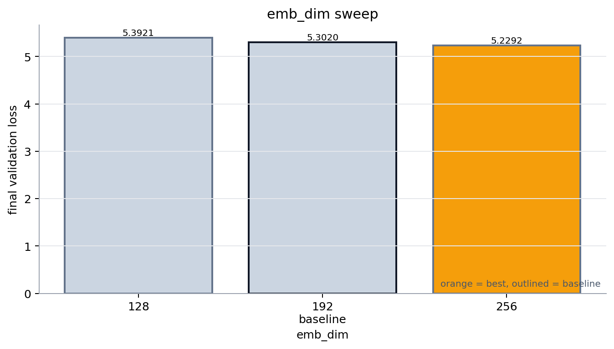

위 그래프에서 baseline은 `emb_dim=192`이고 best는 `256`이다. `128`로 줄이면 손실이 커지고, `256`으로 키우면 소폭 개선된다.

| 실험  | emb_dim      | parameter_count | final_val_loss | final_perplexity |
| --- | ------------ | --------------- | -------------- | ---------------- |
| E07 | 128          | 1,576,192       | 5.392111       | 219.666568       |
| E00 | 192 baseline | 2,954,112       | 5.301974       | 200.732742       |
| E08 | 256          | 4,725,248       | 5.229174       | 186.638487       |

해석: 이번 모델에서는 폭을 줄이면 표현력이 부족해지고, 폭을 키우면 성능이 좋아졌다. 다만 파라미터 수 증가에 비해 loss 개선 폭은 제한적이며, 5 epoch 탐색에서는 과적합보다 표현력 차이가 더 두드러진다.

### 4.4 n_heads: attention을 나누어 보는 관점 수

초기 `n_heads=3,4,6` 5 epoch 실험은 차이가 너무 작아 head 수의 의미를 보기 어려웠다. 그래서 10 epoch baseline `E28`을 기준으로 `n_heads=1,2,4,8,12`를 다시 돌렸다. `emb_dim=192`는 고정했으므로 head 수가 늘수록 head당 차원은 작아진다.

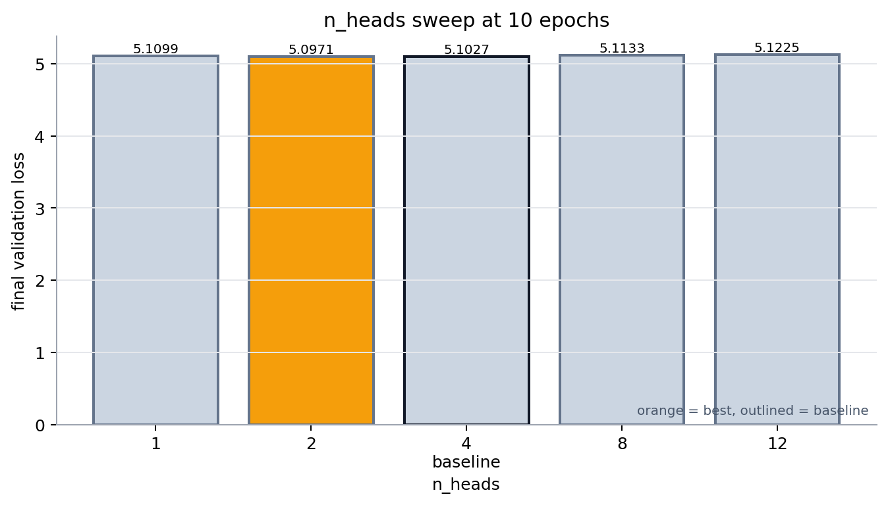

위 그래프에서 baseline은 `n_heads=4`, best는 `n_heads=2`다. 설정값 오름차순으로 보면 `1 -> 2`에서는 좋아지지만, `4 -> 8 -> 12`로 늘릴수록 손실이 다시 커진다.

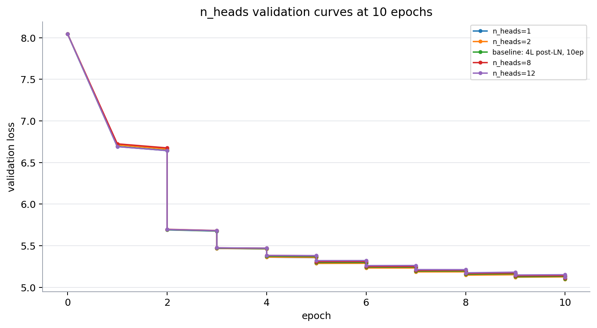

위 곡선에서도 `n_heads=2`가 마지막까지 가장 낮고, `8`, `12`는 학습 후반에도 baseline보다 낮아지지 않는다. 단순히 head 수를 많이 늘리는 것이 이 모델 규모에서는 이득이 아니었다.

| 실험  | n_heads    | head_dim | final_train_loss | final_val_loss | loss_gap |
| --- | ---------- | -------- | ---------------- | -------------- | -------- |
| E31 | 1          | 192      | 4.639138         | 5.109888       | 0.470751 |
| E32 | 2          | 96       | 4.621203         | 5.097077       | 0.475874 |
| E28 | 4 baseline | 48       | 4.619696         | 5.102722       | 0.483027 |
| E33 | 8          | 24       | 4.624903         | 5.113287       | 0.488385 |
| E34 | 12         | 16       | 4.633036         | 5.122543       | 0.489507 |

해석: `n_heads`는 유의미한 파라미터다. 같은 `emb_dim`에서 head 수는 “관점 수”뿐 아니라 “head당 표현 차원”을 같이 바꾼다. 이번 결과는 많은 head보다 적당한 head 수와 충분한 head dimension이 중요하다는 쪽에 가깝다. loss gap은 모두 0.5 미만이라 과적합은 약한 편이고, 이 모델에서는 `n_heads=2`가 가장 좋았으며 `8` 이상은 head당 차원이 너무 작아진 영향이 보인다.

### 4.5 n_layers: Transformer block 깊이

`n_layers`는 Transformer block을 몇 층 쌓을지 정한다. 깊어질수록 표현력은 커지지만 계산량과 최적화 난이도도 증가한다.

깊은 모델은 단순히 layer 수만 늘린다고 좋아지는 것이 아니라, 학습 안정성을 함께 맞춰야 한다. 따라서 `lr=0.0002`, `drop_rate=0.2`, `weight_decay=0.1` 조건에서 `8-layer/12-layer x post-LN/pre-LN` 2x2 실험을 비교했다.

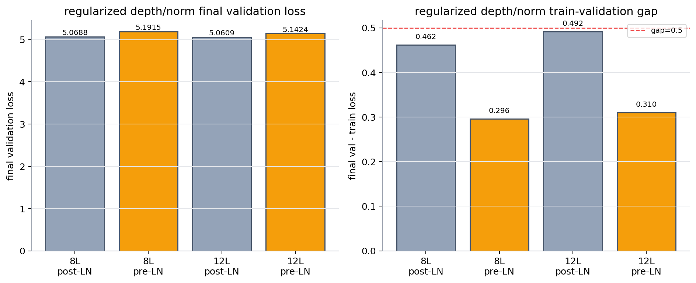

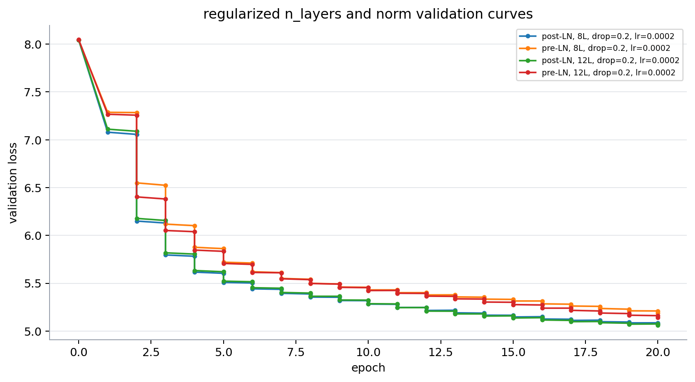

| 실험  | n_layers | norm 위치 | drop_rate | lr     | final_train_loss | final_val_loss | loss_gap | 실행 시간 |
| --- | -------- | ------- | --------- | ------ | ---------------- | -------------- | -------- | ----- |
| E60 | 8        | post-LN | 0.2       | 0.0002 | 4.606819         | 5.068817       | 0.461998 | 139.5초 |
| E61 | 8        | pre-LN  | 0.2       | 0.0002 | 4.895616         | 5.191477       | 0.295861 | 150.6초 |
| E62 | 12       | post-LN | 0.2       | 0.0002 | 4.569018         | 5.060854       | 0.491836 | 205.2초 |
| E63 | 12       | pre-LN  | 0.2       | 0.0002 | 4.832398         | 5.142445       | 0.310047 | 206.4초 |

실험 결과 `12-layer post-LN(E62)`이 네 조건 중 가장 낮은 validation loss인 `5.060854`를 냈다. 즉 안정화된 학습 조건에서는 12-layer까지 깊이를 늘려도 학습이 가능했고, validation loss 기준으로는 post-LN 조합이 pre-LN보다 더 좋았다.

다만 `E62`가 `8-layer post-LN(E60)`보다 낮춘 validation loss는 약 `0.008`에 불과한 반면, 실행 시간은 `139.5초`에서 `205.2초`로 크게 늘었다. 즉 12-layer는 안정화 조건에서 학습 가능하지만, 현재 데이터와 모델 크기에서는 비용 대비 개선 폭이 작다.

또한 pre-LN은 8-layer와 12-layer 모두에서 post-LN보다 validation loss는 높았지만 loss gap은 더 작았다. 따라서 이번 실험의 결론은 “깊은 모델이면 무조건 pre-LN”이 아니라, 낮은 lr과 충분한 dropout을 주면 post-LN도 12-layer까지 학습 가능하고, pre-LN은 더 보수적인 일반화 성향을 보인다는 것이다.

### 4.6 ffn_multiplier: FFN 내부 계산 공간의 크기

`ffn_multiplier`는 Transformer block의 Feed Forward Network 중간 차원을 `emb_dim`의 몇 배로 키울지 정한다.

```text
hidden_dim = emb_dim * ffn_multiplier
```

초기 5 epoch 실험에서는 차이가 작았기 때문에, 10 epoch baseline `E28`을 기준으로 `ffn_multiplier=2,4,6`을 다시 돌렸다.

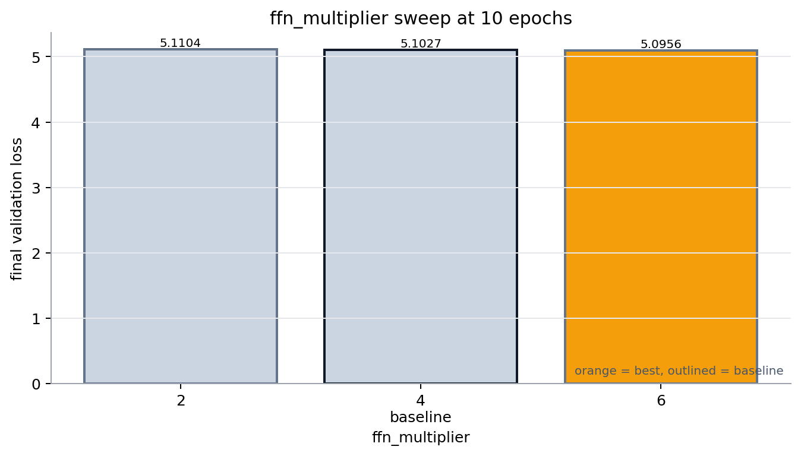

위 그래프에서 baseline은 `ffn_multiplier=4`, best는 `6`이다. 5 epoch에서는 `2`가 소폭 좋아 보였지만, 10 epoch로 늘리니 더 큰 FFN이 validation loss를 조금 더 낮췄다.

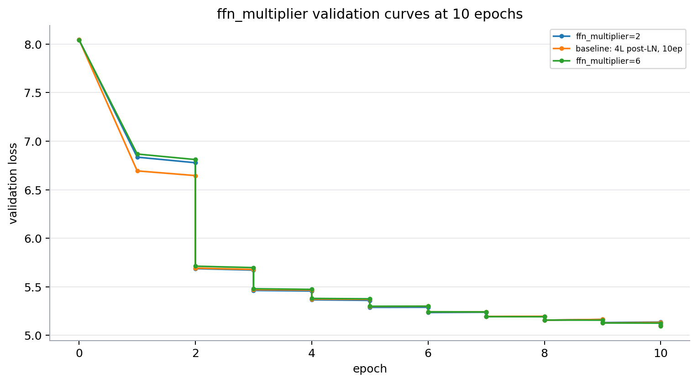

위 곡선에서도 `ffn_multiplier=6`은 후반부에 baseline보다 조금 낮게 끝난다. 차이는 크지 않지만, “FFN을 크게 키워도 의미가 없다”는 기존 결론은 너무 강했다.

| 실험  | ffn_multiplier | parameter_count | final_train_loss | final_val_loss | loss_gap |
| --- | -------------- | --------------- | ---------------- | -------------- | -------- |
| E35 | 2              | 2,362,752       | 4.616791         | 5.110428       | 0.493636 |
| E28 | 4 baseline     | 2,954,112       | 4.619696         | 5.102722       | 0.483027 |
| E36 | 6              | 3,545,472       | 4.624130         | 5.095633       | 0.471503 |

해석: FFN 크기는 attention 이후 각 token 표현을 비선형적으로 가공하는 공간의 크기다. 이번 10 epoch 결과에서는 `6`이 가장 좋았지만 개선 폭은 `0.007089`로 작다. loss gap은 모두 0.5 안팎이라 과적합 차이는 크지 않고, “FFN 증가는 소폭 이득이 있으나 비용 대비 효과는 제한적”이 적절하다.

### 4.7 FFN activation: 비선형 변환 방식

`ReLU`, `GELU`, `SiLU`는 Transformer block의 FFN 안에서 `Linear -> Activation -> Linear` 구조의 비선형 변환을 담당한다.

초기 4-layer 10 epoch 단일 seed 실험에서는 activation 간 차이가 매우 작아 결론을 내리기 어려웠다. 그래서 activation 비교는 더 깊은 8-layer pre-LN 모델에서 20 epoch까지 학습하고, seed 3개를 반복한 후속 실험을 중심으로 판단했다.

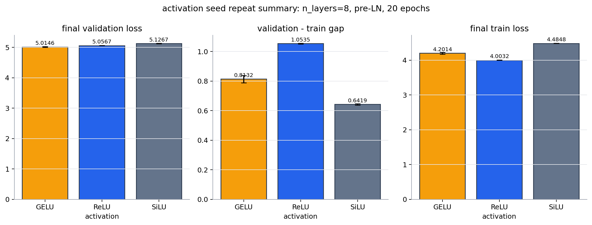

위 그래프는 `n_layers=8`, `pre-LN`, `20 epoch` 조건에서 seed `42`, `123`, `2026`을 반복한 결과의 평균과 표준편차다. 이 조건에서는 GELU가 평균 final validation loss가 가장 낮고, ReLU는 train loss는 가장 낮지만 train-validation gap이 가장 크다.

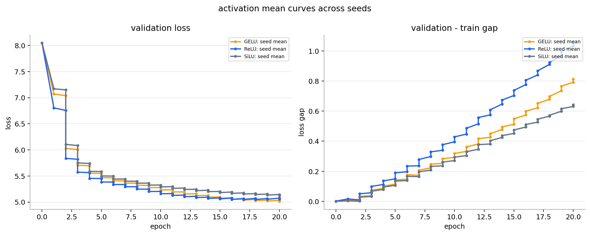

위 곡선은 seed 3개의 평균 validation loss와 평균 gap을 보여준다. ReLU는 학습 데이터에는 더 빠르게 맞지만 gap이 꾸준히 크게 벌어진다. GELU는 ReLU보다 train loss는 높지만 validation loss 평균이 더 낮고, SiLU는 gap은 작지만 underfit 성향으로 validation loss가 높다.

| activation | seed 수 | final_val_loss 평균 | final_val_loss 표준편차 | best_val_loss 평균 | final_train_loss 평균 | loss_gap 평균 |
| ---------- | ------ | ----------------- | ------------------- | ---------------- | ------------------- | ----------- |
| GELU       | 3      | 5.014631          | 0.010777            | 5.014631         | 4.201402            | 0.813229    |
| ReLU       | 3      | 5.056711          | 0.004298            | 5.049802         | 4.003249            | 1.053462    |
| SiLU       | 3      | 5.126724          | 0.011430            | 5.126724         | 4.484840            | 0.641883    |

해석: 8-layer pre-LN 20 epoch seed 반복에서는 GELU가 가장 좋은 평균 validation loss를 냈다. ReLU는 train loss를 가장 낮게 만들지만 gap이 커서 일반화가 나빠졌고, SiLU는 gap은 작지만 train/validation loss가 모두 높아 underfit에 가깝다. 따라서 이번 모델에서는 Transformer FFN activation으로 GELU가 가장 적합하다고 볼 수 있다.

### 4.8 drop_rate: 과적합을 막는 정규화 강도

`drop_rate`는 dropout 비율이다. 학습 중 일부 activation을 무작위로 제거해 모델이 특정 패턴을 외우는 것을 줄인다.

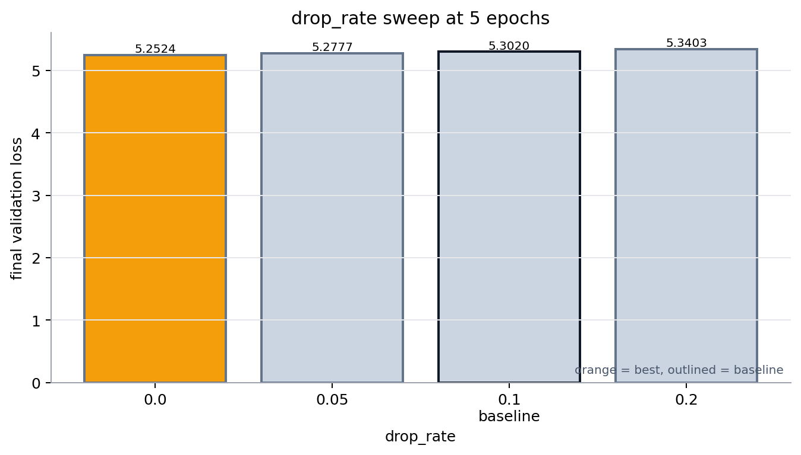

위 5 epoch 그래프에서는 `drop_rate=0.0`이 가장 낮다. 하지만 이것만 보고 dropout이 불필요하다고 결론 내리면 안 된다. 짧은 학습에서는 dropout이 학습 신호를 약하게 만들어 손해처럼 보일 수 있기 때문이다.

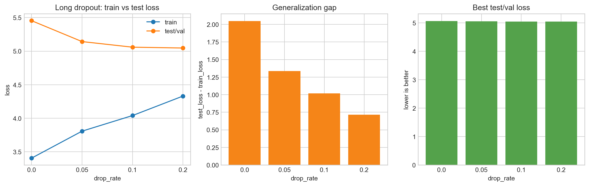

위 장기 dropout 그래프에서는 epoch를 20으로 늘렸을 때 dropout이 train-test gap을 줄이는 방향으로 작동한다. `drop_rate=0.0`은 train loss가 가장 낮지만 test loss와 gap이 커진다.

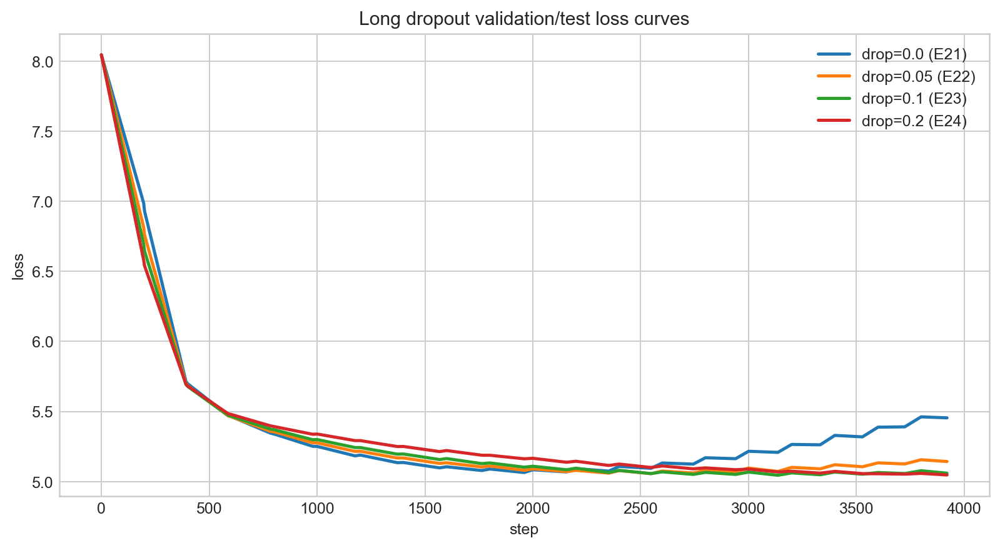

위 곡선은 dropout이 학습 후반의 과적합 양상을 완화하는지 보기 위한 그래프다. `drop_rate=0.1`, `0.2`는 train loss를 덜 낮추는 대신 test loss를 안정적으로 유지한다.

| 실험  | drop_rate    | final_train_loss | final_test_loss | loss_gap | best_val_loss |
| --- | ------------ | ---------------- | --------------- | -------- | ------------- |
| E21 | 0.0          | 3.406094         | 5.454686        | 2.048592 | 5.064496      |
| E22 | 0.05         | 3.808032         | 5.143097        | 1.335065 | 5.056303      |
| E23 | 0.1 baseline | 4.040717         | 5.059713        | 1.018996 | 5.044847      |
| E24 | 0.2          | 4.331211         | 5.047123        | 0.715912 | 5.047123      |

해석: dropout은 단기 loss를 낮추기 위한 장치가 아니라, 긴 학습에서 train-test gap을 줄이는 정규화 장치다. 이번 장기 실험에서는 `drop_rate=0.2`가 final test loss와 gap 기준으로 가장 안정적이었다.

### 4.9 norm_first: LayerNorm 위치

`norm_first`는 Transformer block에서 LayerNorm을 attention/FFN 앞에 둘지 뒤에 둘지 정한다.

```yaml
post-LN: x = norm(x + sublayer(x))
pre-LN : x = x + sublayer(norm(x))
```

처음에는 4-layer 10 epoch만 비교했지만, norm 위치는 깊이가 커질수록 달라질 수 있으므로 8-layer와 12-layer에서 20 epoch까지 다시 비교했다.

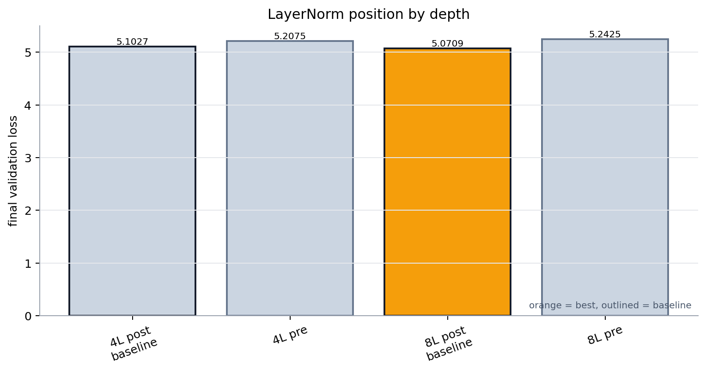

위 10 epoch 그래프에서는 4-layer와 8-layer 모두 post-LN이 pre-LN보다 낮은 validation loss를 냈다. 하지만 이 결론은 10 epoch 기준에 한정된다.

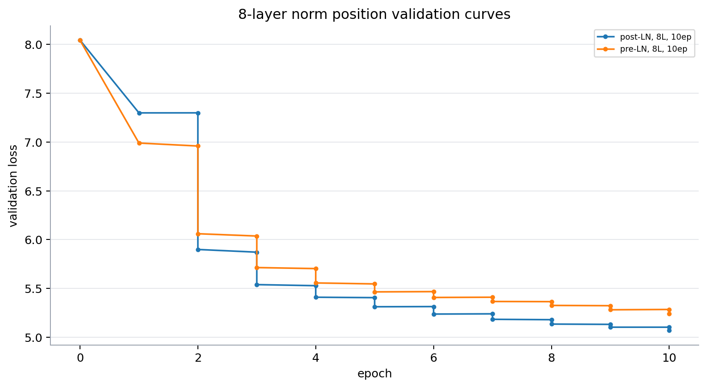

위 10 epoch 곡선에서도 8-layer post-LN은 안정적으로 내려가고, 8-layer pre-LN은 validation loss가 높게 유지된다. 그러나 20 epoch까지 늘리면 pre-LN이 뒤늦게 따라와 post-LN을 역전한다.

| 실험  | n_layers | norm_first              | final_train_loss | final_val_loss | loss_gap |
| --- | -------- | ----------------------- | ---------------- | -------------- | -------- |
| E28 | 4        | False, post-LN baseline | 4.619696         | 5.102722       | 0.483027 |
| E27 | 4        | True, pre-LN            | 4.828863         | 5.207495       | 0.378632 |
| E37 | 8        | False, post-LN          | 4.564352         | 5.070909       | 0.506557 |
| E38 | 8        | True, pre-LN            | 4.924389         | 5.242465       | 0.318076 |

10 epoch 해석: 짧게 보면 post-LN이 더 좋아 보인다. pre-LN은 gap은 작지만 train loss 자체가 높아 충분히 학습하지 못한 쪽에 가깝다.

| 실험  | n_layers | norm_first     | num_epochs | final_train_loss | final_val_loss | loss_gap  |
| --- | -------- | -------------- | ---------- | ---------------- | -------------- | --------- |
| E45 | 8        | False, post-LN | 20         | 3.819977         | 5.077443       | 1.257466  |
| E46 | 8        | True, pre-LN   | 20         | 4.239478         | 5.018016       | 0.778538  |
| E47 | 12       | False, post-LN | 20         | 7.291051         | 7.290566       | -0.000485 |
| E48 | 12       | True, pre-LN   | 20         | 4.156517         | 5.018293       | 0.861776  |

20 epoch 해석: 깊이가 커지고 epoch를 늘리면 결론이 바뀐다. 8-layer에서는 pre-LN이 post-LN보다 final validation loss를 `0.059427` 낮췄고, 12-layer에서는 post-LN이 학습 실패에 가까운 반면 pre-LN은 정상적으로 수렴했다. 따라서 깊은 설정에서는 pre-LN의 안정성 이점이 실제로 나타났다.

정규화 조건 재실험에서는 결론이 다시 보정된다. `drop_rate=0.2`, `lr=0.0002`로 바꾸면 post-LN 8-layer `E60`과 post-LN 12-layer `E62`가 각각 pre-LN `E61`, `E63`보다 validation loss가 낮다. 대신 pre-LN은 두 깊이 모두 train-validation gap이 더 작다. 따라서 `norm_first`는 단독으로 “성능을 올리는 옵션”이라기보다, 깊이, lr, dropout과 함께 최적화 안정성/일반화 성향을 바꾸는 옵션으로 봐야 한다.

### 4.10 qkv_bias: attention projection의 offset

`qkv_bias`는 attention에서 Query, Key, Value를 만드는 Linear layer에 bias를 둘지 정한다.

```typescript
qkv_bias=False: Q = xW
qkv_bias=True : Q = xW + b
```

5 epoch에서 효과가 매우 작았기 때문에, 10 epoch baseline과 8-layer 설정에서 다시 비교했다.

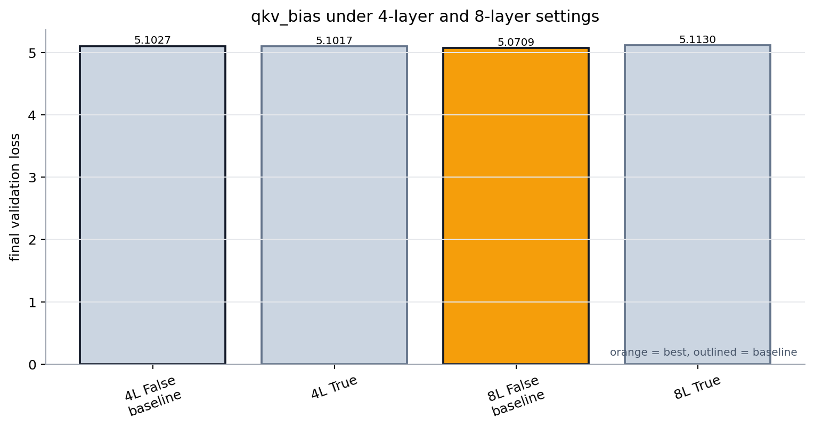

위 그래프에서 4-layer에서는 `qkv_bias=True`가 baseline보다 아주 조금 좋고, 8-layer에서는 오히려 `False`가 더 좋다.

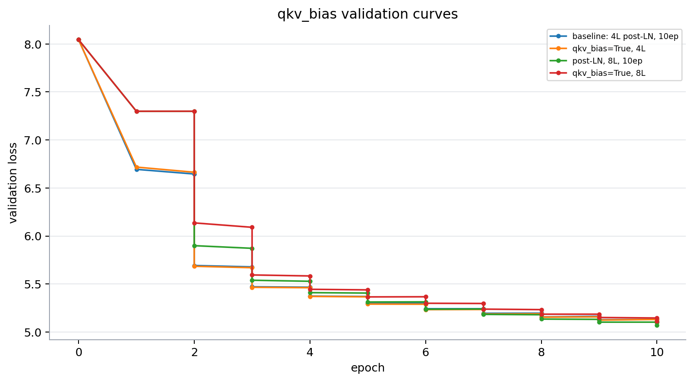

위 곡선에서도 qkv_bias의 방향성은 일관되지 않다. 4-layer에서는 차이가 거의 붙어 있고, 8-layer에서는 bias를 추가한 쪽이 더 높은 loss로 끝난다.

| 비교      | 실험  | qkv_bias       | n_layers | parameter_count | final_val_loss | 차이        |
| ------- | --- | -------------- | -------- | --------------- | -------------- | --------- |
| 4-layer | E28 | False baseline | 4        | 2,954,112       | 5.102722       | 기준        |
| 4-layer | E39 | True           | 4        | 2,956,416       | 5.101716       | -0.001006 |
| 8-layer | E37 | False baseline | 8        | 4,731,264       | 5.070909       | 기준        |
| 8-layer | E40 | True           | 8        | 4,735,872       | 5.112977       | +0.042068 |

해석: qkv_bias는 이번 모델에서 핵심 하이퍼파라미터로 보기 어렵다. 4-layer에서는 거의 무시 가능한 개선이고, 8-layer에서는 악화됐다. 이 결과는 과적합 패턴보다는 효과 크기 자체가 작고 조건별 방향이 일관되지 않는 문제에 가깝다.

### 4.11 weight_tying: 입력 embedding과 출력 projection 공유

`weight_tying`은 입력 token embedding과 출력 LM head weight를 공유하는 기법이다. 파라미터 수를 줄이고 입력/출력 token 공간을 묶어 일반화에 도움을 줄 수 있지만, 충분히 안정화된 학습 설정에서 비교해야 한다.

초기 5~20 epoch 비교는 weight tying의 결론을 내리기에는 학습이 짧거나 중간 관찰에 가까웠다. 최종 판단에는 장기 학습에서 과적합 차이가 분명하게 드러난 50 epoch 비교만 사용한다.

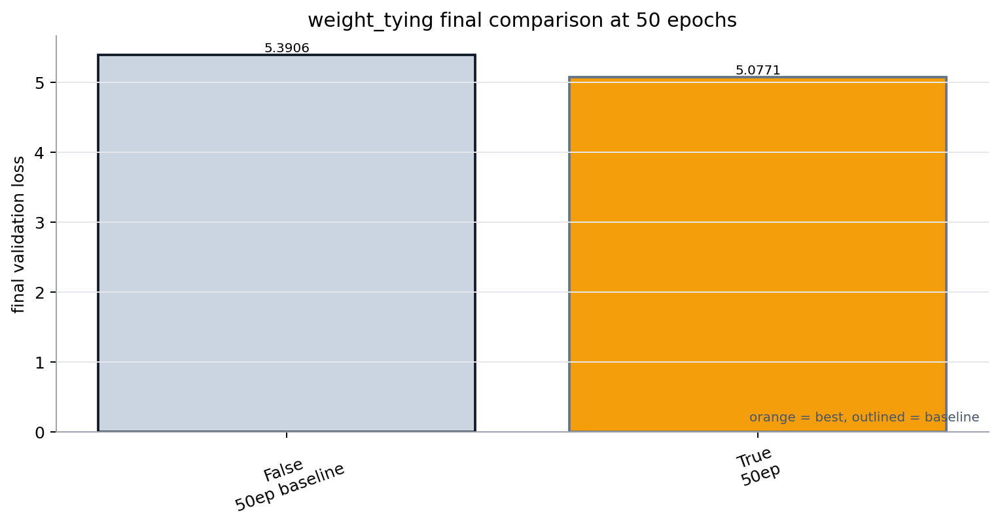

위 그래프에서 `weight_tying=True`는 `False`보다 final validation loss가 낮다. 중요한 점은 `True`가 train loss를 더 빠르게 낮춘 것이 아니라, 긴 학습에서 validation loss 악화를 덜 만들었다는 것이다.

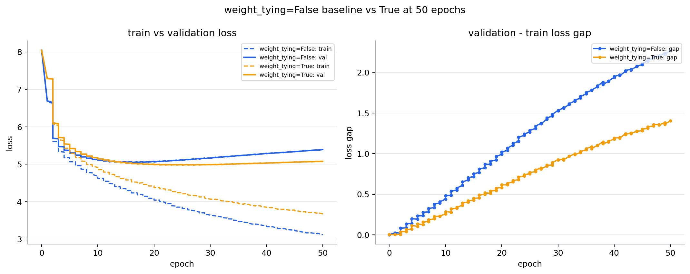

위 그래프는 왼쪽에 train/validation loss를 함께 그리고, 오른쪽에 `validation loss - train loss` gap을 따로 그린 것이다. `weight_tying=False`는 train loss가 훨씬 빠르게 내려가지만 validation loss는 후반에 크게 올라가고 gap도 2.27까지 커진다. 반대로 `weight_tying=True`는 train loss가 덜 내려가지만 validation loss 상승과 gap 증가가 더 작다. 즉 weight tying의 효과는 빠른 fitting이 아니라 과적합 완화로 봐야 한다.

| 실험  | weight_tying   | num_epochs | parameter_count | final_train_loss | final_val_loss | loss_gap |
| --- | -------------- | ---------- | --------------- | ---------------- | -------------- | -------- |
| E43 | False baseline | 50         | 2,954,112       | 3.117082         | 5.390571       | 2.273488 |
| E44 | True           | 50         | 2,378,112       | 3.672257         | 5.077142       | 1.404885 |

| 실험             | best_val_loss | best_step | final_val_loss | best 대비 final 악화 |
| -------------- | ------------- | --------- | -------------- | ---------------- |
| E43 False 50ep | 5.044847      | 3136      | 5.390571       | +0.345724        |
| E44 True 50ep  | 4.977708      | 4900      | 5.077142       | +0.099434        |

해석: weight tying은 loss를 더 빨리 줄이는 옵션이 아니다. `False`가 train loss를 더 낮게 줄였지만, 그 빠른 fitting은 validation loss 개선으로 이어지지 않았고 50 epoch에서는 과적합으로 크게 악화됐다. `True`는 파라미터를 약 57.6만 개 줄이고 train loss 감소는 느리지만, 입력 embedding과 출력 projection을 공유하게 만들어 출력층 자유도를 제한한다. 이번 결과에서는 이 제한이 구조적 정규화처럼 작동해 train-validation gap을 줄이고 장기 일반화를 더 좋게 만들었다.

### 4.12 stride: overlapping sample 수

`stride`는 language modeling dataset을 만들 때 window를 얼마나 겹치게 이동할지 정한다. baseline은 `stride=context_length=128`이라 겹침이 없고, `stride=64`는 절반씩 겹치므로 학습 sample 수가 늘어난다.

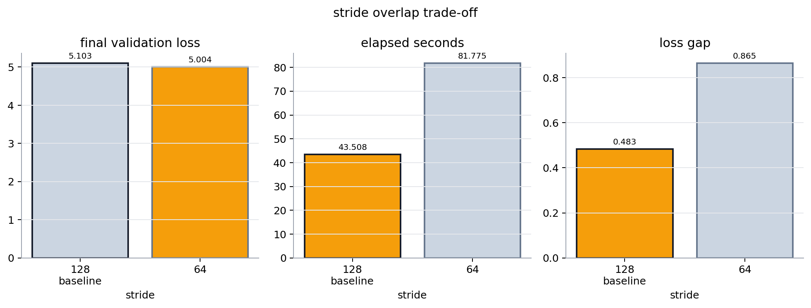

위 그래프에서 `stride=64`는 final validation loss를 낮췄지만, 실행 시간이 크게 늘고 loss gap도 커졌다. 따라서 stride는 단순 성능 개선 파라미터라기보다, 중복 샘플을 늘려 더 많이 학습시키는 대신 비용과 과적합 위험을 함께 키우는 설정이다.

| 실험  | stride       | final_train_loss | final_val_loss | loss_gap | elapsed_sec |
| --- | ------------ | ---------------- | -------------- | -------- | ----------- |
| E28 | 128 baseline | 4.619696         | 5.102722       | 0.483027 | 43.508      |
| E29 | 64           | 4.139527         | 5.004077       | 0.864550 | 81.775      |

해석: `stride=64`는 validation loss를 낮췄지만, 같은 corpus를 더 많이 겹쳐 보게 하므로 학습 시간이 거의 2배가 되고 train-val gap도 커졌다. 성능만 보면 이득이지만, 데이터 중복에 의한 과적합 가능성도 같이 봐야 한다.

## 5. 결론

1. `n_heads`는 10 epoch 재실험 결과 `n_heads=2`가 가장 좋았고, head 수가 너무 많아지면 head당 차원이 작아져 손해가 났다.
2. `ffn_multiplier`는 10 epoch 기준 `6`이 가장 좋았지만 개선 폭은 작다. FFN 용량 증가는 효과가 있으나 비용 대비 제한적이다.
3. `norm_first`는 epoch, depth, lr, dropout에 따라 결론이 달라졌다. 기존 20 epoch 조건에서는 pre-LN이 더 안정적이고 12-layer post-LN은 학습 실패에 가까웠지만, `drop_rate=0.2`, `lr=0.0002`로 정규화한 E60~E63에서는 post-LN이 더 낮은 validation loss를 냈고 pre-LN은 더 작은 gap을 보였다.
4. `qkv_bias`는 4-layer에서는 효과가 거의 없고 8-layer에서는 악화되어, 현재 실험 우선순위가 낮다.
5. `weight_tying`은 loss를 더 빨리 줄이는 옵션이 아니다. train loss는 `False`가 더 빨리 줄지만, 50 epoch에서는 과적합이 커졌다. `True`는 파라미터 절감과 장기 일반화 정규화 관점에서 의미 있는 옵션이다.
6. dropout은 짧은 학습에서는 손해처럼 보이지만, 긴 학습에서는 train-test gap을 줄이는 정규화 역할이 분명하게 나타났다.
7. activation은 8-layer pre-LN 20 epoch seed 3개 반복에서 GELU가 가장 낮은 평균 validation loss를 냈다. ReLU는 train loss를 더 낮추는 대신 gap이 커졌고, SiLU는 underfit 성향이 컸다.

최종적으로 현재 mini GPT에서는 `context_length=64`, `emb_dim=256`, `n_heads=2`, `ffn_multiplier=6`, `activation=GELU`, `drop_rate=0.1~0.2`, `weight_tying=True`를 조합 후보로 두는 것이 합리적이다. 깊은 모델의 LayerNorm 위치는 단순히 pre-LN으로 고정하기보다, 낮은 lr과 충분한 dropout을 적용한 조건에서 post-LN/pre-LN을 함께 비교해야 한다.
