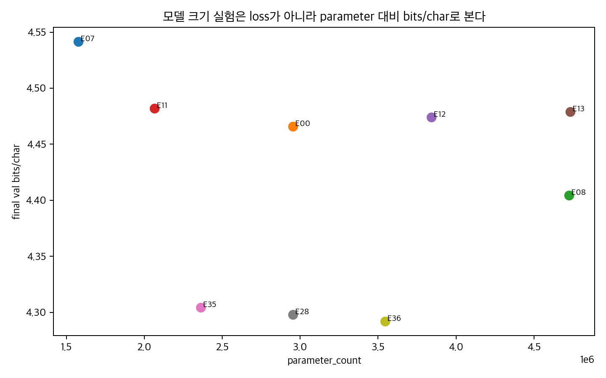

# REPORT.md LLM 지표 재작성 및 로그 보강 프롬프트

아래 프롬프트는 `REPORT.md`를 작성한 개발자 또는 이를 이어받는 코드 에이전트에게 그대로 전달하기 위한 작업 지시서다. 목적은 기존 `final_val_loss` 중심 보고서를 실제 LLM 개발자가 보는 지표 체계로 다시 쓰고, 필요한 로그가 없으면 실험 코드까지 보강하게 만드는 것이다.

## 0. 역할

당신은 mini GPT 실험 보고서와 실험 로깅 코드를 함께 개선하는 LLM 실험 엔지니어다.

기존 `REPORT.md`는 하이퍼파라미터별 실험 흐름을 설명하는 문서로는 괜찮지만, LLM 개발자 관점에서는 tokenizer scale, 학습량, 모델 크기, compute, seed variance, final/best rebound가 충분히 분리되어 있지 않다.

이번 작업의 목표는 다음이다.

1. `REPORT.md`의 해석을 LLM식 지표로 재작성한다.
2. 특히 `vocab_size` 실험은 token-level loss와 `bits/char` 기준 결론을 분리한다.
3. `docs/HY/testresult/*.md`와 `docs/llm_10x/*`의 기존 로그에서 재계산 가능한 지표를 먼저 계산한다.
4. 부족한 로그는 실험 코드에 추가한다.
5. 보고서, 표, 그래프, 테스트를 모두 갱신한다.

## 1. 반드시 먼저 읽을 파일

작업 전에 아래 파일을 읽고 실제 레포 상태를 기준으로 판단한다.

```text
REPORT.md
REPORT_temp.md
docs/HY/testresult/*.md
docs/llm_10x/README.md
docs/llm_10x/experiment_plan.md
docs/llm_10x/aggregate_report.md
docs/llm_10x/aggregate_summary.csv
docs/llm_10x/run_matrix.csv
docs/llm_10x/all_run_results.jsonl
scripts/llm_10x_prepare_cache.py
scripts/llm_10x_run_next.py
scripts/llm_10x_aggregate.py
scripts/llm_10x_llm_developer_report.py
scripts/llm_10x_screen_ready_report.py
src/experiments.py
tests/test_experiments.py
```

주의:

- `REPORT.md`에는 NSMC 기반 HY 실험이 들어 있다.
- `docs/llm_10x`에는 10배 데이터 기반 장기 실험 계획과 일부 결과가 들어 있다.
- 두 실험군은 데이터, 모델 크기, tokenizer, seed policy가 다르므로 한 leaderboard에서 단순 순위 비교하지 않는다.

## 2. 실제 실험 기준

### 2.1 HY / REPORT.md 기준

현재 `REPORT.md`의 주된 기준은 아래와 같다.

```text
dataset: NSMC LM train/val
train file: data/nsmc_lm_train.txt
val file: data/nsmc_lm_val.txt
baseline vocab_size: 3000
baseline train_tokens: 805,021
baseline val_tokens: 70,386
baseline seed: 123
baseline GPU: NVIDIA GeForce RTX 5070 Ti
```

5 epoch baseline `E00`:

```text
vocab_size=3000
context_length=128
emb_dim=192
n_heads=4
n_layers=4
ffn_multiplier=4
activation=GELU
drop_rate=0.1
qkv_bias=False
weight_tying=False
norm_first=False
batch_size=32
lr=0.0004
weight_decay=0.1
num_epochs=5
parameter_count=2,954,112
final_train_loss=5.081426
final_val_loss=5.301974
```

10 epoch baseline `E28`:

```text
same model as E00
num_epochs=10
final_train_loss=4.619696
final_val_loss=5.102722
```

### 2.2 LLM 10x 기준

`docs/llm_10x/experiment_plan.md` 기준 baseline은 아래와 같다.

```text
train: data/obsidian_llm_10x_lm_train.txt
val: data/obsidian_llm_10x_lm_val.txt
train/val source size: 15,001,711 chars class
vocab_size=12000
tokenizer_min_frequency=2
context_length=512
batch_size=4
emb_dim=512
n_heads=8
n_layers=8
drop_rate=0.10
ffn_mult=4
activation_name=gelu
attention_impl=sdpa
qkv_bias=False
tie_embeddings=True
init_std=0.02
learning_rate=0.0003
weight_decay=0.05
grad_clip=1.0
epochs=50
exploratory seeds=[123, 321, 777]
confirm seeds=[123, 321, 777, 2026, 3407, 42, 9001, 2718, 31415, 1618]
```

10x 실험의 claim rule:

```text
n=3: screen-ready, 후보 선별용
n=10: claim-ready, 최종 주장 가능
```

이 규칙은 보고서에 명확히 남긴다. `n=3` 결과는 "최종 결론"이 아니라 "후보" 또는 "탈락 후보"라고 쓴다.

## 3. 핵심 수정 관점

### 3.1 기존 결론이 바뀌는 가장 큰 지점: vocab_size

기존 `REPORT.md`는 `final_val_loss` 기준으로 vocab 2000을 가장 좋게 볼 수 있다.

```text
E04 vocab=2000 final_val_loss=4.811352
E00 vocab=3000 final_val_loss=5.301974
E05 vocab=4000 final_val_loss=5.638393
E06 vocab=5000 final_val_loss=5.882533
```

하지만 tokenizer가 달라지면 token 개수와 예측 단위가 달라진다. LLM tokenizer 비교에서는 문자 기준 정규화 지표를 같이 봐야 한다.

```text
val_nats_per_char = final_val_loss * val_tokens / val_chars
val_bits_per_char = val_nats_per_char / ln(2)
```

현재 재계산된 해석은 다음과 같다.

```text
E04 vocab=2000 val_bits_per_char=4.5304
E00 vocab=3000 val_bits_per_char=4.4658
E05 vocab=4000 val_bits_per_char=4.4285
E06 vocab=5000 val_bits_per_char=4.3991
```

따라서 기존 결론을 아래처럼 수정해야 한다.

```text
token-level final_val_loss 기준으로는 vocab_size=2000이 가장 낮다.
하지만 vocab이 달라지면 token loss 직접 비교는 불공정하다.
val_bits_per_char 기준으로는 vocab_size=5000이 가장 낮다.
따라서 vocab 실험의 결론은 "2000이 최고"가 아니라 "token loss 기준 best와 문자 기준 best가 다르다"이다.
```

## 4. 지표 정의, 의미, 해석 규칙

이 섹션의 표를 코드와 보고서에 반영한다. 각 지표는 단순히 계산값만 나열하지 말고, 무엇을 의미하고 어떤 결론에 쓰는지 문장으로 설명한다.

| 지표 | 계산식 | 의미 | 무엇을 봐야 하나 | 결과 해석 |
| --- | --- | --- | --- | --- |
| `final_train_loss` | final train CE | 학습 데이터 token 예측 손실 | val과 같이 본다 | 낮아지는데 val이 안 따라오면 memorization 가능성 |
| `final_val_loss` | final val CE | validation token 예측 손실 | 같은 tokenizer끼리 비교 | vocab이 다르면 단독 비교 금지 |
| `final_val_nats_per_char` | `final_val_loss * val_tokens / val_chars` | 문자당 nats | vocab/BPE 비교 primary | 낮을수록 tokenizer 차이를 보정한 LM 품질이 좋다 |
| `final_val_bits_per_char` | `final_val_nats_per_char / ln(2)` | 문자당 bits | 보고서용 tokenizer 공정 비교 | 낮을수록 문자 기준 정보량이 작다 |
| `train_tokens_per_char` | `train_tokens / train_chars` | tokenizer가 train text를 얼마나 잘게 쪼개는지 | vocab sweep에서 필수 | 낮으면 token 수가 줄지만 rare token 난이도가 커질 수 있다 |
| `val_tokens_per_char` | `val_tokens / val_chars` | validation tokenizer scale | vocab 비교 보정값 | token loss를 bits/char로 바꿀 때 필요 |
| `chars_per_token` | `chars / tokens` | token 하나의 평균 문자 길이 | token 길이 scale 확인 | 너무 커지면 긴 rare token 학습 부족 가능성 |
| `actual_vocab_size` | tokenizer의 실제 vocab 수 | corpus가 vocab을 채웠는지 | requested vocab과 비교 | 너무 작으면 vocab_size 실험이 실제로는 성립하지 않음 |
| `bpe_merge_count` | 실제 merge rule 수 | BPE 병합 정도 | min_frequency/vocab sweep | merge가 적으면 큰 vocab 요청이 무의미할 수 있음 |
| `token_length_histogram` | token string length 분포 | 긴 token/짧은 token 비율 | tokenizer profile | 긴 token이 많고 val bits가 나쁘면 sparse token 문제 |
| `top_merge_rules` | 상위 merge pair | tokenizer가 무엇을 묶는지 | qualitative audit | 의미 없는 병합이 많으면 tokenizer quality 의심 |
| `final_loss_gap` | `final_val_loss - final_train_loss` | train/val 일반화 차이 | 장기 학습/dropout/tying | 커질수록 memorization 가능성 |
| `generalization_gap_delta` | final gap - initial gap | 학습 중 gap 증가량 | epoch sweep | 크면 학습하면서 외우는 쪽으로 감 |
| `train_val_improvement_gap` | train 개선량 - val 개선량 | train만 더 빨리 좋아졌는지 | overfit risk | 크면 train fitting이 val generalization보다 앞섬 |
| `overfit_score` | positive gap/delta/improvement 합 | 과적합 종합 신호 | 후보 guardrail | 낮을수록 안전하다 |
| `best_val_loss` | 학습 중 최소 val loss | 가장 좋은 checkpoint | final과 같이 비교 | final보다 낮으면 early stopping 후보 |
| `best_step` | best val이 나온 update | 최적 시점 | epoch/tokens_seen으로 변환 | 너무 이르면 이후 학습은 낭비/과적합 후보 |
| `best_tokens_seen` | best step까지 본 token 수 | best checkpoint 학습량 | 동료팀/epoch 비교 | epoch보다 공정한 비교 단위 |
| `final_minus_best_val_loss` | `final_val_loss - best_val_loss` | 후반 rebound | 장기 학습 필수 | 크면 final checkpoint를 쓰면 안 된다 |
| `tokens_seen` | `batch_tokens * optimizer_updates` | 전체 학습량 | epoch 대신 비교 | tokenizer/batch/context가 다르면 반드시 필요 |
| `estimated_chars_seen` | `tokens_seen * train_chars_per_token` | raw text 노출량 근사 | vocab 비교 보조 | token scale 차이를 보정한다 |
| `parameter_count` | trainable params | 모델 크기 | capacity 실험 | 같은 quality면 작을수록 효율적 |
| `compute_proxy` | `parameter_count * tokens_seen` | 비용 근사 | loss-vs-compute | 작은 실험에서는 FLOPs proxy로 사용 |
| `estimated_train_flops` | `6 * parameter_count * tokens_seen` | 대략 학습 FLOPs | compute 보고 | 정확 FLOPs가 아님을 명시 |
| `tokens_per_param` | `tokens_seen / parameter_count` | 데이터/모델 비율 | data sufficiency | 너무 작으면 과적합 위험이 커짐 |
| `tokens_per_sec_after_warmup` | warmup 이후 train throughput | 순수 학습 속도 | context/depth/capacity | 전체 elapsed보다 처리량 비교에 적합 |
| `seconds_per_epoch` | `elapsed_sec / epochs` | epoch당 시간 비용 | sweep cost | 긴 context/depth 비용 확인 |
| `seed_mean` | seed별 metric 평균 | 평균 성능 | activation/norm | 평균 개선이 있는지 본다 |
| `seed_std` 또는 `IQR` | seed 분산 | 재현성 | 작은 delta 해석 | 평균 차이가 std보다 작으면 inconclusive |
| `paired_delta` | condition metric - baseline metric 같은 seed | baseline 대비 효과 | phase별 paired comparison | seed variance를 줄여 해석한다 |
| `win_rate` | baseline보다 나은 seed 비율 | seed별 승률 | 후보 선별 | n=3이면 최소 2승 필요 |
| `distinct_1` | unique unigram / total unigram | 생성 다양성 | generation audit | 낮으면 반복 생성 |
| `distinct_2` | unique bigram / total bigram | phrase 다양성 | generation audit | 낮으면 반복 문구 |
| `repetition_ratio_3gram` | 반복 3gram 비율 | 반복/붕괴 정도 | loss와 함께 확인 | 높으면 loss 개선만으로 채택 금지 |

## 5. 코드 수정 요청

기존 코드가 이미 일부 지표를 기록하고 있더라도, 아래 항목이 누락되어 있으면 보강한다.

### 5.1 tokenizer cache/profile 보강

대상 파일:

```text
scripts/llm_10x_prepare_cache.py
scripts/llm_10x_run_next.py
```

추가 산출물:

```text
local/llm_10x_isolated/cache/vocab_{vocab}_minfreq_{minfreq}/tokenizer_profile.json
local/llm_10x_isolated/cache/vocab_{vocab}_minfreq_{minfreq}/tokenizer_profile.csv
```

필수 필드:

```text
corpus_sha256
train_sha256
val_sha256
requested_vocab_size
actual_vocab_size
tokenizer_min_frequency
bpe_merge_count
train_chars
val_chars
train_tokens
val_tokens
train_tokens_per_char
val_tokens_per_char
train_chars_per_token
val_chars_per_token
token_length_histogram
top_50_merge_rules
special_token_ids
```

해석용으로 `token_length_histogram`은 최소한 아래 bin을 제공한다.

```text
length_1
length_2
length_3_4
length_5_8
length_9_16
length_17_plus
```

### 5.2 run result logging 보강

대상 파일:

```text
scripts/llm_10x_run_next.py
src/experiments.py
```

`result.json`에 아래 필드를 추가한다.

```text
optimizer_updates
best_tokens_seen
best_val_bits_per_char
best_val_nats_per_char
final_train_nats_per_char
final_val_nats_per_char
final_minus_best_val_loss
estimated_chars_seen
tokens_per_param
compute_proxy
estimated_train_flops
tokens_per_sec_after_warmup
peak_gpu_memory_mb
eval_batches
eval_tokens
eval_chars
```

구현 힌트:

```python
train_tokens_per_char = cache_manifest["train_tokens_per_char"]
val_tokens_per_char = cache_manifest["val_tokens_per_char"]
train_chars_per_token = cache_manifest["train_chars_per_token"]

final_train_nats_per_char = final_train_loss * train_tokens_per_char
final_val_nats_per_char = final_val_loss * val_tokens_per_char
final_val_bits_per_char = final_val_nats_per_char / math.log(2)
best_val_nats_per_char = best_val_loss * val_tokens_per_char
best_val_bits_per_char = best_val_nats_per_char / math.log(2)
final_minus_best_val_loss = final_val_loss - best_val_loss
best_tokens_seen = best_step * batch_size * context_length
estimated_chars_seen = tokens_seen * train_chars_per_token
compute_proxy = parameter_count * tokens_seen
estimated_train_flops = 6 * parameter_count * tokens_seen
tokens_per_param = tokens_seen / parameter_count
```

주의:

- `best_tokens_seen`은 drop_last, 마지막 batch 크기, gradient accumulation이 생기면 단순식이 틀릴 수 있다. 현재 코드처럼 `tokens_seen += input_batch.numel()`를 누적한다면, history event의 `tokens_seen`을 best 시점에 저장하는 방식이 더 정확하다.
- `tokens_per_sec_after_warmup`은 처음 몇 step을 제외한 train step 시간으로 계산한다. 최소 `warmup_steps = min(20, total_steps // 10)` 정도를 둔다.
- CUDA 사용 시 `torch.cuda.max_memory_allocated()`를 기록하고, MPS/CPU에서는 `null` 또는 `0`으로 둔다.

### 5.3 history.jsonl 보강

대상 파일:

```text
scripts/llm_10x_run_next.py
```

epoch event마다 아래 필드를 추가한다.

```text
val_nats_per_char
val_bits_per_char
train_nats_per_char
train_bits_per_char
final_minus_current_best_val_loss
tokens_seen
estimated_chars_seen
tokens_per_sec_after_warmup
```

목적:

- epoch milestone 분석에서 `final_val_loss`만이 아니라 `bits/char`, gap, rebound를 같이 그리기 위함이다.
- `1500 epoch` 장기 run은 final만 보지 말고 milestone별 best/final/rebound를 추출해야 한다.

### 5.4 generation metric 보강

새 파일을 만들거나 기존 report script에 추가한다.

권장 파일:

```text
scripts/llm_generation_metrics.py
```

고정 prompt set:

```text
이 영화는
정말
스토리는
배우들의 연기는
```

decoding config:

```text
temperature=0.8
top_k=50
max_new_tokens=100
num_samples_per_prompt=3
```

필수 지표:

```text
distinct_1
distinct_2
repetition_ratio_3gram
average_generated_length
manual_quality_note
```

해석 규칙:

- `val_bits_per_char`가 좋아져도 repetition ratio가 커지면 채택 보류다.
- vocab이 커진 후보는 생성 샘플에서 이상한 긴 token/파편화가 없는지 사람이 확인한다.

### 5.5 aggregation 보강

대상 파일:

```text
scripts/llm_10x_aggregate.py
scripts/llm_10x_llm_developer_report.py
scripts/llm_10x_screen_ready_report.py
```

조건별 집계에 아래 통계를 추가한다.

```text
median
mean
std
iqr
min
max
paired_delta_to_baseline_median
paired_delta_to_baseline_by_seed
baseline_win_rate
screen_ready = n >= 3
claim_ready = n >= 10
```

집계 대상 metric:

```text
final_val_loss
final_val_bits_per_char
best_val_loss
best_val_bits_per_char
final_generalization_gap
overfit_score
final_minus_best_val_loss
tokens_seen
estimated_chars_seen
tokens_per_sec_after_warmup
seconds_per_epoch
parameter_count
compute_proxy
estimated_train_flops
```

## 6. 실험 설계 요청

### 6.1 Tokenizer-only profile

가장 먼저 수행한다. 모델 학습 없이 tokenizer scale만 본다.

```text
vocab_size = [4000, 6000, 8000, 10000, 12000, 16000, 20000, 24000, 32000, 40000, 48000, 56000, 64000]
tokenizer_min_frequency = [1, 2, 3, 4, 5, 8, 13, 21, 34, 55]
train/val split fixed
tokenizer trained on train only
```

볼 것:

- `actual_vocab_size`가 requested vocab을 따라가는가?
- `tokens_per_char`가 줄어드는가?
- `chars_per_token`이 너무 커져 rare token이 늘어나는가?
- `top_merge_rules`가 의미 있는 병합을 하는가?

결론:

- tokenizer profile에서 후보 vocab/min_freq를 2-3개로 줄인다.
- 이 기준 없이 LLM 모델 실험 결론을 내리지 않는다.

### 6.2 Vocab LM sweep

Tokenizer-only 후보로 짧은 LM 실험을 수행한다.

```text
vocab_size candidates = tokenizer profile에서 고른 5개 이하
model = 10x baseline
epochs = 50
seeds = [123, 321, 777]
```

판정:

- primary: `final_val_bits_per_char`, `best_val_bits_per_char`
- guardrail: `overfit_score`, `final_generalization_gap`, `final_minus_best_val_loss`
- cost: `tokens_per_sec_after_warmup`, `parameter_count`, `estimated_train_flops`

보고서 문장:

```text
token loss 기준 best와 bits/char 기준 best가 다르면 둘을 분리해서 적는다.
vocab 실험에서는 final_val_loss 단독 순위를 사용하지 않는다.
```

### 6.3 Epoch/exposure sweep

1500 epoch 물리 run은 milestone으로 분석한다.

```text
milestones = [25, 50, 75, 100, 150, 200, 300, 400, 600, 800, 1000, 1200, 1500]
seeds = [123, 321, 777]
```

볼 것:

- val bits/char가 어느 milestone까지 내려가는가?
- `final_loss_gap`은 언제부터 커지는가?
- `best_val_loss` 이후 rebound가 있는가?
- 동료팀의 "1500 epoch에도 과적합 없음" 주장이 gap/best/rebound 기준으로도 맞는가?

해석:

- val이 내려가도 gap이 커지면 "quality improves with memorization risk"다.
- best가 300 epoch인데 final 1500이 나쁘면 "1500 epoch가 좋다"가 아니라 "early stopping 필요"다.

### 6.4 Dropout x Epoch

dropout은 짧은 final loss가 아니라 장기 gap/rebound로 평가한다.

```text
drop_rate = [0.0, 0.02, 0.05, 0.1, 0.2, 0.3, 0.4]
epoch milestones = [50, 100, 200, 400, 800, 1500]
seeds = [123, 321, 777]
```

해석:

- dropout이 커져 gap은 줄고 bits/char가 나빠지면 regularization trade-off다.
- dropout이 gap과 bits/char를 모두 개선하면 confirmed 후보.
- dropout 결론은 epoch 길이를 명시해야 한다.

### 6.5 Activation

활성함수는 작은 차이가 seed variance에 묻히기 쉽다.

```text
activation = [gelu, gelu_exact, quick_gelu, relu, silu, swish, mish, squared_relu, identity]
gated_activation = [swiglu, geglu]  # 별도 그룹
seeds = [123, 321, 777]
```

해석:

- 평균 개선이 seed std보다 작으면 `inconclusive`.
- ReLU처럼 train loss만 낮고 gap이 커지면 fitting은 빠르지만 일반화는 나쁘다고 쓴다.
- SwiGLU/GEGLU는 단순 activation이 아니라 gated FFN 구조 변경으로 분리해서 해석한다.

### 6.6 Norm x Depth

질문은 `Pre-LN이 좋은가?`가 아니다. 질문은 아래다.

```text
깊이가 늘어날 때 Pre-LN이 안정성을 주는가?
lr/dropout을 안정화하면 Post-LN도 깊은 모델에서 학습 가능한가?
```

실험:

```text
n_layers = [8, 12]
norm_first = [False, True]
lr = [0.0003, 0.0002]
drop_rate = [0.1, 0.2]
seeds = [123, 321, 777]
```

해석:

- Post-LN이 val bits는 낮지만 gap이 크면 "quality 우세, stability 열세".
- Pre-LN이 val bits는 높지만 gap/rebound가 작으면 "stability 우세".
- 깊은 Post-LN이 높은 loss에 머물면 최적화 실패로 분류한다.

### 6.7 Capacity

모델 크기는 성능과 비용을 함께 본다.

```text
emb_dim / n_layers / ffn_mult / n_heads는 한 번에 하나씩 바꾼다.
```

필수 그래프:

```text
parameter_count -> val_bits_per_char
estimated_train_flops -> val_bits_per_char
tokens_per_sec_after_warmup -> val_bits_per_char
```

해석:

- 같은 quality면 더 작은 모델이 낫다.
- 큰 모델이 train loss만 낮추고 gap이 커지면 overfit trade-off다.
- 깊이 증가는 norm/epoch/lr/dropout과 상호작용하므로 단독 결론 금지.

## 7. 보고서 재작성 지시

`REPORT.md`를 아래 구조로 재작성한다.

```text
1. 실험 목적
2. 데이터와 tokenizer split policy
3. baseline 모델과 seed policy
4. LLM 지표 정의
5. tokenizer/vocab 재해석
6. 학습량/epoch/rebound 분석
7. regularization/dropout/weight tying 분석
8. capacity/compute 효율 분석
9. activation seed 반복 분석
10. norm_first x depth 상호작용 분석
11. generation quality sanity check
12. 결론: confirmed / trade-off / inconclusive / rejected
13. 다음 실험 계획: 10-seed confirmation matrix
```

각 하이퍼파라미터 섹션은 아래 형식을 따른다.

```text
질문:
  이 실험이 검증하려는 한 문장 질문

고정 조건:
  dataset, tokenizer, model, seed, epoch, lr 등

바꾼 변수:
  정확히 하나의 축

primary metric:
  주 결론에 쓸 지표

guardrail metric:
  과적합/비용/속도 지표

결과:
  표와 그래프

해석:
  confirmed / trade-off / inconclusive / rejected 중 하나

주의:
  어떤 결론은 아직 말하면 안 되는지
```

## 8. 그래프 작성 및 Markdown 검토 지침

그래프는 "예쁜 그림"이 아니라 결론을 검증하는 장치다. 모든 그래프는 보고서 본문에서 아래 세 가지 질문에 답해야 한다.

```text
1. 이 그래프가 검증하는 질문은 무엇인가?
2. 어떤 축과 지표를 봐야 하는가?
3. 그래프 모양이 어떤 경우에 confirmed / trade-off / inconclusive / rejected인가?
```

### 8.1 공통 그래프 규칙

모든 그래프에 적용한다.

```text
format: PNG 권장, 필요 시 SVG 병행
width: 1400px 이상
dpi: 160 이상
font: 한글 깨짐 없는 폰트 또는 기본 sans-serif
title: 질문형 제목 사용
xlabel/ylabel: 지표명과 단위 포함
legend: 실험 축, seed, baseline 여부 표시
baseline: 점선 또는 회색 기준선으로 표시
seed repeats: 개별 seed 점 + median/mean 선을 함께 표시
error bar: n>=3이면 std 또는 IQR 표시
claim-ready: n>=10만 최종 claim 색상 사용
screen-ready: n=3은 후보 색상 사용
```

Markdown에는 상대 경로로 이미지를 넣는다. `REPORT.md` 기준 경로와 `docs/llm_10x/*.md` 기준 경로가 다르므로, 각 문서 위치에서 실제로 열리는 경로를 사용한다.

예시:

```markdown


```

그래프 바로 아래에는 반드시 한 문장 해석을 붙인다.

```markdown
해석: token-level loss 기준 best와 bits/char 기준 best가 다르므로, vocab 결론은 두 기준을 분리해야 한다.
```

### 8.2 그래프별 작성 지시

#### 8.2.1 `vocab_loss_vs_bits_per_char.png`

목적:

```text
vocab_size 실험에서 token-level final_val_loss와 문자 기준 bits/char가 서로 다른 결론을 내는지 확인한다.
```

구성:

```text
x축: vocab_size
왼쪽 y축: final_val_loss
오른쪽 y축: final_val_bits_per_char
보조선 또는 보조 패널: val_tokens_per_char
점: 각 실험
선: 같은 실험군 연결
baseline: vocab=3000 또는 10x baseline vocab=12000 점선
```

봐야 할 것:

- `final_val_loss`가 낮아지는 방향과 `bits_per_char`가 낮아지는 방향이 같은가?
- 작은 vocab이 token loss만 낮추고 bits/char는 나쁜가?
- 큰 vocab이 bits/char는 좋지만 parameter_count 또는 throughput 비용을 키우는가?

해석:

```text
token loss best != bits/char best:
  vocab 결론은 반드시 분리한다.

bits/char best가 크거나 sparse한 vocab:
  tokenizer 압축은 좋지만 비용/희소성 trade-off를 확인한다.

bits/char와 token loss가 모두 개선:
  tokenizer 후보로 승격한다.
```

Markdown 예시:

```markdown

```

#### 8.2.2 `vocab_tokenizer_profile.png`

목적:

```text
모델 학습 전 tokenizer 자체가 corpus를 어떻게 쪼개는지 확인한다.
```

구성:

```text
panel A: vocab_size -> actual_vocab_size
panel B: vocab_size -> bpe_merge_count
panel C: vocab_size -> train_tokens_per_char / val_tokens_per_char
panel D: vocab_size -> chars_per_token
panel E: token_length_histogram stacked bar
```

봐야 할 것:

- requested vocab과 actual vocab이 크게 다르면 corpus가 부족하다.
- tokens/char가 낮아지는데 bits/char가 나빠지면 rare token 문제가 의심된다.
- 긴 token 비율이 급증하면 validation에서 sparse token을 못 배울 수 있다.

해석:

```text
actual_vocab_size << requested_vocab_size:
  해당 vocab_size는 실험축으로 부적절하거나 corpus가 부족하다.

tokens_per_char 감소 + bits_per_char 개선:
  tokenizer 효율 개선 후보.

tokens_per_char 감소 + bits_per_char 악화:
  압축은 했지만 예측 난이도/희소성이 커진 후보.
```

Markdown 예시:

```markdown

```

#### 8.2.3 `parameter_count_vs_bits_per_char.png`

목적:

```text
모델을 키워서 얻은 품질 개선이 비용 대비 타당한지 확인한다.
```

구성:

```text
x축: parameter_count
y축: final_val_bits_per_char
점 색상: 실험축(emb_dim, n_layers, ffn_mult, n_heads)
점 크기: tokens_per_sec_after_warmup 또는 tokens_per_sec
점 라벨: experiment_id
baseline: 기준 모델 강조
```

봐야 할 것:

- parameter가 늘수록 bits/char가 실제로 내려가는가?
- 큰 모델이 같은 품질을 더 느리게만 달성하는가?
- 작은 모델이 비슷한 bits/char를 내면 효율 후보인가?

해석:

```text
bits/char 개선 + 비용 증가:
  quality 우선이면 후보, efficiency 기준이면 trade-off.

parameter 증가 + bits/char 정체:
  capacity 증가는 rejected 또는 low-priority.

작은 parameter + 비슷한 bits/char:
  efficient candidate.
```

Markdown 예시:

```markdown

```

#### 8.2.4 `loss_vs_compute_proxy.png`

목적:

```text
학습 compute를 더 쓴 만큼 validation 품질이 개선되는지 확인한다.
```

구성:

```text
x축: estimated_train_flops 또는 compute_proxy = parameter_count * tokens_seen
y축: final_val_bits_per_char 또는 best_val_bits_per_char
색상: phase
점 모양: screen-ready(n=3) / claim-ready(n=10)
baseline: 각 phase baseline
```

봐야 할 것:

- compute가 늘었는데 quality가 정체하면 비효율이다.
- best_val 기준으로는 좋지만 final 기준으로 나쁘면 rebound가 있다.
- 낮은 compute에서 좋은 후보가 있는가?

해석:

```text
compute 증가 + bits/char 개선:
  scaling 후보.

compute 증가 + bits/char 정체:
  비용 낭비 후보.

best bits/char 개선 + final bits/char 악화:
  early stopping 필요.
```

Markdown 예시:

```markdown

```

#### 8.2.5 `epoch_best_final_rebound.png`

목적:

```text
장기 학습에서 best checkpoint와 final checkpoint가 얼마나 달라지는지 확인한다.
```

구성:

```text
x축: epoch 또는 tokens_seen
y축 1: train_loss, val_loss
y축 2 또는 하단 패널: final_generalization_gap
별표: best_val_loss가 나온 epoch
막대 또는 선: final_minus_best_val_loss
```

봐야 할 것:

- val loss가 계속 내려가는가?
- train-val gap은 언제부터 커지는가?
- best 이후 final rebound가 있는가?
- 1500 epoch 주장이 final/best/gap 기준으로도 맞는가?

해석:

```text
val 하락 + gap 낮음:
  장기 학습 confirmed.

val 하락 + gap 증가:
  quality improves with memorization risk.

best 이후 final rebound 큼:
  early stopping 필요.

final val 상승 + gap 큼:
  명확한 과적합.
```

Markdown 예시:

```markdown

```

#### 8.2.6 `dropout_gap_rebound.png`

목적:

```text
dropout이 긴 학습에서 gap과 rebound를 줄이는지, 아니면 underfit을 만드는지 확인한다.
```

구성:

```text
x축: drop_rate
y축 panel A: best_val_bits_per_char
y축 panel B: final_val_bits_per_char
y축 panel C: final_generalization_gap
y축 panel D: final_minus_best_val_loss
색상: epoch milestone
error bar: seed std/IQR
```

봐야 할 것:

- dropout 증가로 gap이 줄어드는가?
- gap은 줄지만 best/final bits가 나빠지는가?
- 어느 dropout에서 quality와 overfit guardrail이 동시에 좋은가?

해석:

```text
gap 감소 + bits/char 개선:
  confirmed regularization 후보.

gap 감소 + bits/char 악화:
  regularization trade-off.

gap도 크고 bits/char도 나쁨:
  rejected.
```

Markdown 예시:

```markdown

```

#### 8.2.7 `activation_seed_errorbar.png`

목적:

```text
activation 차이가 seed variance보다 큰지 확인한다.
```

구성:

```text
x축: activation_name
y축: final_val_bits_per_char 또는 best_val_loss
점: seed별 개별 결과
막대 또는 점선: 평균/중앙값
error bar: std 또는 IQR
보조 패널: final_generalization_gap
gated FFN(swiglu/geglu): 별도 색상 또는 별도 패널
```

봐야 할 것:

- 평균 차이가 error bar보다 큰가?
- train loss만 낮추고 gap이 커지는 activation이 있는가?
- gated activation은 parameter_count 변화까지 같이 봤는가?

해석:

```text
평균 개선 > seed std + gap 안정:
  activation 후보.

평균 차이 <= seed std:
  inconclusive.

train loss 개선 + gap 증가:
  fitting은 빠르지만 일반화 trade-off.
```

Markdown 예시:

```markdown

```

#### 8.2.8 `norm_depth_matrix.png`

목적:

```text
Pre-LN/Post-LN이 깊이에 따라 quality와 stability를 어떻게 바꾸는지 확인한다.
```

구성:

```text
heatmap A: n_layers x norm_first -> final_val_bits_per_char
heatmap B: n_layers x norm_first -> final_generalization_gap
heatmap C: n_layers x norm_first -> final_minus_best_val_loss
행: n_layers
열: post-LN/pre-LN
facet: lr/drop_rate 안정화 조건
```

봐야 할 것:

- 깊이가 늘 때 post-LN이 학습 실패하는가?
- pre-LN이 val loss는 높지만 gap/rebound를 줄이는가?
- lr/dropout 안정화 후 결론이 바뀌는가?

해석:

```text
post-LN lower bits + higher gap:
  quality 우세, stability 열세.

pre-LN higher bits + lower gap:
  stability 우세, quality trade-off.

deep post-LN high loss plateau:
  optimization failure.
```

Markdown 예시:

```markdown

```

#### 8.2.9 `generation_repetition_audit.png`

목적:

```text
loss 개선이 실제 생성 품질 개선으로 이어지는지 확인한다.
```

구성:

```text
x축: experiment_id 또는 condition_id
y축 panel A: distinct_1
y축 panel B: distinct_2
y축 panel C: repetition_ratio_3gram
색상: phase 또는 tokenizer/model 후보
보조 표: fixed prompt sample 일부
```

봐야 할 것:

- val bits가 좋아졌는데 repetition ratio가 커지는가?
- distinct가 낮아져 반복 문구가 늘어나는가?
- vocab 후보별로 이상한 tokenization artifact가 있는가?

해석:

```text
bits/char 개선 + repetition 낮음:
  generation sanity 통과.

bits/char 개선 + repetition 높음:
  채택 보류.

distinct 낮음 + sample 반복:
  loss만으로 좋은 모델이라 말하면 안 됨.
```

Markdown 예시:

```markdown

```

### 8.3 10x 전용 그래프

`docs/llm_10x/llm_developer_figures/`에는 10배 데이터 실험 전용 그래프를 둔다.

```text
tokenizer_fairness.png
  x축: vocab_size 또는 tokenizer_min_frequency
  y축: final_val_loss와 final_val_bits_per_char
  목적: tokenizer scale이 loss 해석을 뒤집는지 확인

loss_vs_compute.png
  x축: estimated_train_flops
  y축: best/final val bits per char
  목적: compute 대비 품질

loss_vs_tokens.png
  x축: tokens_seen 또는 estimated_chars_seen
  y축: val bits per char
  목적: epoch 숫자 대신 실제 학습량 기준 비교

throughput_quality.png
  x축: tokens_per_sec_after_warmup
  y축: val bits per char
  목적: 빠르면서 품질이 좋은 후보 탐색
```

10x 그래프 Markdown 예시:

```markdown


```

`docs/llm_10x/aggregate_report.md` 안에서는 위처럼 `llm_developer_figures/...` 상대 경로를 사용한다. `REPORT.md`에서 참조할 때는 `docs/llm_10x/llm_developer_figures/...` 경로를 사용한다.

### 8.4 그래프 생성 스크립트 요구사항

그래프 생성 스크립트는 아래 입력과 출력을 명확히 한다.

권장 파일:

```text
scripts/generate_llm_metric_figures.py
```

입력:

```text
docs/HY/testresult/*.md
docs/llm_10x/aggregate_summary.csv
docs/llm_10x/all_run_results.jsonl
local/llm_10x_isolated/cache/*/tokenizer_profile.json
```

출력:

```text
docs/HY/figures_temp/*.png
docs/llm_10x/llm_developer_figures/*.png
docs/llm_10x/llm_developer_figures/figure_index.md
```

`figure_index.md`에는 각 그래프를 Markdown에서 바로 확인할 수 있게 썸네일 목록을 넣는다.

```markdown
# LLM Metric Figure Index


```

### 8.5 그래프 검토 체크리스트

그래프 생성 후 아래를 확인한다.

```text
[ ] 모든 그래프가 Markdown에서 깨지지 않고 보인다.
[ ] x/y축에 단위가 있다.
[ ] baseline이 명확히 표시되어 있다.
[ ] seed 개별 점 또는 error bar가 있다.
[ ] n=3 screen-ready와 n=10 claim-ready가 시각적으로 구분된다.
[ ] vocab 그래프는 final_val_loss와 bits/char를 둘 다 보여준다.
[ ] epoch 그래프는 best/final/rebound/gap을 같이 보여준다.
[ ] dropout 그래프는 loss와 gap을 같이 보여준다.
[ ] capacity 그래프는 parameter_count 또는 compute proxy를 x축으로 둔다.
[ ] 그래프 아래에 한 문장 해석이 있다.
```

## 9. 테스트 요청

코드 수정 후 반드시 테스트를 추가하거나 갱신한다.

테스트 항목:

```text
bits_per_char 계산이 final_val_loss * tokens_per_char / ln(2)와 일치한다.
final_minus_best_val_loss가 final_val_loss - best_val_loss와 일치한다.
best_tokens_seen이 best event의 tokens_seen과 일치한다.
compute_proxy와 estimated_train_flops가 올바르게 계산된다.
tokenizer_profile.json에 required fields가 모두 존재한다.
aggregate_summary.csv가 median/std/IQR/paired_delta/win_rate를 포함한다.
vocab이 다른 실험에서 report generator가 final_val_loss만으로 best를 쓰지 않는다.
```

권장 테스트 파일:

```text
tests/test_experiments.py
tests/test_llm_10x_metrics.py
```

## 10. 산출물 체크리스트

작업 완료 전 아래 항목을 모두 확인한다.

```text
[ ] REPORT.md가 vocab token loss best와 bits/char best를 분리해서 설명한다.
[ ] REPORT.md가 final loss만이 아니라 best/final/rebound/gap을 설명한다.
[ ] REPORT.md가 모델 크기 실험에서 parameter_count, tokens_seen, compute proxy를 같이 본다.
[ ] REPORT.md가 activation 결과를 seed 평균/표준편차로 설명한다.
[ ] REPORT.md가 n=3 exploratory와 n=10 claim-ready를 구분한다.
[ ] tokenizer_profile.json/csv가 생성된다.
[ ] result.json에 best_tokens_seen, final_minus_best, nats/char, flops proxy가 들어간다.
[ ] aggregate_summary.csv에 paired delta와 win rate가 들어간다.
[ ] 새 그래프가 생성된다.
[ ] tests가 통과한다.
```

## 11. 금지할 해석

아래 문장은 쓰지 않는다.

```text
vocab_size=2000이 무조건 best다.
1500 epoch에서도 과적합이 없다.
Pre-LN이 항상 좋다.
Post-LN이 항상 좋다.
dropout은 좋다/나쁘다.
큰 모델이 좋다.
activation A가 무조건 좋다.
```

대신 아래처럼 쓴다.

```text
vocab_size=2000은 token loss 기준 best지만, bits/char 기준 best는 다르다.
1500 epoch run은 final val, best val, gap, rebound를 함께 봐야 한다.
Pre-LN/Post-LN은 depth, lr, dropout 조건에 따라 quality/stability trade-off가 다르다.
dropout은 epoch가 길어질 때 gap/rebound를 줄이는 regularization trade-off로 평가한다.
capacity 증가는 quality, parameter_count, throughput, compute proxy를 함께 본다.
activation 효과는 seed 평균과 분산으로만 주장한다.
```

## 12. 최종 응답 형식

작업이 끝나면 다음 형식으로 요약한다.

```text
수정한 코드:
- path

추가한 로그 필드:
- field: meaning

다시 생성한 산출물:
- path

REPORT.md에서 바뀐 핵심 결론:
- vocab
- epoch/rebound
- dropout
- norm/depth
- activation
- capacity

테스트:
- command
- result

남은 한계:
- n=3 exploratory라 claim-ready가 아닌 항목
- 아직 generation/downstream이 없는 항목
```
