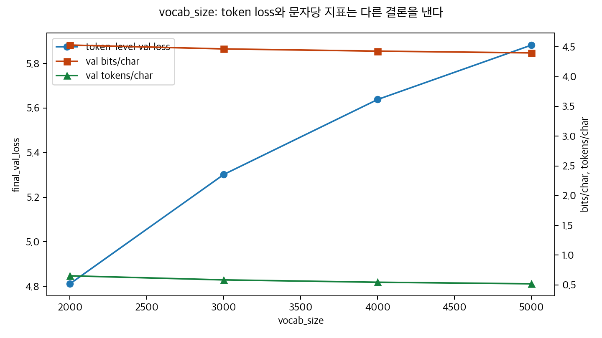
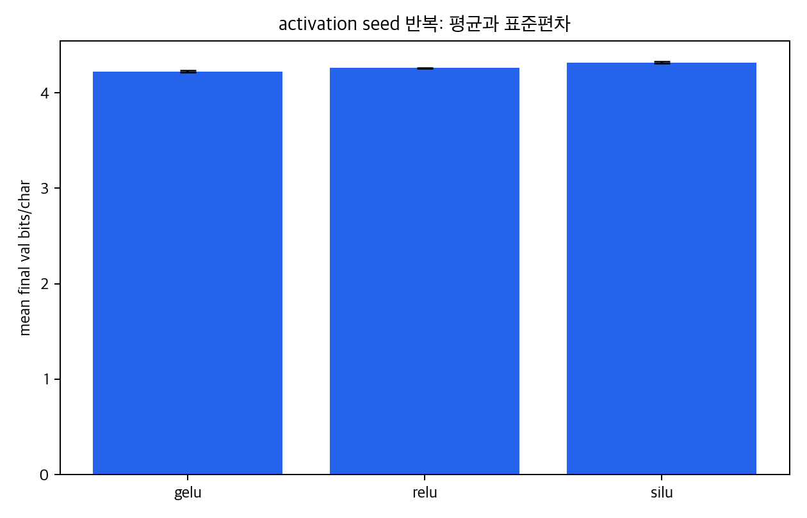
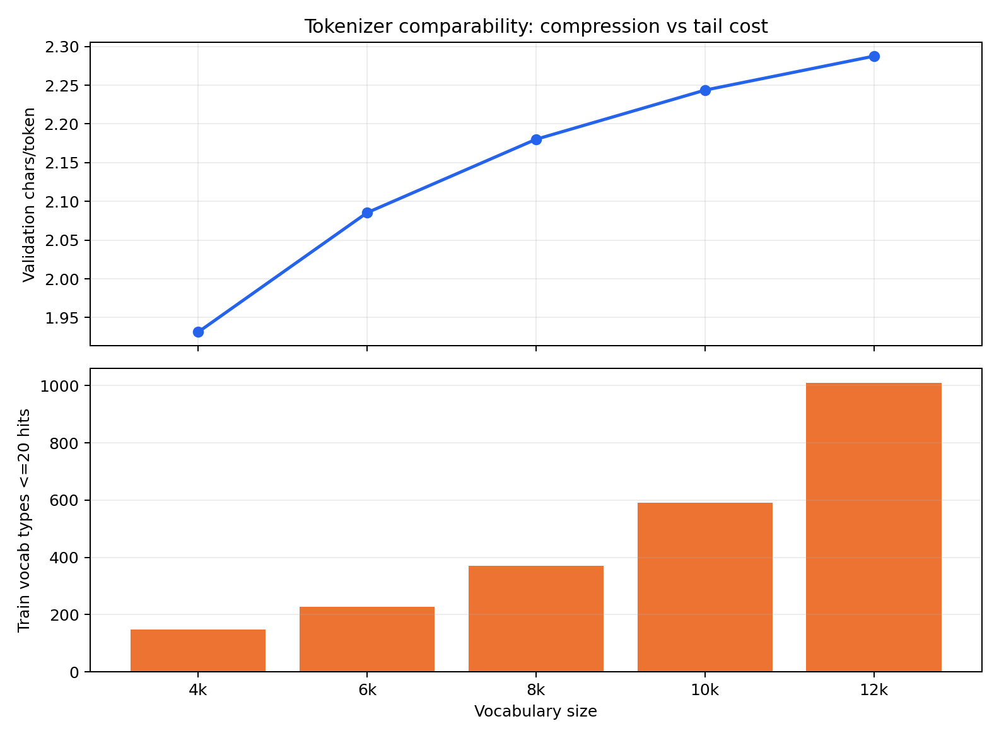

# mini GPT 구현 및 LLM 하이퍼파라미터 실험 보고서 - LLM 지표 수정본

이 문서는 원본 `REPORT.md`를 수정하지 않고 작성한 대체 초안입니다. 원본 보고서의 실험 흐름은 유지하되, 결론의 기준을 실제 LLM 개발자가 보는 지표 체계로 바꿉니다.

핵심 변경은 네 가지입니다.

1. `final_val_loss` 중심 해석을 `bits/char`, `best/final rebound`, `train-val gap`, `compute proxy` 중심으로 바꿉니다.
2. `vocab_size` 실험은 token-level loss와 문자 기준 정규화 지표를 분리합니다.
3. `epoch`, `dropout`, `weight_tying`, `norm_first`는 final loss 한 점이 아니라 `best_val_loss`, `final_minus_best_val_loss`, `final_generalization_gap`을 함께 봅니다.
4. seed 반복이 있는 실험은 평균과 표준편차 또는 IQR을 기준으로만 주장합니다.

## 0. 팀 정보

| 항목 | 내용 |
| --- | --- |
| 과정 | AI 과정 |
| 팀명 | Week13/14 Team6 |
| 팀원 | 최우녕, 이창원, 이혜연 |

## 1. 보고서 목적

이 보고서는 직접 구현한 mini GPT 모델에서 Transformer 기반 LLM 하이퍼파라미터가 사전학습 품질, tokenizer 효율, 학습 안정성, 과적합, 계산 비용에 어떤 영향을 주는지 확인하기 위한 실험 보고서입니다.

원본 보고서는 `validation loss` 중심의 하이퍼파라미터 실험 보고서로는 충분히 의미가 있습니다. 다만 LLM 개발자 관점에서는 다음 문제가 남아 있습니다.

- tokenizer가 다른 vocab 실험을 token-level loss만으로 비교했습니다.
- final checkpoint만 강조되어 best checkpoint와 후반 rebound가 충분히 분리되지 않았습니다.
- 모델 크기와 학습량이 바뀌는 실험에서 `parameter_count`, `tokens_seen`, `compute_proxy`가 결론 축으로 충분히 쓰이지 않았습니다.
- 일부 실험은 seed 반복이 없거나 n=3 단계라 최종 주장으로 쓰기 어렵습니다.

따라서 이 수정본은 기존 실험 결과를 버리는 것이 아니라, 같은 결과를 LLM 지표로 다시 읽는 문서입니다.

## 2. 구현 및 테스트 현황

| 단계 | 구현 내용 | 구현 파일 |
| --- | --- | --- |
| 1 | UTF-8 byte-level BPE tokenizer | `src/bpe.py` |
| 2 | GPTDataset, DataLoader, token/position embedding | `src/dataset.py`, `src/embeddings.py` |
| 3 | MultiHeadAttention, causal mask | `src/attention.py` |
| 4 | LayerNorm, GELU/ReLU/SiLU, FeedForward, TransformerBlock, GPTModel | `src/model.py` |
| 5 | loss 계산, generation, checkpoint, training utility | `src/train.py` |
| 6 | NSMC 감성 분류 Dataset과 classifier | `src/finetune.py` |
| 7 | 실험 실행 및 Markdown 결과 저장 루프 | `scripts/run_lm_experiment.py`, `scripts/run_all_lm_experiments.py`, `scripts/run_followup_experiments.py` |
| 8 | HY 지표 재해석 및 그래프 생성 | `scripts/generate_llm_metric_reinterpretation.py` |
| 9 | 10x tokenizer/profile/run/aggregate/report | `scripts/llm_10x_*.py` |

기존 HY 실험 결과는 아래 경로에 있습니다.

```text
docs/HY/testresult/*.md
docs/HY/figures/*.png
docs/HY/figures_temp/*.png
docs/HY/report_llm_metrics.csv
```

10배 데이터 실험 결과는 아래 경로에 있습니다.

```text
docs/llm_10x/*.md
docs/llm_10x/aggregate_summary.csv
docs/llm_10x/all_run_results.jsonl
docs/llm_10x/llm_developer_figures/*.png
```

## 3. 실험 기준

### 3.1 HY / NSMC 기준

| 항목 | 내용 |
| --- | --- |
| 원본 데이터 | NSMC |
| 사전학습 데이터 | `data/nsmc_lm_train.txt`, `data/nsmc_lm_val.txt` |
| tokenizer | 직접 구현한 UTF-8 byte-level BPE |
| baseline vocab_size | 3000 |
| baseline train_tokens | 805,021 |
| baseline val_tokens | 70,386 |
| seed | 123 |
| GPU | NVIDIA GeForce RTX 5070 Ti |

5 epoch baseline `E00`:

| 항목 | 값 |
| --- | ---: |
| vocab_size | 3000 |
| context_length | 128 |
| emb_dim | 192 |
| n_heads | 4 |
| n_layers | 4 |
| ffn_multiplier | 4 |
| activation | GELU |
| drop_rate | 0.1 |
| qkv_bias | False |
| weight_tying | False |
| norm_first | False, post-LN |
| parameter_count | 2,954,112 |
| batch_size | 32 |
| lr | 0.0004 |
| weight_decay | 0.1 |
| final_train_loss | 5.081426 |
| final_val_loss | 5.301974 |

10 epoch baseline `E28`는 같은 구조에서 `num_epochs=10`이며 `final_train_loss=4.619696`, `final_val_loss=5.102722`입니다.

### 3.2 LLM 10x 기준

10x 실험은 HY/NSMC 실험과 데이터, tokenizer, 모델 크기, seed policy가 다르므로 한 leaderboard에서 직접 순위 비교하지 않습니다.

| 항목 | 값 |
| --- | --- |
| train | `data/obsidian_llm_10x_lm_train.txt` |
| val | `data/obsidian_llm_10x_lm_val.txt` |
| source size | 약 15,001,711 chars class |
| vocab_size | 12000 |
| tokenizer_min_frequency | 2 |
| context_length | 512 |
| batch_size | 4 |
| emb_dim | 512 |
| n_heads | 8 |
| n_layers | 8 |
| drop_rate | 0.10 |
| ffn_mult | 4 |
| activation_name | gelu |
| attention_impl | sdpa |
| qkv_bias | False |
| tie_embeddings | True |
| learning_rate | 0.0003 |
| weight_decay | 0.05 |
| grad_clip | 1.0 |
| target epochs | 50 |

10x claim rule:

| 반복 수 | 상태 | 허용되는 표현 |
| ---: | --- | --- |
| n=3 | screen-ready | 후보, 탈락 후보, 추가 반복 대상 |
| n=10 | claim-ready | 최종 주장 가능 |

현재 10x 중간 결과는 claim-ready가 아니라 다음 실험 우선순위를 정하는 screen-ready evidence로 해석합니다.

## 4. LLM 지표 정의와 해석 규칙

### 4.1 핵심 지표

| 지표 | 계산식 | 의미 | 무엇을 봐야 하나 | 해석 |
| --- | --- | --- | --- | --- |
| `final_train_loss` | final train CE | 학습 데이터 token 예측 손실 | val과 같이 본다 | 낮아지는데 val이 안 따라오면 memorization 가능성 |
| `final_val_loss` | final validation CE | validation token 예측 손실 | 같은 tokenizer끼리 비교 | vocab이 다르면 단독 비교 금지 |
| `final_val_nats_per_char` | `final_val_loss * val_tokens / val_chars` | 문자당 nats | vocab/BPE 비교 primary | 낮을수록 tokenizer 차이를 보정한 LM 품질이 좋다 |
| `final_val_bits_per_char` | `final_val_nats_per_char / ln(2)` | 문자당 bits | 보고서용 tokenizer 공정 비교 | 낮을수록 문자 기준 정보량이 작다 |
| `tokens_per_char` | `tokens / chars` | tokenizer가 text를 얼마나 잘게 쪼개는지 | vocab sweep에서 필수 | 낮으면 token 수는 줄지만 rare token 난이도가 커질 수 있다 |
| `chars_per_token` | `chars / tokens` | token 하나의 평균 문자 길이 | token 길이 scale 확인 | 너무 커지면 긴 rare token 학습 부족 가능성 |
| `actual_vocab_size` | tokenizer 실제 vocab 수 | corpus가 vocab을 채웠는지 | requested vocab과 비교 | 너무 작으면 vocab_size 실험이 성립하지 않음 |
| `bpe_merge_count` | 실제 merge rule 수 | BPE 병합 정도 | min_frequency/vocab sweep | merge가 적으면 큰 vocab 요청이 무의미할 수 있음 |
| `token_length_histogram` | token string length 분포 | 긴 token/짧은 token 비율 | tokenizer profile | 긴 token이 많고 val bits가 나쁘면 sparse token 문제 |
| `top_50_merge_rules` | 상위 merge pair | tokenizer가 무엇을 묶는지 | qualitative audit | 의미 없는 병합이 많으면 tokenizer quality 의심 |
| `final_generalization_gap` | `final_val_loss - final_train_loss` | train/val 일반화 차이 | 장기 학습/dropout/tying | 커질수록 memorization 가능성 |
| `generalization_gap_delta` | final gap - initial gap | 학습 중 gap 증가량 | epoch sweep | 크면 학습하면서 외우는 쪽으로 감 |
| `train_val_improvement_gap` | train 개선량 - val 개선량 | train만 더 빨리 좋아졌는지 | overfit risk | 크면 train fitting이 val generalization보다 앞섬 |
| `overfit_score` | positive gap/delta/improvement 합 | 과적합 종합 신호 | 후보 guardrail | 낮을수록 안전 |
| `best_val_loss` | 학습 중 최소 val loss | 가장 좋은 checkpoint | final과 같이 비교 | final보다 낮으면 early stopping 후보 |
| `best_tokens_seen` | best 시점까지 본 token 수 | best checkpoint 학습량 | epoch/tokens_seen 비교 | epoch보다 공정한 비교 단위 |
| `final_minus_best_val_loss` | `final_val_loss - best_val_loss` | 후반 rebound | 장기 학습 필수 | 크면 final checkpoint를 쓰면 안 됨 |
| `tokens_seen` | train input token 누적 | 전체 학습량 | epoch 대신 비교 | tokenizer/batch/context가 다르면 필수 |
| `estimated_chars_seen` | `tokens_seen * train_chars_per_token` | raw text 노출량 근사 | vocab 비교 보조 | token scale 차이를 보정 |
| `parameter_count` | trainable params | 모델 크기 | capacity 실험 | 같은 quality면 작을수록 효율적 |
| `compute_proxy` | `parameter_count * tokens_seen` | 비용 근사 | loss-vs-compute | 작은 실험의 FLOPs proxy |
| `estimated_train_flops` | `6 * parameter_count * tokens_seen` | 대략 학습 FLOPs | compute 보고 | 정확 FLOPs가 아님을 명시 |
| `tokens_per_param` | `tokens_seen / parameter_count` | 데이터/모델 비율 | data sufficiency | 너무 작으면 과적합 위험 |
| `tokens_per_sec_after_warmup` | warmup 이후 train throughput | 순수 학습 속도 | context/depth/capacity | 전체 elapsed보다 처리량 비교에 적합 |
| `seed_mean`, `seed_std`, `IQR` | seed 평균/분산 | 재현성 | activation/norm/dropout | 평균 차이가 std보다 작으면 inconclusive |
| `paired_delta_to_baseline` | 같은 seed 조건 - baseline | baseline 대비 효과 | phase별 paired comparison | seed variance를 줄여 해석 |
| `baseline_win_rate` | baseline보다 나은 seed 비율 | seed별 승률 | 후보 선별 | n=3이면 최소 2승 필요 |
| `distinct_1`, `distinct_2` | unique ngram / total ngram | 생성 다양성 | generation audit | 낮으면 반복 생성 |
| `repetition_ratio_3gram` | 반복 3gram 비율 | 반복/붕괴 정도 | loss와 함께 확인 | 높으면 loss 개선만으로 채택 금지 |

### 4.2 결론 라벨

각 실험 결론은 아래 네 가지 중 하나로 끝냅니다.

| 라벨 | 의미 |
| --- | --- |
| `confirmed` | primary metric이 개선되고 guardrail도 안정적이며 seed variance보다 효과가 큼 |
| `trade-off` | 품질은 개선되지만 비용, gap, rebound, throughput 중 하나가 악화됨 |
| `inconclusive` | 효과가 seed variance보다 작거나 반복 수가 부족함 |
| `rejected` | primary metric과 guardrail이 모두 악화되거나 비용 대비 이득이 없음 |

## 5. Vocab Size: 결론이 바뀌는 핵심 실험

질문: vocab 크기가 커질 때 언어 모델 품질이 좋아지는가, 아니면 token 단위가 바뀌어 loss 해석만 달라지는가?

고정 조건: NSMC train/validation split, seed `123`, 5 epoch, baseline 구조는 `E00`과 동일합니다.

바꾼 변수: `vocab_size`

Primary metric: tokenizer가 다르므로 `final_val_bits_per_char`

Guardrail metric: `parameter_count`, `tokens_per_sec`, `actual_vocab_size`, `bpe_merge_count`, `token_length_histogram`



해석: token-level loss 기준 best와 bits/char 기준 best가 다르므로, vocab 결론은 두 기준을 분리해야 합니다.

| 실험 | vocab_size | parameter_count | val_tokens_per_char | val_chars_per_token | final_val_loss | final_val_bits_per_char | tokens_per_sec |
| --- | ---: | ---: | ---: | ---: | ---: | ---: | ---: |
| E04 | 2000 | 2,570,112 | 0.6527 | 1.5322 | 4.8114 | 4.5304 | 195,011.7 |
| E00 | 3000 | 2,954,112 | 0.5838 | 1.7128 | 5.3020 | 4.4658 | 195,309.5 |
| E05 | 4000 | 3,338,112 | 0.5444 | 1.8369 | 5.6384 | 4.4285 | 195,553.1 |
| E06 | 5000 | 3,722,112 | 0.5184 | 1.9292 | 5.8825 | 4.3991 | 188,826.1 |

결과:

- `final_val_loss` 기준으로는 E04, vocab 2000이 가장 낮습니다.
- `final_val_bits_per_char` 기준으로는 E06, vocab 5000이 가장 낮습니다.
- vocab이 커질수록 `val_tokens_per_char`가 내려가므로 같은 문장을 더 적은 token으로 표현합니다.
- 그러나 LM head 크기와 rare token 비용이 같이 증가합니다.

결론: `trade-off`

원본 보고서에서 `vocab_size=2000이 가장 좋다`라고 읽힐 수 있는 문장은 수정해야 합니다. 더 정확한 결론은 아래입니다.

```text
token-level final_val_loss 기준 best는 vocab_size=2000이다.
하지만 tokenizer가 달라지면 token loss 직접 비교는 불공정하다.
문자당 정보량인 final_val_bits_per_char 기준 best는 vocab_size=5000이다.
따라서 vocab 실험은 "2000이 최고"가 아니라 "token loss best와 문자 기준 best가 다르며, tokenizer 효율과 sparse token/비용 trade-off가 있다"로 해석한다.
```

다음 vocab 실험은 모델 학습 전에 tokenizer-only profile을 먼저 만듭니다.

```text
vocab_size = [4000, 6000, 8000, 10000, 12000, 16000, 20000, 24000, 32000, 40000, 48000, 56000, 64000]
tokenizer_min_frequency = [1, 2, 3, 4, 5, 8, 13, 21, 34, 55]
train/val split fixed
tokenizer trained on train only
```

볼 것:

- `actual_vocab_size`가 requested vocab을 따라가는가?
- `tokens_per_char`가 줄어드는가?
- `chars_per_token`이 너무 커져 rare token이 늘어나는가?
- `top_50_merge_rules`가 의미 있는 병합을 하는가?

## 6. Context Length

질문: 더 긴 context가 validation 품질을 높이는가, 아니면 짧은 리뷰 corpus에서는 sample 수와 학습 밀도 손실이 더 큰가?

고정 조건: NSMC, vocab 3000, baseline model, 5 epoch, seed 123

바꾼 변수: `context_length`

Primary metric: `final_val_bits_per_char`

Guardrail metric: `tokens_per_sec`, `compute_proxy`, train/val gap

| 실험 | context_length | stride | final_val_loss | final_val_bits_per_char | tokens_per_sec | compute_proxy |
| --- | ---: | ---: | ---: | ---: | ---: | ---: |
| E01 | 64 | 64 | 5.1461 | 4.3344 | 102,490.4 | 1.184e13 |
| E00 | 128 | 128 | 5.3020 | 4.4658 | 195,309.5 | 1.186e13 |
| E02 | 192 | 192 | 5.3886 | 4.5388 | 288,413.6 | 1.194e13 |
| E03 | 256 | 256 | 5.4470 | 4.5879 | 340,329.1 | 1.196e13 |

결론: `confirmed` within this dataset

NSMC 리뷰는 짧은 문장이 많기 때문에 `context_length=64`가 가장 낮은 validation bits/char를 냈습니다. 긴 context가 일반적으로 나쁘다는 결론은 아니며, 이 데이터와 5 epoch 조건에서는 짧은 context가 더 데이터 효율적이었다는 결론입니다.

주의: context 실험은 throughput이 일반 기대와 다르게 흔들릴 수 있으므로, 다음부터는 `tokens_per_sec_after_warmup`을 우선 기록합니다.

## 7. Capacity: Embedding, Layers, Heads, FFN

Capacity 실험은 `val loss`만 보면 안 됩니다. 모델을 키우면 품질이 좋아질 수 있지만 `parameter_count`, `tokens_seen`, `estimated_train_flops`, `tokens_per_sec_after_warmup` 비용이 같이 증가합니다.

### 7.1 Embedding Dimension

질문: embedding 폭 증가가 비용 대비 품질 개선을 만드는가?

| 실험 | emb_dim | parameter_count | final_val_loss | final_val_bits_per_char | compute_proxy |
| --- | ---: | ---: | ---: | ---: | ---: |
| E07 | 128 | 1,576,192 | 5.3921 | 4.5417 | 6.327e12 |
| E00 | 192 | 2,954,112 | 5.3020 | 4.4658 | 1.186e13 |
| E08 | 256 | 4,725,248 | 5.2292 | 4.4044 | 1.897e13 |

결론: `trade-off`

`emb_dim=256`이 품질 지표는 가장 좋지만 parameter_count와 compute proxy가 크게 증가합니다. “큰 embedding이 좋다”가 아니라 “품질은 좋아졌지만 비용 대비 이득을 따로 판단해야 한다”가 정확합니다.

### 7.2 n_heads

질문: 같은 embedding 폭에서 attention head 수를 늘리는 것이 유리한가?

| 실험 | n_heads | head_dim | final_train_loss | final_val_loss | loss_gap |
| --- | ---: | ---: | ---: | ---: | ---: |
| E31 | 1 | 192 | 4.6391 | 5.1099 | 0.4708 |
| E32 | 2 | 96 | 4.6212 | 5.0971 | 0.4759 |
| E28 | 4 | 48 | 4.6197 | 5.1027 | 0.4830 |
| E33 | 8 | 24 | 4.6249 | 5.1133 | 0.4884 |
| E34 | 12 | 16 | 4.6330 | 5.1225 | 0.4895 |

결론: `inconclusive -> candidate`

`n_heads=2`가 가장 낮지만 개선 폭이 작습니다. head 수가 너무 많아지면 head당 차원이 작아져 손해가 날 수 있다는 후보 결론은 가능하지만, 최종 주장은 seed 반복이 필요합니다.

### 7.3 n_layers and norm_first

질문은 `Pre-LN이 좋은가?`가 아닙니다. 질문은 아래입니다.

```text
깊이가 늘어날 때 Pre-LN이 안정성을 주는가?
lr/dropout을 안정화하면 Post-LN도 깊은 모델에서 학습 가능한가?
```

20 epoch 재실험:

| 실험 | n_layers | norm 위치 | final_train_loss | final_val_loss | loss_gap | best_val_loss |
| --- | ---: | --- | ---: | ---: | ---: | ---: |
| E23 | 4 | post-LN baseline | 4.0407 | 5.0597 | 1.0190 | 5.0448 |
| E45 | 8 | post-LN | 3.8200 | 5.0774 | 1.2575 | 5.0263 |
| E46 | 8 | pre-LN | 4.2395 | 5.0180 | 0.7785 | 5.0180 |
| E47 | 12 | post-LN | 7.2911 | 7.2906 | -0.0005 | 7.2904 |
| E48 | 12 | pre-LN | 4.1565 | 5.0183 | 0.8618 | 5.0183 |

정규화 조건 재실험:

| 실험 | n_layers | norm 위치 | drop_rate | lr | final_train_loss | final_val_loss | loss_gap |
| --- | ---: | --- | ---: | ---: | ---: | ---: | ---: |
| E60 | 8 | post-LN | 0.2 | 0.0002 | 4.6068 | 5.0688 | 0.4620 |
| E61 | 8 | pre-LN | 0.2 | 0.0002 | 4.8956 | 5.1915 | 0.2959 |
| E62 | 12 | post-LN | 0.2 | 0.0002 | 4.5690 | 5.0609 | 0.4918 |
| E63 | 12 | pre-LN | 0.2 | 0.0002 | 4.8324 | 5.1424 | 0.3100 |

결론: `trade-off`

기존 20 epoch 조건에서는 깊은 post-LN이 불안정했고 12-layer post-LN은 학습 실패에 가까웠습니다. 하지만 낮은 lr과 높은 dropout을 적용하자 post-LN도 12-layer까지 학습 가능해졌고 validation loss는 post-LN이 더 낮았습니다. pre-LN은 gap이 더 작아 stability 측면에서 장점이 있습니다.

따라서 결론은 “Pre-LN이 항상 좋다”가 아니라 “깊이, lr, dropout 조건에 따라 quality/stability trade-off가 바뀐다”입니다.

### 7.4 FFN Multiplier

질문: FFN 내부 폭을 키우면 비용 대비 validation 품질이 좋아지는가?

| 실험 | ffn_multiplier | parameter_count | final_train_loss | final_val_loss | loss_gap |
| --- | ---: | ---: | ---: | ---: | ---: |
| E35 | 2 | 2,362,752 | 4.6168 | 5.1104 | 0.4936 |
| E28 | 4 | 2,954,112 | 4.6197 | 5.1027 | 0.4830 |
| E36 | 6 | 3,545,472 | 4.6241 | 5.0956 | 0.4715 |

결론: `trade-off`

`ffn_multiplier=6`이 가장 낮지만 개선 폭은 작습니다. FFN 용량 증가는 효과가 있으나 비용 대비 제한적입니다. 다음 실험은 `parameter_count -> bits/char`, `estimated_train_flops -> bits/char`, `tokens_per_sec_after_warmup -> bits/char` 그래프로 봐야 합니다.

## 8. Regularization: Dropout, Weight Tying, Stride

### 8.1 Dropout

질문: dropout은 짧은 학습 loss를 낮추는가, 아니면 긴 학습에서 gap/rebound를 줄이는가?

| 실험 | drop_rate | final_train_loss | final_test_loss | loss_gap | best_val_loss |
| --- | ---: | ---: | ---: | ---: | ---: |
| E21 | 0.0 | 3.4061 | 5.4547 | 2.0486 | 5.0645 |
| E22 | 0.05 | 3.8080 | 5.1431 | 1.3351 | 5.0563 |
| E23 | 0.1 | 4.0407 | 5.0597 | 1.0190 | 5.0448 |
| E24 | 0.2 | 4.3312 | 5.0471 | 0.7159 | 5.0471 |

결론: `confirmed` for long-run regularization

dropout은 짧은 학습에서는 손해처럼 보일 수 있지만, 긴 학습에서는 train-test gap을 줄이는 정규화 역할이 나타납니다. dropout 결론은 반드시 epoch 길이를 함께 적어야 합니다.

다음 실험은 아래처럼 dropout과 epoch milestone을 교차해야 합니다.

```text
drop_rate = [0.0, 0.02, 0.05, 0.1, 0.2, 0.3, 0.4]
epoch milestones = [50, 100, 200, 400, 800, 1500]
seeds = [123, 321, 777]
```

### 8.2 Weight Tying

질문: 입력 embedding과 출력 projection 공유가 작은 corpus에서 구조적 regularization처럼 작동하는가?

| 실험 | weight_tying | num_epochs | parameter_count | final_train_loss | final_val_loss | loss_gap |
| --- | --- | ---: | ---: | ---: | ---: | ---: |
| E43 | False | 50 | 2,954,112 | 3.1171 | 5.3906 | 2.2735 |
| E44 | True | 50 | 2,378,112 | 3.6723 | 5.0771 | 1.4049 |

| 실험 | best_val_loss | best_step | final_val_loss | final_minus_best_val_loss |
| --- | ---: | ---: | ---: | ---: |
| E43 False 50ep | 5.0448 | 3136 | 5.3906 | 0.3457 |
| E44 True 50ep | 4.9777 | 4900 | 5.0771 | 0.0994 |

결론: `confirmed` within HY long-run

weight tying은 train loss를 더 빨리 낮추는 옵션이 아닙니다. 오히려 train loss는 덜 낮추지만 validation rebound와 gap을 줄였습니다. 작은 corpus에서는 출력층 자유도를 제한해 regularization처럼 작동한 것으로 해석합니다.

### 8.3 Stride

질문: overlapping sample을 늘리면 품질 개선인가, 아니면 중복 노출로 인한 overfit risk인가?

| 실험 | stride | final_train_loss | final_val_loss | loss_gap | elapsed_sec |
| --- | ---: | ---: | ---: | ---: | ---: |
| E28 | 128 | 4.6197 | 5.1027 | 0.4830 | 43.508 |
| E29 | 64 | 4.1395 | 5.0041 | 0.8646 | 81.775 |

결론: `trade-off`

`stride=64`는 validation loss를 낮췄지만 같은 corpus를 더 많이 겹쳐 보게 하므로 시간과 train-val gap이 커졌습니다. 성능만 보면 이득이지만 데이터 중복과 과적합 가능성을 같이 봐야 합니다.

## 9. Activation

질문: activation 차이가 seed variance보다 큰가?

고정 조건: 8-layer pre-LN, 20 epoch, seed `[42, 123, 2026]`



해석: activation 효과는 단일 seed가 아니라 평균과 표준편차로 판단해야 합니다.

| activation | runs | mean_val_loss | std_val_loss | mean_bits_per_char | std_bits_per_char |
| --- | ---: | ---: | ---: | ---: | ---: |
| GELU | 3 | 5.0146 | 0.0132 | 4.2237 | 0.0111 |
| ReLU | 3 | 5.0567 | 0.0053 | 4.2592 | 0.0044 |
| SiLU | 3 | 5.1267 | 0.0140 | 4.3181 | 0.0118 |

결론: `confirmed` for GELU in this repeated setting

GELU가 평균 validation loss와 bits/char가 가장 낮습니다. ReLU는 train loss를 더 낮추는 대신 gap이 커지고, SiLU는 gap은 작지만 underfit 성향이 있습니다.

주의: SwiGLU/GEGLU는 단순 activation 교체가 아니라 gated FFN 구조 변경이므로 별도 그룹으로 해석해야 합니다.

## 10. Epoch와 장기 학습 해석

질문: 작은 corpus에서 epoch를 길게 늘리면 validation도 계속 좋아지는가?

원칙:

- train loss는 epoch를 늘리면 대체로 계속 내려갑니다.
- validation이 계속 좋아지는지는 `best_val_loss`, `final_val_loss`, `final_minus_best_val_loss`, `final_generalization_gap`으로 봐야 합니다.
- 1500 epoch 주장은 epoch 숫자가 아니라 `tokens_seen`, `estimated_chars_seen`, `best_tokens_seen`으로 환산해야 합니다.

동료팀처럼 1500 epoch까지 과적합이 보이지 않는다고 주장하려면 아래 조건을 만족해야 합니다.

| 조건 | 해석 |
| --- | --- |
| val bits/char가 milestone마다 계속 하락 | 장기 학습 품질 개선 가능 |
| final_generalization_gap이 낮게 유지 | memorization risk 낮음 |
| final_minus_best_val_loss가 작음 | final checkpoint 사용 가능 |
| seed 3개 이상에서 같은 패턴 | screen-ready |
| seed 10개에서 같은 패턴 | claim-ready |

권장 epoch milestone:

```text
milestones = [25, 50, 75, 100, 150, 200, 300, 400, 600, 800, 1000, 1200, 1500]
seeds = [123, 321, 777]
```

해석 규칙:

- val 하락 + gap 낮음: 장기 학습 `confirmed`
- val 하락 + gap 증가: `quality improves with memorization risk`
- best 이후 final rebound 큼: early stopping 필요
- final val 상승 + gap 큼: 명확한 과적합

## 11. 그래프 작성 기준

그래프는 예쁜 그림이 아니라 결론 검증 장치입니다. 모든 그래프 아래에는 반드시 “이 그래프가 무엇을 검증했고 어떻게 해석해야 하는지” 한 문장을 붙입니다.

공통 규칙:

- PNG 권장, width 1400px 이상, dpi 160 이상
- x/y축에 지표명과 단위를 포함
- baseline은 점선 또는 회색 기준선으로 표시
- seed 반복은 개별 seed 점 + median/mean 선을 함께 표시
- n>=3이면 std 또는 IQR error bar 표시
- n=3 screen-ready와 n=10 claim-ready는 색 또는 marker로 구분
- vocab 그래프는 `final_val_loss`와 `bits/char`를 둘 다 보여줌
- epoch 그래프는 best/final/rebound/gap을 같이 보여줌
- capacity 그래프는 `parameter_count` 또는 `estimated_train_flops`를 x축으로 둠

필수 그래프:

| 그래프 | 목적 | x축 | y축/패널 | 결론 판정 |
| --- | --- | --- | --- | --- |
| `vocab_loss_vs_bits_per_char.png` | token loss와 bits/char 결론이 다른지 확인 | vocab_size | final_val_loss, final_val_bits_per_char, val_tokens_per_char | 다르면 vocab 결론 분리 |
| `vocab_tokenizer_profile.png` | tokenizer 자체가 corpus를 어떻게 쪼개는지 확인 | vocab_size/min_frequency | actual_vocab_size, merges, tokens/char, chars/token, length bins | corpus가 requested vocab을 못 채우면 sweep 부적절 |
| `parameter_count_vs_bits_per_char.png` | 모델 크기 대비 품질 | parameter_count | final_val_bits_per_char | parameter 증가 + bits 정체면 low priority |
| `loss_vs_compute_proxy.png` | compute를 더 쓴 만큼 품질이 좋아지는지 | estimated_train_flops | best/final val bits/char | best만 좋고 final이 나쁘면 early stopping |
| `epoch_best_final_rebound.png` | 장기 학습 rebound 확인 | epoch/tokens_seen | train/val loss, gap, final_minus_best | rebound 크면 final checkpoint 금지 |
| `dropout_gap_rebound.png` | dropout regularization 확인 | drop_rate | best/final bits, gap, rebound | gap과 bits가 같이 좋아져야 confirmed |
| `activation_seed_errorbar.png` | activation 차이가 seed variance보다 큰지 확인 | activation_name | val bits/loss + error bar, gap | 평균 차이가 std보다 작으면 inconclusive |
| `norm_depth_matrix.png` | 깊이에 따른 Pre-LN/Post-LN 안정성 | n_layers x norm_first | bits, gap, rebound heatmap | quality/stability trade-off |
| `generation_repetition_audit.png` | loss 개선이 생성 품질로 이어지는지 확인 | condition_id | distinct_1/2, repetition_3gram | repetition 높으면 채택 보류 |

10x 전용 그래프는 아래 위치에 둡니다.

```text
docs/llm_10x/llm_developer_figures/
```

Markdown 예시:

```markdown


```

## 12. 다음 실험 목록

우선순위는 tokenizer profile -> vocab LM sweep -> epoch/dropout/norm/capacity 순서입니다.

| 우선순위 | 실험 | 축 | 고정 조건 | primary | guardrail |
| ---: | --- | --- | --- | --- | --- |
| 1 | Tokenizer-only profile | vocab/min_frequency | train-only tokenizer, fixed split | tokens/char, chars/token | actual_vocab_size, merge_count, token length |
| 2 | Vocab LM sweep | 후보 vocab 5개 이하 | 10x baseline, 50 epoch, seeds 3 | final/best val bits | overfit_score, gap, rebound, throughput |
| 3 | Epoch/exposure | milestone | baseline, seeds 3 | best/final val bits | final_minus_best, gap |
| 4 | Dropout x Epoch | drop_rate x milestone | baseline | best/final bits | gap/rebound |
| 5 | Activation | activation_name | fixed model, seeds 3 | seed mean bits | seed std, gap |
| 6 | Gated FFN | swiglu/geglu | 별도 구조 그룹 | bits/char | parameter_count 증가 |
| 7 | Norm x Depth | n_layers x norm_first x lr/dropout | layers `[8,12]` | stability + bits | failure, gap, rebound |
| 8 | Capacity | emb_dim/n_layers/ffn_mult/n_heads | 한 번에 하나씩 변경 | bits/char | params, flops, tok/s |
| 9 | Generation audit | fixed prompt set | candidate checkpoints | distinct/repetition | manual sample quality |

Seed policy:

```text
exploratory seeds = [123, 321, 777]
confirm seeds = [123, 321, 777, 2026, 3407, 42, 9001, 2718, 31415, 1618]
```

## 13. 코드 로그 요구사항

다음 실험부터 아래 로그가 남아야 보고서가 자동으로 재작성 가능합니다.

Tokenizer profile 산출물:

```text
local/llm_10x_isolated/cache/vocab_{vocab}_minfreq_{minfreq}/tokenizer_profile.json
local/llm_10x_isolated/cache/vocab_{vocab}_minfreq_{minfreq}/tokenizer_profile.csv
```

필수 필드:

```text
corpus_sha256
train_sha256
val_sha256
requested_vocab_size
actual_vocab_size
tokenizer_min_frequency
bpe_merge_count
train_chars
val_chars
train_tokens
val_tokens
train_tokens_per_char
val_tokens_per_char
train_chars_per_token
val_chars_per_token
token_length_histogram
top_50_merge_rules
special_token_ids
```

`result.json` 필수 필드:

```text
optimizer_updates
best_tokens_seen
best_val_bits_per_char
best_val_nats_per_char
final_train_nats_per_char
final_val_nats_per_char
final_minus_best_val_loss
estimated_chars_seen
tokens_per_param
compute_proxy
estimated_train_flops
tokens_per_sec_after_warmup
peak_gpu_memory_mb
eval_batches
eval_tokens
eval_chars
```

`history.jsonl` epoch event 필수 필드:

```text
val_nats_per_char
val_bits_per_char
train_nats_per_char
train_bits_per_char
final_minus_current_best_val_loss
tokens_seen
estimated_chars_seen
tokens_per_sec_after_warmup
```

집계 CSV 필수 통계:

```text
median
mean
std
iqr
min
max
paired_delta_to_baseline_median
paired_delta_to_baseline_by_seed
baseline_win_rate
screen_ready
claim_ready
```

## 14. Generation Quality Sanity Check

loss가 좋아도 생성이 반복되면 채택하면 안 됩니다. 고정 prompt set과 decoding config를 사용합니다.

Prompt set:

```text
이 영화는
정말
스토리는
배우들의 연기는
```

Decoding:

```text
temperature=0.8
top_k=50
max_new_tokens=100
num_samples_per_prompt=3
```

필수 지표:

```text
distinct_1
distinct_2
repetition_ratio_3gram
average_generated_length
manual_quality_note
```

해석:

- `val_bits_per_char`가 좋아져도 repetition ratio가 커지면 채택 보류
- vocab이 커진 후보는 생성 샘플에서 이상한 긴 token/파편화가 없는지 사람이 확인
- checkpoint가 없으면 generation 품질 결론은 쓰지 않음

## 15. 최종 결론

현재 HY 실험은 mini GPT 하이퍼파라미터 탐색으로 충분한 출발점입니다. 하지만 LLM 개발자 관점의 최종 결론은 아래처럼 바뀝니다.

1. vocab 실험은 `vocab_size=2000이 best`가 아닙니다. token loss 기준 best는 2000, bits/char 기준 best는 5000입니다. 결론은 tokenizer 효율과 sparse token/비용의 `trade-off`입니다.
2. context 실험은 NSMC/5 epoch 조건에서 `context_length=64`가 좋았습니다. 긴 context가 보편적으로 나쁘다는 뜻은 아닙니다.
3. capacity 실험은 품질과 비용을 함께 봐야 합니다. `emb_dim=256`, `ffn_multiplier=6`은 품질 후보지만 compute 비용이 증가합니다.
4. norm_first는 depth, lr, dropout과 상호작용합니다. Pre-LN/Post-LN 중 하나가 항상 좋은 것이 아니라 quality/stability trade-off입니다.
5. dropout은 짧은 학습의 loss 개선 장치가 아니라 긴 학습에서 gap/rebound를 줄이는 regularization으로 평가해야 합니다.
6. weight tying은 작은 corpus에서 구조적 regularization처럼 작동해 gap과 rebound를 줄였습니다.
7. activation은 seed 반복 기준 GELU가 가장 안정적입니다. 단일 seed 결과로 activation 결론을 쓰면 안 됩니다.
8. 1500 epoch 같은 장기 학습 주장은 final loss 한 점이 아니라 best/final/rebound/gap/tokens_seen 기준으로 검증해야 합니다.
9. 10x 실험은 n=3이면 후보 선별 단계이고, n=10이 되어야 최종 claim-ready입니다.
10. 아직 generation repetition audit과 downstream metric이 없으므로, “좋은 LLM”이라는 최종 표현은 보류합니다.

금지할 문장과 대체 문장:

| 금지 문장 | 대체 문장 |
| --- | --- |
| vocab_size=2000이 무조건 best다 | token loss 기준 best는 2000이지만, bits/char 기준 best는 다르다 |
| 1500 epoch에도 과적합이 없다 | 1500 epoch run은 final, best, gap, rebound를 함께 봐야 한다 |
| Pre-LN이 항상 좋다 | Pre-LN/Post-LN은 depth, lr, dropout 조건에 따라 quality/stability trade-off가 다르다 |
| dropout은 좋다/나쁘다 | dropout은 epoch가 길어질 때 gap/rebound를 줄이는 regularization trade-off로 평가한다 |
| 큰 모델이 좋다 | capacity 증가는 quality, parameter_count, throughput, compute proxy를 함께 본다 |
| activation A가 무조건 좋다 | activation 효과는 seed 평균과 분산으로만 주장한다 |
