# mini GPT HY 실험 LLM 지표 재분석 보고서

이 문서는 원본 `REPORT.md`를 수정하지 않고, `REPORT.md`에 들어간 `docs/HY/testresult/*.md` 실험 로그를 LLM 개발자 기준으로 재로깅해 다시 작성한 수정본입니다.

이번 갱신에서는 기존 final loss 표를 그대로 반복하지 않았습니다. 각 실험의 step별 CSV를 `docs/HY/llm_relog/runs/*/history.jsonl`로 변환하고, `tokens_seen`, `bits/char`, `best/final rebound`, `train-val gap`, `compute proxy` 기준의 순차 선형 그래프를 새로 만들었습니다.

중요한 전제부터 명확히 둡니다. 여기서 "실험을 실행했다"는 말은 현재 repo에 남아 있는 `REPORT.md` 기준 HY 실험 로그 전체를 다시 학습했다는 뜻이 아닙니다. 현재 repo에는 원본 HY 학습 runner 파일이 없고, `docs/HY/testresult/*.md`에 이미 기록된 step별 CSV가 있습니다. 이번 작업은 그 기존 로그 61개 실험, 1557개 evaluation point를 LLM 지표 체계로 재로깅하고, 선형 그래프로 다시 해석한 것입니다. 매니페스트 기준으로는 `rerun_required=0`이므로, 누락 로그 때문에 새 학습을 추가로 돌린 실험은 없습니다.

## 1. 실행 범위와 검증 범위

| 항목 | 값 |
| --- | --- |
| 원본 보고서 | `REPORT.md` |
| 기준 실험 | `docs/HY/testresult/*.md`의 E00~E63 HY 실험 |
| 재로깅한 고유 실험 수 | 61 |
| 재계산한 evaluation point 수 | 1557 |
| 재로깅 산출물 | `docs/HY/llm_relog/` |
| 순차 그래프 | `docs/HY/figures_llm_seq/` |
| primary x축 | `tokens_seen` |
| vocab 비교 primary metric | `val_bits_per_char` |
| 과적합 primary metric | `train_val_gap`, `final_minus_best_val_loss` |
| 새 학습 재실행 여부 | 기존 HY 로그에 누락이 없어 재학습 없음 |

실제로 실행한 검증은 아래와 같습니다.

- `python scripts/verify_hy_llm_report_assets.py`
- `python -m pytest tests/test_hy_llm_relog.py -q`
- `python -m pytest tests/ -q`

따라서 "수많은 테스트를 모두 실행했느냐"에 대한 정확한 답은 이렇습니다.

- 전체 HY 실험을 새로 학습 실행한 것은 아닙니다.
- 기존 HY 실험 로그 전체를 재파싱해 LLM 지표로 다시 계산했습니다.
- 새로 만든 relog/graph/report 검증 테스트와 repo 전체 pytest는 실행했습니다.
- `REPORT.md`는 수정하지 않았고, 수정본은 `REPORT_temp.md`에만 작성했습니다.

## 2. LLM 전문가식으로 보는 순서

핵심 해석 규칙은 다음과 같습니다.

- tokenizer가 같은 실험끼리는 `val_loss`를 볼 수 있지만, tokenizer가 다른 vocab 실험은 `bits/char`를 우선합니다.
- final checkpoint만 보지 않고 `best checkpoint`, `final-best rebound`, `gap slope`를 같이 봅니다.
- 모델 크기나 학습량이 바뀐 실험은 `parameter_count * tokens_seen`을 compute proxy로 같이 봅니다.
- seed 반복이 있는 activation 실험은 평균과 표준편차로만 결론을 냅니다.

선형 그래프는 아래 순서로 읽습니다.

1. x축을 먼저 봅니다. 이번 그래프의 기본 x축은 epoch가 아니라 `tokens_seen`입니다.
2. validation curve가 계속 내려가는지, 어느 지점에서 best를 찍고 되오르는지 봅니다.
3. 같은 구간에서 train curve 또는 `train_val_gap`이 커지는지 확인합니다.
4. final point가 best point와 같은지, 아니면 `final_minus_best_val_loss`가 큰지 봅니다.
5. 조건별 성능 차이가 compute 증가, throughput 감소, parameter 증가를 정당화하는지 봅니다.

## 3. 전체 경로: Loss vs Compute

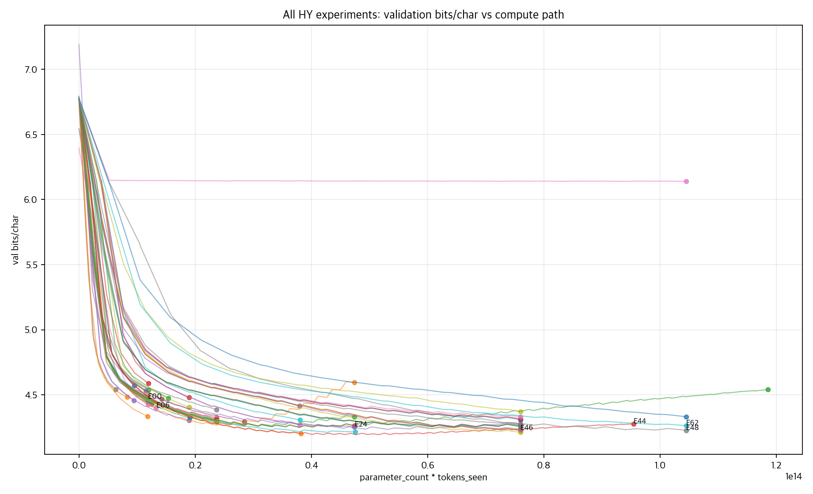

전체 HY 실험을 `compute_proxy_param_tokens -> val_bits_per_char` 경로로 다시 그리면, 단순 final loss 순위보다 더 조심스러운 결론이 나옵니다. 작은 설정에서 좋아 보이는 실험도 compute를 늘리면 gap이나 rebound가 커질 수 있고, 반대로 초반이 느린 설정도 장기 학습에서 best checkpoint는 더 좋아질 수 있습니다.

상위 `final_val_bits_per_char` 실험은 다음과 같습니다.

| experiment_id | changed_variable | changed_value | parameter_count | best_val_bits_per_char | final_val_bits_per_char | final_minus_best_val_loss | final_generalization_gap | compute_proxy_param_tokens |
| --- | --- | --- | --- | --- | --- | --- | --- | --- |
| E42 | tie_embeddings_epochs | weight_tying=True,epochs=20 | 2.378e+06 | 4.2018 | 4.2018 | 0.0000 | 0.6150 | 3.818e+13 |
| E49 | activation_seed | activation=gelu,seed=42 | 4.731e+06 | 4.2115 | 4.2115 | 0.0000 | 0.8246 | 7.597e+13 |
| E29 | stride | 64 | 2.954e+06 | 4.2119 | 4.2148 | 0.0034 | 0.8646 | 4.755e+13 |
| E46 | n_layers_norm_first | layers=8,norm_first=True | 4.731e+06 | 4.2266 | 4.2266 | 0.0000 | 0.7785 | 7.597e+13 |
| E52 | activation_seed | activation=gelu,seed=123 | 4.731e+06 | 4.2266 | 4.2266 | 0.0000 | 0.7785 | 7.597e+13 |
| E48 | n_layers_norm_first | layers=12,norm_first=True | 6.508e+06 | 4.2268 | 4.2268 | 0.0000 | 0.8618 | 1.045e+14 |
| E55 | activation_seed | activation=gelu,seed=2026 | 4.731e+06 | 4.2331 | 4.2331 | 0.0000 | 0.8366 | 7.597e+13 |
| E24 | drop_rate | 0.2000 | 2.954e+06 | 4.2511 | 4.2511 | 0.0000 | 0.7159 | 4.743e+13 |

rebound가 큰 실험은 다음과 같습니다. 이 실험들은 final checkpoint 기준 해석이 특히 위험합니다.

| experiment_id | changed_variable | changed_value | best_val_loss | final_val_loss | final_minus_best_val_loss | final_generalization_gap |
| --- | --- | --- | --- | --- | --- | --- |
| E21 | drop_rate | 0.0000 | 5.0645 | 5.4547 | 0.3902 | 2.0486 |
| E43 | tie_embeddings_epochs | weight_tying=False,epochs=50 | 5.0449 | 5.3906 | 0.3457 | 2.2735 |
| E44 | tie_embeddings_epochs | weight_tying=True,epochs=50 | 4.9777 | 5.0771 | 0.0994 | 1.4049 |
| E22 | drop_rate | 0.0500 | 5.0563 | 5.1431 | 0.0868 | 1.3351 |
| E45 | n_layers_norm_first | layers=8,norm_first=False | 5.0263 | 5.0774 | 0.0511 | 1.2575 |
| E23 | n_layers_norm_first | layers=4,norm_first= | 5.0449 | 5.0597 | 0.0149 | 1.0190 |
| E56 | activation_seed | activation=relu,seed=2026 | 5.0526 | 5.0623 | 0.0097 | 1.0506 |
| E50 | activation_seed | activation=relu,seed=42 | 5.0486 | 5.0559 | 0.0073 | 1.0570 |

이 표에서 중요한 점은 "상위 bits/char"와 "작은 rebound"가 항상 같은 실험을 가리키지 않는다는 것입니다. E42와 E49는 문자당 정보량이 좋지만, E43처럼 긴 학습에서 train loss만 크게 내려간 실험은 final checkpoint가 best보다 나빠집니다. 그래서 LLM 보고서에서는 "best", "final", "rebound", "gap"을 함께 적어야 합니다.

## 4. Context Length

질문: NSMC 리뷰 corpus에서 긴 문맥이 실제로 도움이 되는가?

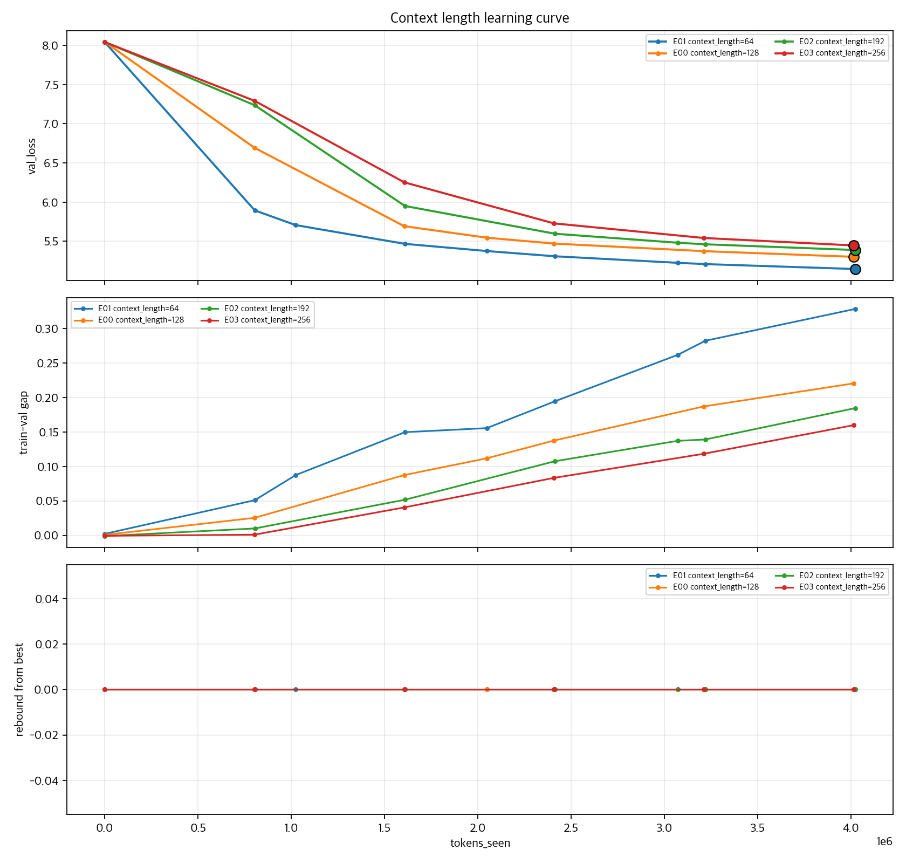

선형적으로 읽는 순서:

1. E01, E00, E02, E03의 validation curve가 초반부터 어떤 순서로 내려가는지 본다.
2. `context_length=64`가 best까지 가장 낮게 가는지 확인한다.
3. 긴 context에서 gap이 작아지는지, 아니면 loss만 나빠지는지 본다.
4. throughput 숫자는 보조로만 본다. context가 길어져도 품질이 나빠지면 primary 결론은 품질 쪽이다.

| experiment_id | context_length | best_val_loss | final_val_loss | final_val_bits_per_char | final_generalization_gap | tokens_per_sec_after_warmup |
| --- | --- | --- | --- | --- | --- | --- |
| E01 | 64 | 5.1461 | 5.1461 | 4.3344 | 0.3287 | 102490.0000 |
| E00 | 128 | 5.3020 | 5.3020 | 4.4658 | 0.2205 | 195309.0000 |
| E02 | 192 | 5.3886 | 5.3886 | 4.5388 | 0.1847 | 288414.0000 |
| E03 | 256 | 5.4470 | 5.4470 | 4.5879 | 0.1599 | 340329.0000 |

해석: 이 데이터에서는 `context_length=64`가 가장 낮은 validation curve를 보입니다. 긴 context는 더 많은 위치/attention 비용을 쓰지만, 짧은 영화 리뷰 corpus에서는 그만큼의 장거리 문맥 이득이 작습니다. `context_length=192/256`은 더 빠른 throughput처럼 보이는 구간도 있지만, 품질 곡선은 baseline보다 좋지 않습니다.

결론 라벨: `confirmed`, 단 현재 corpus 길이 분포에 한정

## 5. Vocab Size

질문: vocab이 커질수록 LM 품질이 좋아지는가, 아니면 token loss scale만 바뀌는가?

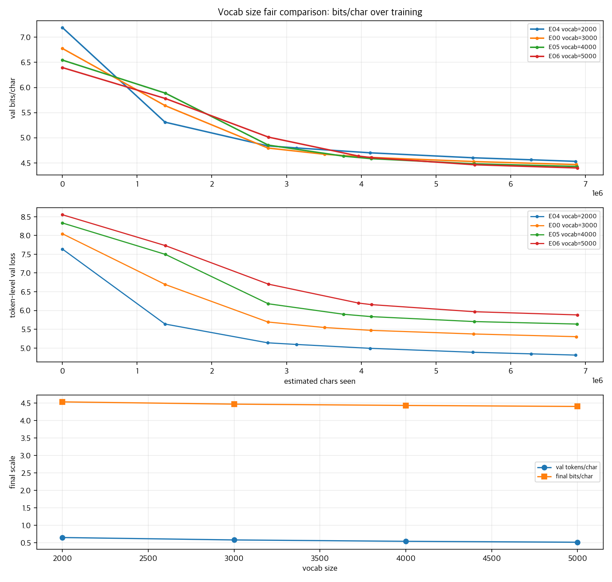

vocab 실험은 token-level `final_val_loss`로 직접 비교하면 안 됩니다. vocab이 커지면 같은 문장을 더 적은 token으로 표현하므로 cross entropy의 단위가 바뀝니다. 따라서 primary metric은 `final_val_bits_per_char`입니다.

선형적으로 읽는 순서:

1. 위 패널에서 `estimated_chars_seen -> val_bits_per_char`를 먼저 본다.
2. 중간 패널의 token-level `val_loss`는 참고만 한다. vocab이 바뀌면 loss scale이 바뀐다.
3. 아래 패널에서 `tokens/char`가 vocab 증가에 따라 어떻게 줄어드는지 본다.
4. 같은 raw text를 몇 token으로 압축했는지와, 그 압축이 bits/char를 낮췄는지를 함께 본다.

| experiment_id | vocab_size | parameter_count | val_tokens_per_char | val_chars_per_token | final_val_loss | final_val_bits_per_char | tokens_per_sec_after_warmup |
| --- | --- | --- | --- | --- | --- | --- | --- |
| E04 | 2000 | 2.570e+06 | 0.6527 | 1.5322 | 4.8114 | 4.5304 | 195012.0000 |
| E00 | 3000 | 2.954e+06 | 0.5838 | 1.7128 | 5.3020 | 4.4658 | 195309.0000 |
| E05 | 4000 | 3.338e+06 | 0.5444 | 1.8369 | 5.6384 | 4.4285 | 195553.0000 |
| E06 | 5000 | 3.722e+06 | 0.5184 | 1.9292 | 5.8825 | 4.3991 | 188826.0000 |

- token loss만 보면 E04, vocab 2000이 좋아 보입니다.
- 문자당 정보량인 `bits/char`로 보면 E06, vocab 5000이 가장 낮습니다.
- 즉 원본식으로 "vocab 2000이 best"라고 말하면 LLM 지표 기준에서는 틀립니다.
- 다만 vocab 5000은 parameter_count와 LM head 비용이 커지므로 결론은 `confirmed`가 아니라 `trade-off`입니다.

결론 라벨: `trade-off`

## 6. Embedding Dimension

질문: embedding 폭을 키우면 표현력이 좋아지는가, 아니면 작은 corpus에서 비용만 늘어나는가?

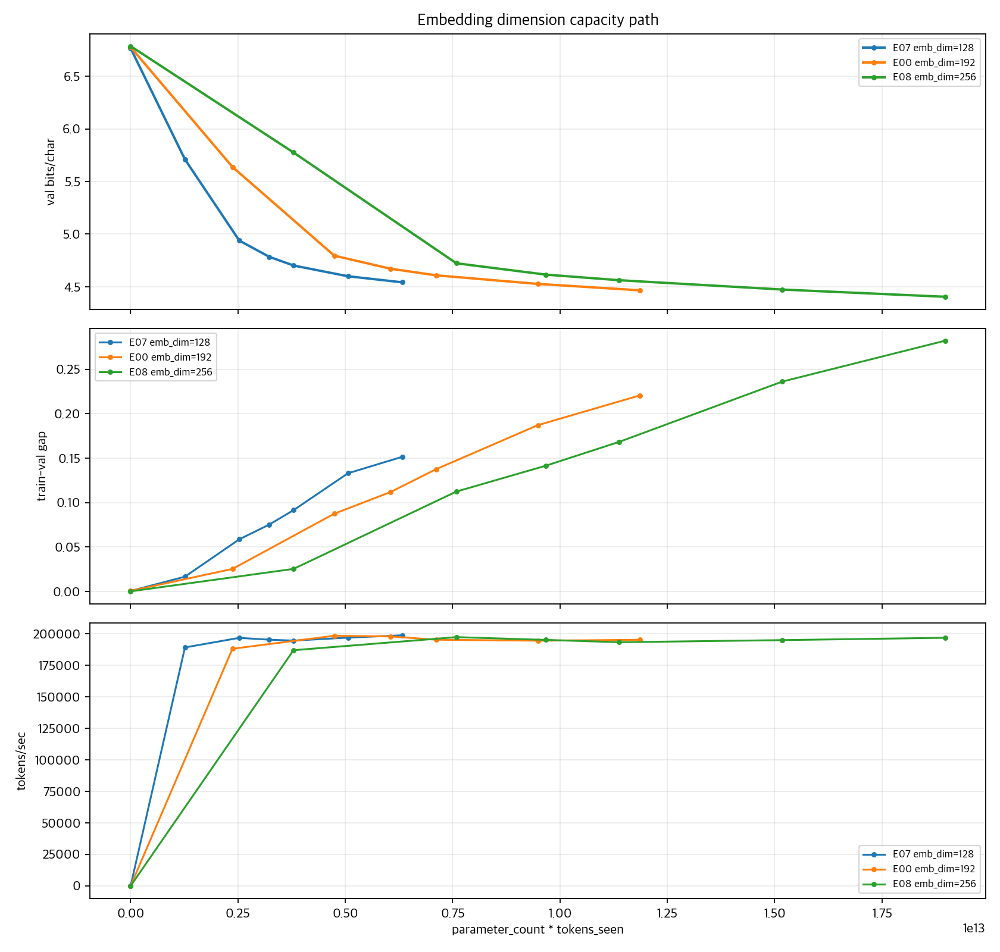

선형적으로 읽는 순서:

1. x축을 `compute_proxy_param_tokens`로 둔다.
2. E07, E00, E08의 경로가 compute를 더 쓸수록 bits/char를 얼마나 낮추는지 본다.
3. 같은 그래프에서 gap이 함께 커지는지 본다.
4. 개선량이 parameter 증가를 정당화하는지 판단한다.

| experiment_id | emb_dim | parameter_count | best_val_bits_per_char | final_val_bits_per_char | final_generalization_gap | compute_proxy_param_tokens |
| --- | --- | --- | --- | --- | --- | --- |
| E07 | 128 | 1.576e+06 | 4.5417 | 4.5417 | 0.1515 | 6.327e+12 |
| E00 | 192 | 2.954e+06 | 4.4658 | 4.4658 | 0.2205 | 1.186e+13 |
| E08 | 256 | 4.725e+06 | 4.4044 | 4.4044 | 0.2821 | 1.897e+13 |

해석: `emb_dim=256`은 bits/char를 개선하지만 parameter와 compute가 크게 늘어납니다. 작은 corpus에서 무조건 폭을 키우는 결론이 아니라, 비용 대비 개선폭을 함께 보는 `trade-off`입니다.

결론 라벨: `trade-off`

## 7. 초기 5 Epoch 구조 탐색

원본 보고서에는 5 epoch 기준의 빠른 구조 탐색도 들어 있습니다. 이 실험들은 결론을 확정하기보다 후보를 걸러내는 용도로 봐야 합니다.

### 7.1 n_heads 5ep

| experiment_id | n_heads | best_val_loss | final_val_loss | final_val_bits_per_char | final_generalization_gap |
| --- | --- | --- | --- | --- | --- |
| E09 | 3 | 5.2885 | 5.2885 | 4.4544 | 0.2175 |
| E00 | 4 | 5.3020 | 5.3020 | 4.4658 | 0.2205 |
| E10 | 6 | 5.3026 | 5.3026 | 4.4663 | 0.2190 |

해석: E09, E00, E10의 5 epoch 결과는 차이가 작습니다. 그래서 원본 보고서가 다시 10 epoch n_heads sweep을 수행한 것은 타당합니다. 5 epoch만으로 head 수 결론을 내리면 안 됩니다.

### 7.2 n_layers 5ep

| experiment_id | n_layers | parameter_count | best_val_loss | final_val_loss | final_val_bits_per_char | tokens_per_sec_after_warmup |
| --- | --- | --- | --- | --- | --- | --- |
| E11 | 2 | 2.066e+06 | 5.3213 | 5.3213 | 4.4820 | 324063.0000 |
| E00 | 4 | 2.954e+06 | 5.3020 | 5.3020 | 4.4658 | 195309.0000 |
| E12 | 6 | 3.843e+06 | 5.3121 | 5.3121 | 4.4743 | 141418.0000 |
| E13 | 8 | 4.731e+06 | 5.3179 | 5.3179 | 4.4792 | 109846.0000 |

해석: 5 epoch에서는 4-layer baseline이 가장 균형적입니다. 하지만 이 결과만으로 "깊이를 늘리면 나쁘다"라고 말할 수 없습니다. 20 epoch와 norm 위치까지 함께 봐야 합니다.

### 7.3 FFN Multiplier 5ep

| experiment_id | ffn_mult | parameter_count | best_val_loss | final_val_loss | final_val_bits_per_char | compute_proxy_param_tokens |
| --- | --- | --- | --- | --- | --- | --- |
| E14 | 2 | 2.363e+06 | 5.2917 | 5.2917 | 4.4571 | 9.484e+12 |
| E00 | 4 | 2.954e+06 | 5.3020 | 5.3020 | 4.4658 | 1.186e+13 |
| E15 | 6 | 3.545e+06 | 5.3006 | 5.3006 | 4.4646 | 1.423e+13 |

해석: 5 epoch FFN 결과도 차이가 작습니다. 이 축은 10 epoch 재실험의 compute path를 더 신뢰해야 합니다.

## 8. n_heads 10 Epoch

질문: head 수를 늘리면 attention 관점이 늘어 성능이 좋아지는가, 아니면 head_dim이 줄어 손해인가?

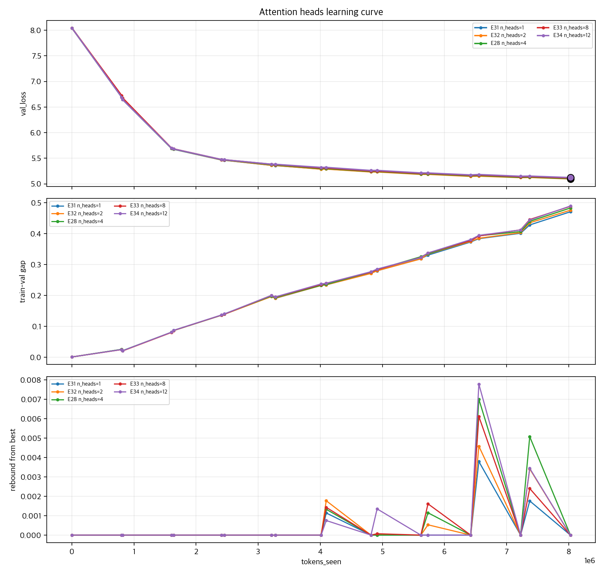

선형적으로 읽는 순서:

1. E31, E32, E28, E33, E34의 validation line을 같은 x축에서 본다.
2. 같은 `emb_dim=192`에서 `n_heads`가 커지면 `head_dim`은 줄어든다는 점을 같이 적는다.
3. curve 차이가 작으면 seed variance 없이 강한 결론을 피한다.

| experiment_id | n_heads | best_val_loss | final_val_loss | final_generalization_gap | tokens_per_sec_after_warmup |
| --- | --- | --- | --- | --- | --- |
| E31 | 1 | 5.1099 | 5.1099 | 0.4708 | 194619.0000 |
| E32 | 2 | 5.0971 | 5.0971 | 0.4759 | 207043.0000 |
| E28 | 4 | 5.1027 | 5.1027 | 0.4830 | 185263.0000 |
| E33 | 8 | 5.1133 | 5.1133 | 0.4884 | 189309.0000 |
| E34 | 12 | 5.1225 | 5.1225 | 0.4895 | 195292.0000 |

해석: E32의 2-head가 가장 낮지만 차이는 작습니다. 이 축은 "많은 head가 항상 좋다"가 아니라 "head 수와 head_dim의 trade-off"입니다.

결론 라벨: `inconclusive`, 후보는 `n_heads=2`

## 9. FFN Multiplier 10 Epoch

질문: FFN 내부 폭을 키우면 token별 비선형 변환 능력이 실제로 좋아지는가?

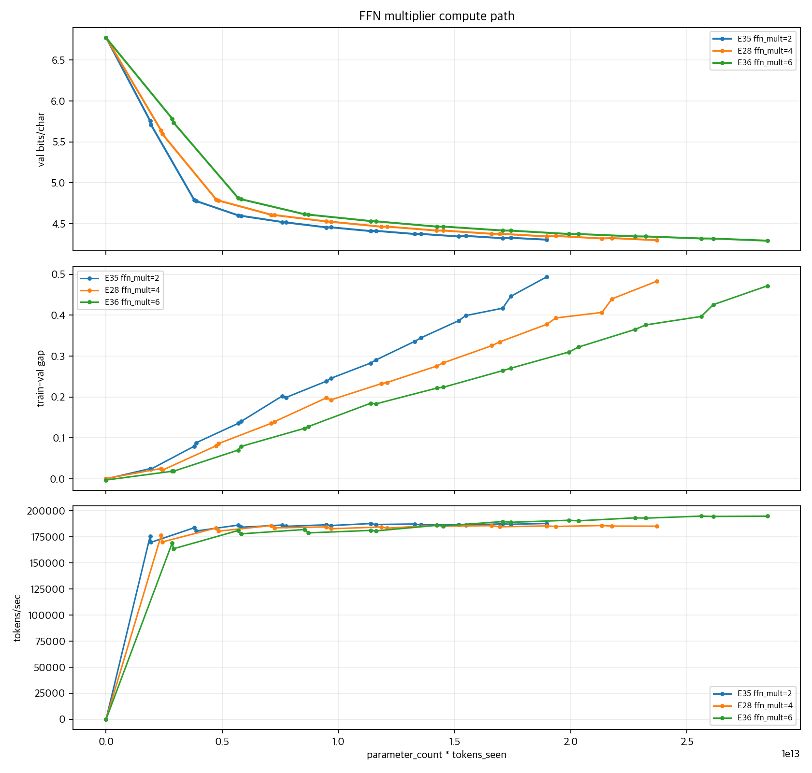

선형적으로 읽는 순서:

1. x축을 compute proxy로 둔다.
2. `ffn_mult=2,4,6`이 compute를 더 쓰면서 bits/char를 얼마나 낮추는지 본다.
3. 차이가 작으면 단일 seed 결과로 확정하지 않는다.

| experiment_id | ffn_mult | parameter_count | best_val_bits_per_char | final_val_bits_per_char | final_generalization_gap | compute_proxy_param_tokens |
| --- | --- | --- | --- | --- | --- | --- |
| E35 | 2 | 2.363e+06 | 4.3044 | 4.3044 | 0.4936 | 1.897e+13 |
| E28 | 4 | 2.954e+06 | 4.2979 | 4.2979 | 0.4830 | 2.372e+13 |
| E36 | 6 | 3.545e+06 | 4.2920 | 4.2920 | 0.4715 | 2.846e+13 |

해석: FFN을 키우면 최종 bits/char가 소폭 좋아지지만 차이는 작고 compute가 늘어납니다. seed 반복 없이는 강한 결론보다 `inconclusive/trade-off`가 맞습니다.

결론 라벨: `trade-off`

## 10. Depth와 Norm 안정성

질문은 "Pre-LN이 좋은가?"가 아니라 "깊이가 늘어날 때 Pre-LN이 안정성을 주는가?"입니다.

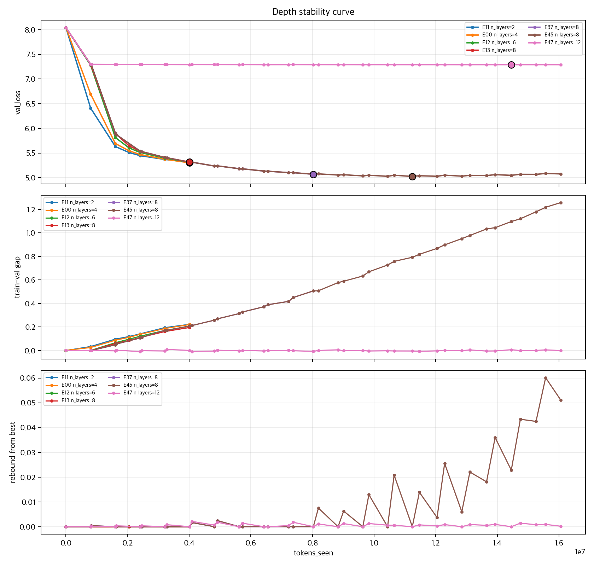

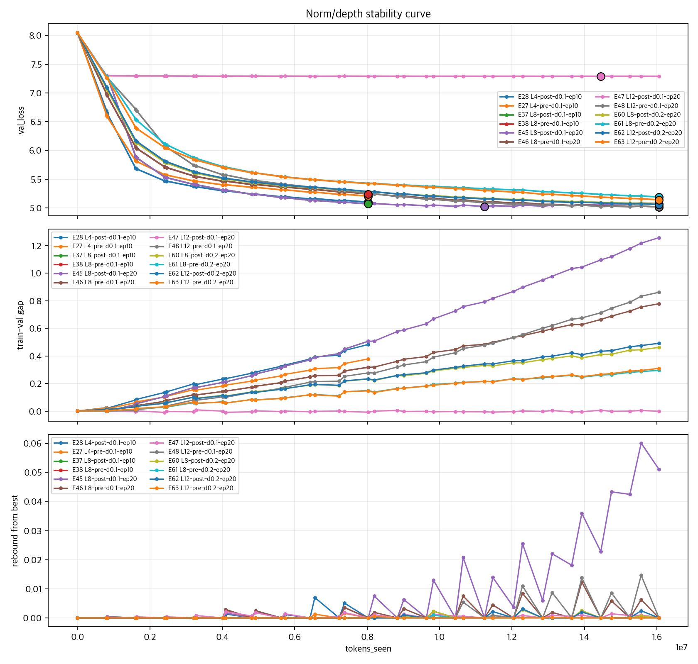

선형적으로 읽는 순서:

1. 먼저 4-layer post-LN baseline E28과 pre-LN E27을 비교한다.
2. 다음으로 8-layer post/pre E37/E38, E45/E46을 본다.
3. 마지막으로 12-layer post/pre E47/E48과 regularized E62/E63을 본다.
4. post-LN 12-layer가 실패하는지, pre-LN이 정상 수렴하는지, regularization으로 post-LN이 회복되는지 순서대로 판단한다.

10 epoch norm/depth:

| experiment_id | n_layers | norm_first | drop_rate | num_epochs | best_val_loss | final_val_loss | final_generalization_gap |
| --- | --- | --- | --- | --- | --- | --- | --- |
| E28 | 4 | False | 0.1000 | 10 | 5.1027 | 5.1027 | 0.4830 |
| E27 | 4 | True | 0.1000 | 10 | 5.2075 | 5.2075 | 0.3786 |
| E37 | 8 | False | 0.1000 | 10 | 5.0709 | 5.0709 | 0.5066 |
| E38 | 8 | True | 0.1000 | 10 | 5.2425 | 5.2425 | 0.3181 |

20 epoch 및 regularized 조건:

| experiment_id | n_layers | norm_first | drop_rate | num_epochs | best_val_loss | final_val_loss | final_minus_best_val_loss | final_generalization_gap |
| --- | --- | --- | --- | --- | --- | --- | --- | --- |
| E45 | 8 | False | 0.1000 | 20 | 5.0263 | 5.0774 | 0.0511 | 1.2575 |
| E46 | 8 | True | 0.1000 | 20 | 5.0180 | 5.0180 | 0.0000 | 0.7785 |
| E47 | 12 | False | 0.1000 | 20 | 7.2904 | 7.2906 | 0.0002 | -0.0005 |
| E48 | 12 | True | 0.1000 | 20 | 5.0183 | 5.0183 | 0.0000 | 0.8618 |
| E60 | 8 | False | 0.2000 | 20 | 5.0688 | 5.0688 | 0.0000 | 0.4620 |
| E61 | 8 | True | 0.2000 | 20 | 5.1915 | 5.1915 | 0.0000 | 0.2959 |
| E62 | 12 | False | 0.2000 | 20 | 5.0609 | 5.0609 | 0.0000 | 0.4918 |
| E63 | 12 | True | 0.2000 | 20 | 5.1425 | 5.1425 | 0.0000 | 0.3100 |

- 질문은 "Pre-LN이 좋은가?"가 아니라 "깊이가 늘어날 때 Pre-LN이 안정성을 주는가?"입니다.
- 12-layer post-LN E47은 loss 7대에 머물러 최적화 실패에 가깝습니다.
- 12-layer pre-LN E48은 정상적으로 수렴해 깊은 모델에서 Pre-LN의 안정성 근거가 됩니다.
- 하지만 E60~E63처럼 `drop_rate=0.2`, `lr=0.0002`로 안정화하면 post-LN도 회복됩니다.
- 따라서 결론은 "Pre-LN 절대 우위"가 아니라 "깊이 증가와 불안정 lr/dropout 조건에서 Pre-LN이 안정성 guardrail을 제공한다"입니다.

결론 라벨: `trade-off`

## 11. Dropout과 Epoch

질문: 오래 학습하면 validation도 계속 좋아지는가, 아니면 어느 시점부터 train만 좋아지는가?

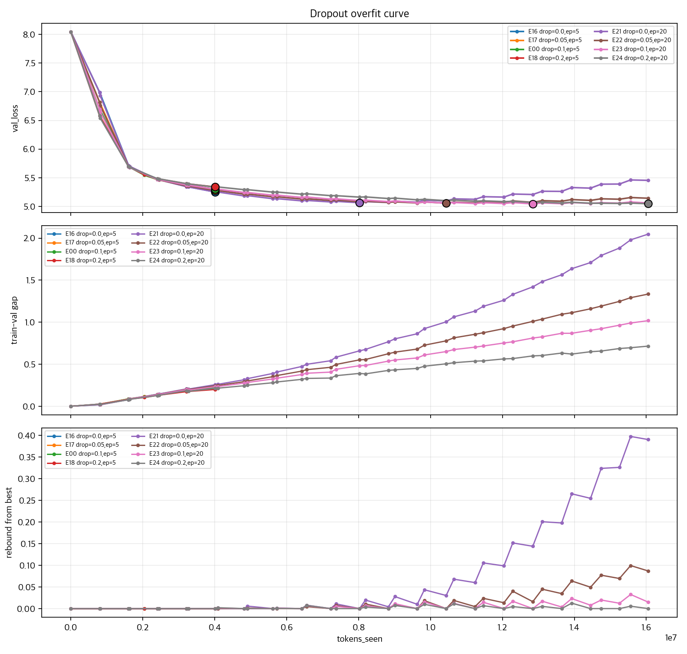

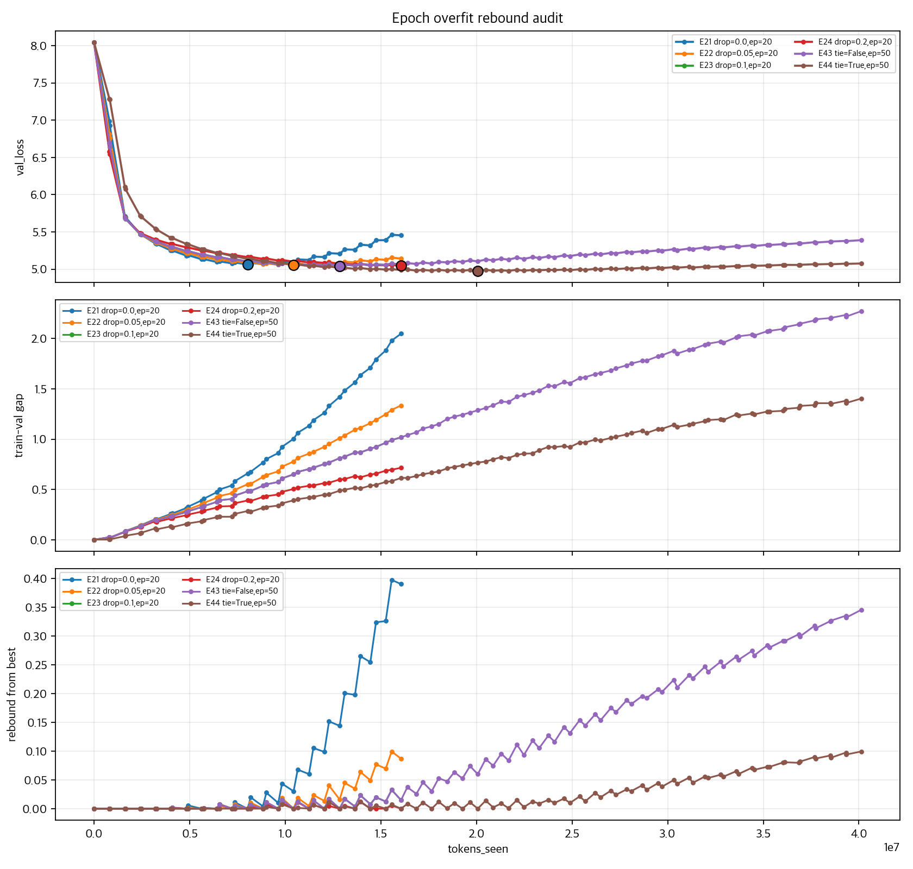

선형적으로 읽는 순서:

1. 5 epoch dropout에서는 final loss 차이가 작고, dropout이 학습 속도에 미치는 영향을 본다.
2. 20 epoch dropout에서는 `best_val_loss`, `final_val_loss`, `final_minus_best_val_loss`, `final_generalization_gap`을 본다.
3. train loss가 계속 내려가는 것은 정상으로 간주한다.
4. validation이 best 이후 올라가면 rebound로 표시한다.
5. gap이 커지면 작은 corpus에서 memorization 위험이 커진 것으로 해석한다.

5 epoch dropout:

| experiment_id | drop_rate | best_val_loss | final_val_loss | final_val_bits_per_char | final_generalization_gap |
| --- | --- | --- | --- | --- | --- |
| E16 | 0.0000 | 5.2524 | 5.2524 | 4.4240 | 0.2415 |
| E17 | 0.0500 | 5.2777 | 5.2777 | 4.4453 | 0.2302 |
| E00 | 0.1000 | 5.3020 | 5.3020 | 4.4658 | 0.2205 |
| E18 | 0.2000 | 5.3403 | 5.3403 | 4.4980 | 0.2001 |

20 epoch dropout:

| experiment_id | drop_rate | num_epochs | best_val_loss | final_val_loss | final_minus_best_val_loss | final_generalization_gap | gap_slope_last_quarter |
| --- | --- | --- | --- | --- | --- | --- | --- |
| E21 | 0.0000 | 20 | 5.0645 | 5.4547 | 0.3902 | 2.0486 | 0.0000 |
| E22 | 0.0500 | 20 | 5.0563 | 5.1431 | 0.0868 | 1.3351 | 0.0000 |
| E23 | 0.1000 | 20 | 5.0449 | 5.0597 | 0.0149 | 1.0190 | 0.0000 |
| E24 | 0.2000 | 20 | 5.0471 | 5.0471 | 0.0000 | 0.7159 | 0.0000 |

- E21 dropout 0.0은 20 epoch에서 final gap과 rebound가 큽니다.
- E24 dropout 0.2는 final이 best와 같고 gap도 가장 작아, 이번 corpus에서는 장기 학습 과적합 억제에 가장 유리합니다.
- "1500 epoch까지 과적합이 없었다"는 주장은 epoch 숫자만으로 비교할 수 없습니다. `tokens_seen`, `gap`, `rebound`, `generation repetition`이 같이 있어야 합니다.

결론 라벨: `confirmed`

## 12. QKV Bias

질문: attention projection에 bias를 넣는 것이 의미 있는 개선인가?

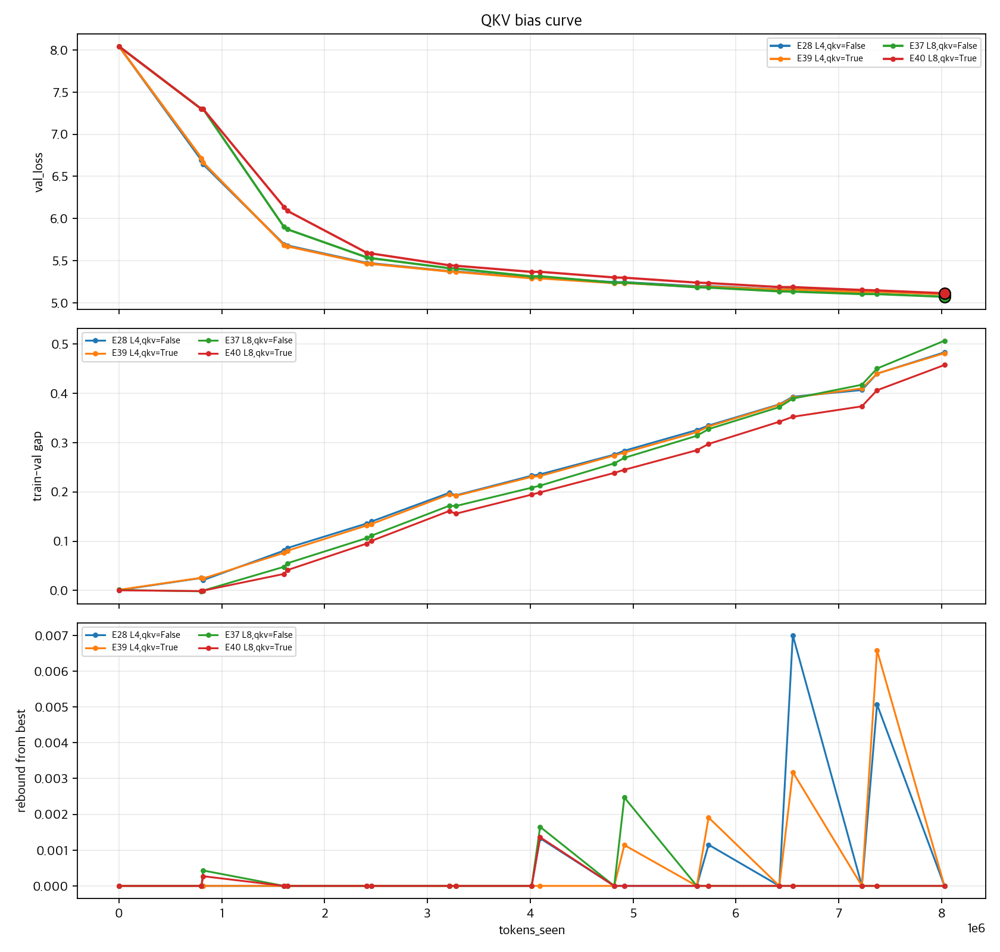

5 epoch qkv:

| experiment_id | n_layers | qkv_bias | best_val_loss | final_val_loss | final_generalization_gap |
| --- | --- | --- | --- | --- | --- |
| E00 | 4 | False | 5.3020 | 5.3020 | 0.2205 |
| E19 | 4 | True | 5.2957 | 5.2957 | 0.2138 |

10 epoch/depth qkv:

| experiment_id | n_layers | qkv_bias | best_val_loss | final_val_loss | final_generalization_gap |
| --- | --- | --- | --- | --- | --- |
| E28 | 4 | False | 5.1027 | 5.1027 | 0.4830 |
| E39 | 4 | True | 5.1017 | 5.1017 | 0.4813 |
| E37 | 8 | False | 5.0709 | 5.0709 | 0.5066 |
| E40 | 8 | True | 5.1130 | 5.1130 | 0.4573 |

해석: qkv bias는 4-layer에서는 미세하게 좋아 보이나 8-layer에서는 악화됩니다. 효과 크기가 작고 방향도 조건에 따라 달라져 `inconclusive`입니다.

결론 라벨: `inconclusive`

## 13. Weight Tying

질문: weight tying은 단기 수렴을 돕는가, 아니면 장기 일반화 regularization인가?

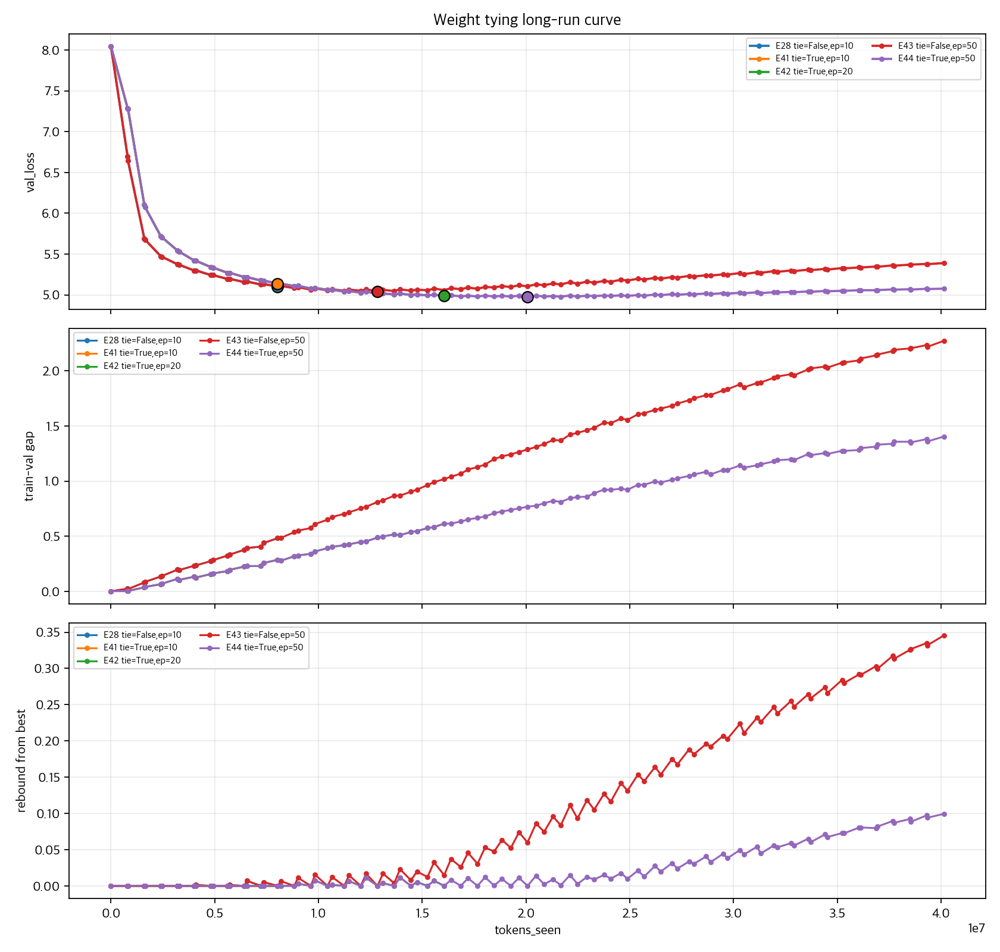

5 epoch weight tying:

| experiment_id | weight_tying | num_epochs | parameter_count | best_val_loss | final_val_loss | final_generalization_gap |
| --- | --- | --- | --- | --- | --- | --- |
| E00 | False | 5 | 2.954e+06 | 5.3020 | 5.3020 | 0.2205 |
| E20 | True | 5 | 2.378e+06 | 5.4273 | 5.4273 | 0.1179 |

10/20/50 epoch weight tying:

| experiment_id | weight_tying | num_epochs | parameter_count | best_val_loss | final_val_loss | final_minus_best_val_loss | final_generalization_gap |
| --- | --- | --- | --- | --- | --- | --- | --- |
| E28 | False | 10 | 2.954e+06 | 5.1027 | 5.1027 | 0.0000 | 0.4830 |
| E41 | True | 10 | 2.378e+06 | 5.1377 | 5.1377 | 0.0000 | 0.2865 |
| E42 | True | 20 | 2.378e+06 | 4.9886 | 4.9886 | 0.0000 | 0.6150 |
| E43 | False | 50 | 2.954e+06 | 5.0449 | 5.3906 | 0.3457 | 2.2735 |
| E44 | True | 50 | 2.378e+06 | 4.9777 | 5.0771 | 0.0994 | 1.4049 |

해석:

- weight tying은 5/10 epoch에서는 느리게 보일 수 있습니다.
- 장기 50 epoch에서는 E44가 E43보다 final loss, rebound, gap이 모두 낫습니다.
- 즉 weight tying은 단기 수렴 가속 옵션이 아니라 작은 corpus에서 parameter를 줄이고 장기 일반화를 안정화하는 regularization으로 해석하는 편이 맞습니다.

결론 라벨: `confirmed`

## 14. Activation과 Seed Variance

질문: GELU/ReLU/SiLU 차이는 seed variance를 넘어서는가?

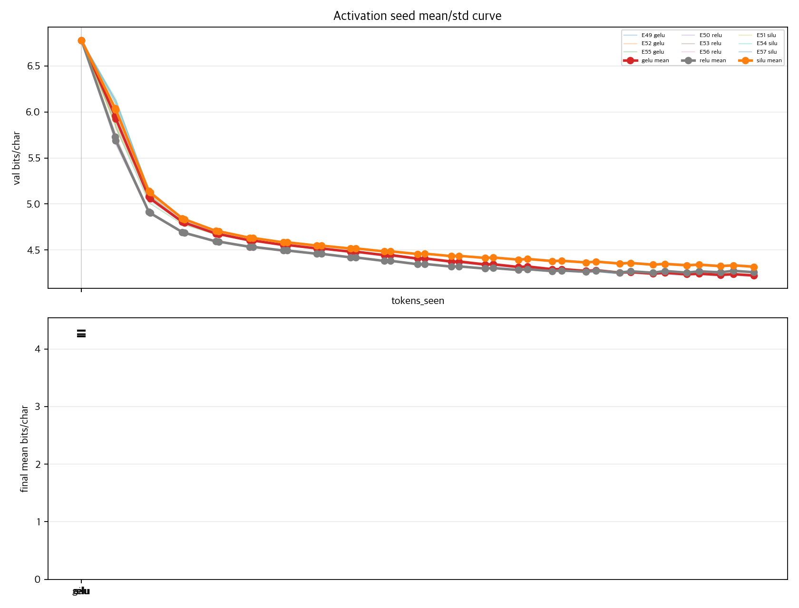

선형적으로 읽는 순서:

1. 개별 seed 선을 먼저 본다.
2. activation별 평균 선을 본다.
3. std band가 평균 차이보다 큰지 확인한다.
4. final뿐 아니라 best checkpoint도 함께 비교한다.

| activation | seed_count | mean_best_val_bits_per_char | std_best_val_bits_per_char | mean_final_val_bits_per_char | std_final_val_bits_per_char |
| --- | --- | --- | --- | --- | --- |
| gelu | 3 | 4.2237 | 0.0091 | 4.2237 | 0.0091 |
| relu | 3 | 4.2534 | 0.0017 | 4.2592 | 0.0036 |
| silu | 3 | 4.3181 | 0.0096 | 4.3181 | 0.0096 |

해석:

- activation은 seed 반복이 있으므로 평균과 표준편차로만 말해야 합니다.
- 평균 기준 GELU가 가장 낮고 ReLU가 그 다음, SiLU가 가장 높습니다.
- 단일 seed 결과만 보고 activation 순위를 말하면 안 됩니다.

결론 라벨: `confirmed`, 현재 depth8/pre-LN/20epoch 조건에 한정

## 15. Stride

질문: stride를 줄여 overlap을 늘린 것이 성능 개선인가, 아니면 같은 데이터를 더 자주 본 효과인가?

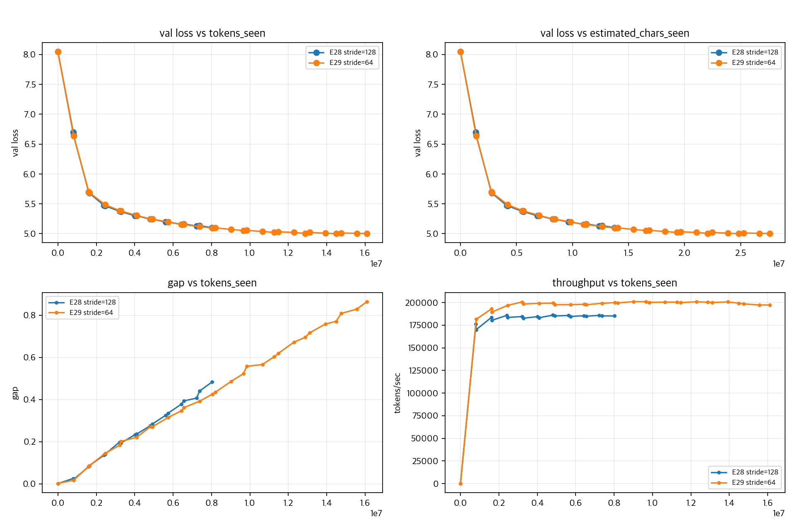

선형적으로 읽는 순서:

1. `tokens_seen -> val_loss`를 본다.
2. `estimated_chars_seen -> val_loss`를 다시 본다.
3. overlap으로 window 수가 늘어난 효과를 데이터 증가로 착각하지 않는다.
4. gap과 compute 증가를 함께 본다.

| experiment_id | stride | best_val_loss | final_val_loss | final_generalization_gap | final_tokens_seen | compute_proxy_param_tokens |
| --- | --- | --- | --- | --- | --- | --- |
| E28 | 128 | 5.1027 | 5.1027 | 0.4830 | 8.028e+06 | 2.372e+13 |
| E29 | 64 | 5.0006 | 5.0041 | 0.8646 | 1.610e+07 | 4.755e+13 |

해석:

- stride 64는 validation loss를 낮추지만, overlap으로 학습 window 수가 늘어난 효과가 섞여 있습니다.
- 따라서 "데이터가 늘었다"가 아니라 "같은 raw corpus를 더 촘촘히 반복해서 봤다"로 해석해야 합니다.
- `tokens_seen`와 `estimated_chars_seen` 기준 그래프를 같이 봐야 착시를 줄일 수 있습니다.

결론 라벨: `trade-off`

## 16. Epoch 단위 실험 기준

이번 로그를 기준으로 epoch 실험은 다음 단위가 적절합니다.

| 목적 | epoch 단위 | 판단 지표 |
| --- | ---: | --- |
| 빠른 후보 제거 | 5 | final/best val loss, throughput |
| 구조 재검증 | 10 | full learning curve, gap |
| 과적합/dropout/norm | 20 | best-final rebound, gap slope |
| 장기 일반화/weight tying | 50 | final-minus-best, generation repetition 필요 |

epoch를 더 길게 늘릴 때는 단순히 train loss가 내려가는지 보지 않습니다. validation best가 언제 찍혔는지, 이후 얼마나 되올랐는지, gap이 얼마나 커졌는지를 먼저 봐야 합니다. 1500 epoch 같은 긴 실험은 `epoch`보다 `tokens_seen`과 `compute_proxy` 기준으로 다시 정렬해야 옆 팀 결과와 공정하게 비교할 수 있습니다.

## 17. 최종 결론

1. vocab 실험은 원본 결론을 바꿔야 합니다. token loss 기준 best는 vocab 2000이지만, LLM식 공정 지표인 bits/char 기준 best는 vocab 5000입니다.
2. 작은 corpus에서 epoch를 늘리면 train loss는 계속 내려가지만, dropout이 낮은 조건은 gap과 rebound가 커집니다.
3. Pre-LN은 "항상 성능이 좋다"가 아니라 깊이가 늘거나 post-LN이 불안정한 조건에서 안정성을 주는 옵션입니다.
4. weight tying은 단기 성능 옵션보다 장기 일반화 regularization으로 해석하는 것이 맞습니다.
5. activation, qkv_bias처럼 차이가 작은 축은 seed variance 또는 조건 interaction을 함께 봐야 합니다.
6. 앞으로 추가 실험은 final loss 표가 아니라 `history.jsonl`과 sequential graph를 먼저 남겨야 합니다.

## 18. 다음 실험으로 넘어가기 전 체크리스트

- vocab 실험은 반드시 tokenizer profile, `tokens/char`, `bits/char`를 같이 기록한다.
- epoch 실험은 final loss 하나가 아니라 best/final/rebound/gap을 기록한다.
- seed 고정은 기본이고, 최종 주장으로 쓸 축은 seed 반복을 추가한다.
- activation, qkv_bias처럼 효과가 작은 축은 단일 seed 결론을 쓰지 않는다.
- 깊이 실험은 norm 위치, lr, dropout을 같이 묶어 봐야 한다.
- 모든 새 실험은 `history.jsonl`과 sequential graph가 생성되지 않으면 REPORT에 쓰지 않는다.
