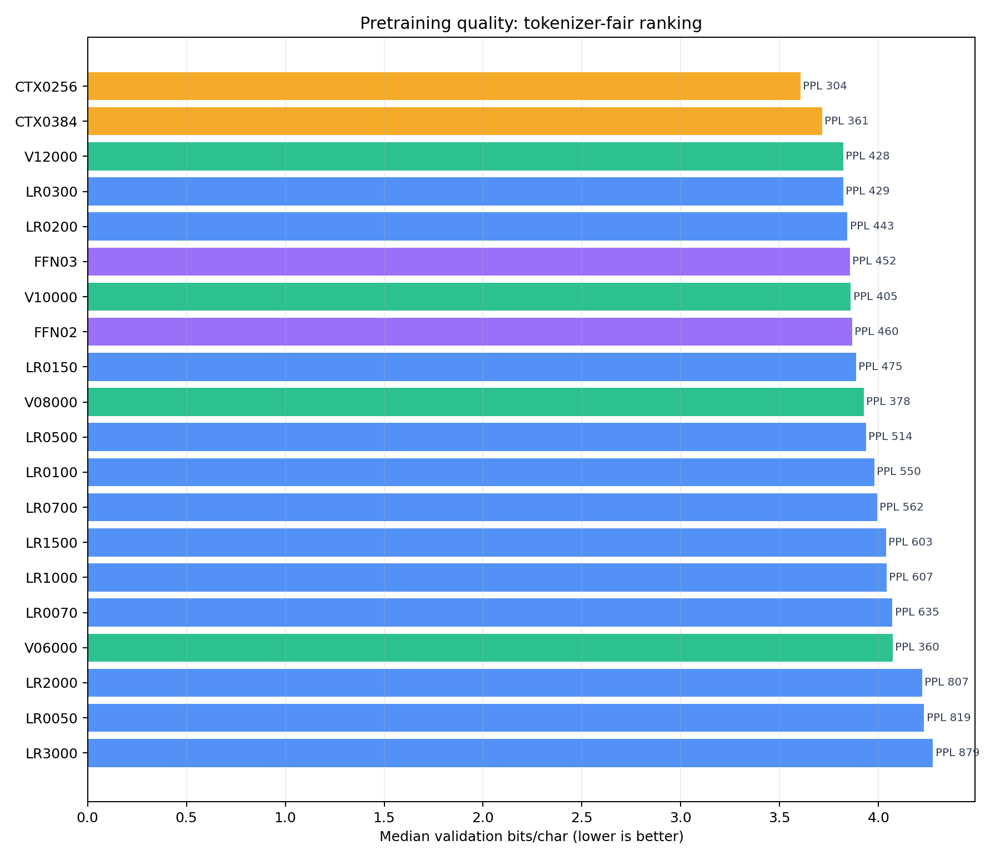
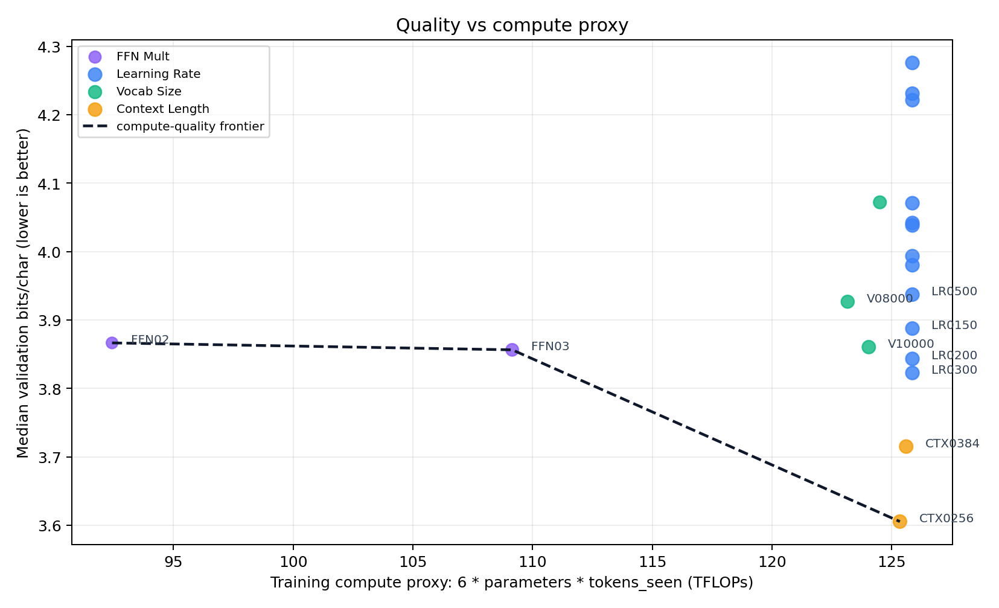
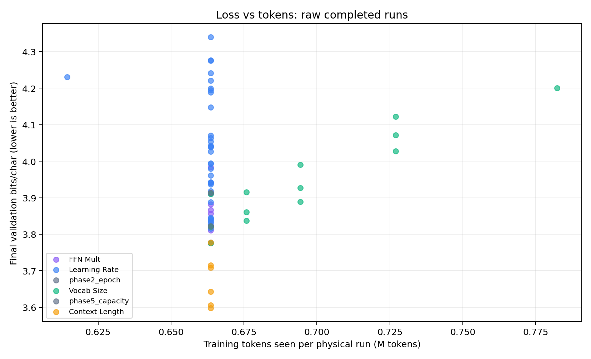
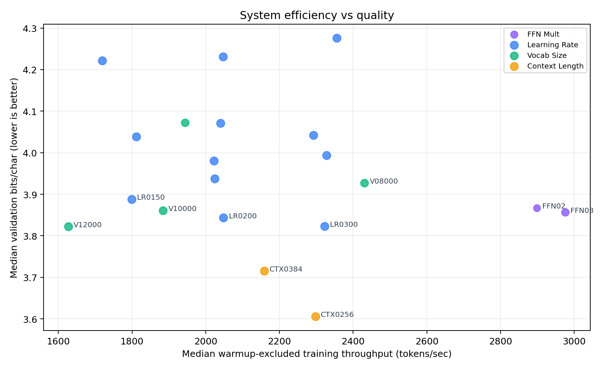

# LLM 10x 중간 보고서 - LLM 개발자 지표 기준

- generated_at_utc: `2026-06-03T16:07:25+00:00`
- completed_physical_runs: `66` / `354`
- pending_physical_runs: `288`
- screen_ready_conditions: `20`
- claim_ready_conditions: `0`
- result_ledger_status: `PASS`
- all_results_jsonl: `/Users/woonyong/workspace/Krafton-Jungle/SW_AI-W13-gpt/docs/llm_10x/all_run_results.jsonl`
- queue_last_recorded: `run_0111` / `M031` / `training` / `75/324` updates

## 요약

이번 개정판은 단순 학습 로그 시각화가 아니라 LLM 실험에서 보통 분리해서 보는 `pretraining quality`, `tokenizer comparability`, `scaling/compute efficiency`, `system efficiency`, `unmeasured benchmark/safety gaps` 순서로 결과를 다시 정리했습니다.
- 현재 screen-ready 품질 1위는 `CTX0256`이며 validation bits/char 중앙값은 `3.60530`, validation perplexity 중앙값은 `303.8`입니다.
- compute proxy까지 같이 보면 현재 비용 효율 후보는 `FFN02`입니다. 품질-계산량 곱 기준으로 가장 낮고, 추정 학습 compute는 `92.4` TFLOPs입니다.
- `claim-ready=0`이므로 이 문서는 최종 주장용이 아니라, 지금까지의 결과로 다음 반복/보강 순서를 정하는 중간 의사결정 문서입니다.

## 지표 체계

| 영역 | 현재 보고서에서 보는 지표 | 현재 상태 | 해석 |
| --- | --- | --- | --- |
| Pretraining 품질 | validation loss, perplexity, bits/token, bits/char | 사용 가능 | loss가 낮을수록 좋지만 tokenizer가 다르면 bits/char를 우선 비교 |
| Tokenizer 공정성 | chars/token, bits/char, tail vocab type, top-token mass | 사용 가능 | token loss만 비교하면 vocab size가 다른 조건에서 불공정할 수 있음 |
| Scaling/compute | parameter_count, tokens_seen, FLOPs proxy = 6*N*T, loss-vs-compute | 근사 가능 | 실제 MFU는 없지만 조건 간 계산량 proxy 비교는 가능 |
| 시스템 비용 | warmup-excluded tokens/sec, elapsed time, seconds/epoch | 사용 가능 | 같은 품질이면 더 빠른 조건이 우선 후보 |
| Downstream benchmark | MMLU, BIG-bench, GSM8K, HumanEval | 없음 | 현재는 사전학습 소형 LM 탐색이라 태스크 성능 결론 불가 |
| Chat/instruction | pairwise win rate, LLM judge, MT-Bench류 | 없음 | instruction tuning과 평가셋이 없어 사용자 선호 결론 불가 |
| Safety/holistic | toxicity, robustness, calibration, fairness | 없음 | 별도 HELM류 harness가 필요 |
| Sample quality | next-token/sample inspection | 현재 불가 | 큐가 `--no-checkpoints`로 실행되어 완료 run의 모델 가중치가 없음 |

## 데이터셋과 비교 가능성

`obsidian_llm_10x`는 `1,601`개 문서와 `4,828`개 chunk에서 만든 LM 데이터셋입니다. train은 `14,898,445` 문자, validation은 `1,321,972` 문자입니다.
- LM 파일 문자 수는 기존 NSMC 파일 대비 약 `10.81배`입니다.
- train 문자 구성은 한글 `6.28%`, ASCII `74.80%`입니다. 따라서 현재 결론은 한글 전용 tokenizer 결론이 아니라 영어/코드/LLM 자료가 많은 혼합 corpus 결론입니다.

## 핵심 Figures

### Figure 1. Pretraining 품질 순위

bits/char 기준으로 tokenizer 차이를 보정한 품질 순위입니다. 막대 옆 PPL은 같은 tokenization 조건 안에서 직관을 돕는 보조 지표입니다.

### Figure 2. Loss vs Compute

6*N*T FLOPs proxy와 validation bits/char를 같이 봅니다. 점선은 현재 screen-ready 조건의 compute-quality frontier입니다.

### Figure 3. Loss vs Tokens

개별 physical run의 tokens_seen과 validation bits/char를 봅니다. 대부분 0.1 epoch라 x축이 좁지만, 300-step/324-step 차이와 축별 품질 분산을 확인할 수 있습니다.

### Figure 4. Throughput vs Quality

warmup 제외 tokens/sec와 validation bits/char를 같이 봅니다. 같은 품질이면 오른쪽 아래 조건이 더 좋습니다.

### Figure 5. Tokenizer 공정성

vocab size별 chars/token 압축 이득과 low-frequency tail type 비용을 동시에 보여줍니다.

## Pretraining 품질 순위

여기서는 `validation bits/char`를 1차 순위 기준으로 둡니다. `validation loss`와 `perplexity`는 token 단위 지표라 같은 tokenizer 안에서는 유용하지만, vocab size 비교에서는 bits/char가 더 공정합니다.

| 순위 | 조건 | 축 | 값 | n | val loss nats/token | val PPL | val bits/token | val bits/char | params(M) | tokens seen(M) | FLOPs proxy(T) | warm tok/s |
| ---: | --- | --- | ---: | ---: | ---: | ---: | ---: | ---: | ---: | ---: | ---: | ---: |
| 1 | CTX0256 | Context Length | 256 | 3 | 5.7163 | 303.8 | 8.2469 | 3.60530 | 31.5 | 0.664 | 125.3 | 2298 |
| 2 | CTX0384 | Context Length | 384 | 3 | 5.8902 | 361.5 | 8.4977 | 3.71494 | 31.5 | 0.664 | 125.6 | 2159 |
| 3 | V12000 | Vocab Size | 12000 | 3 | 6.0597 | 428.2 | 8.7423 | 3.82184 | 31.6 | 0.664 | 125.9 | 1628 |
| 4 | LR0300 | Learning Rate | 0.0003 | 3 | 6.0607 | 428.7 | 8.7438 | 3.82250 | 31.6 | 0.664 | 125.9 | 2323 |
| 5 | LR0200 | Learning Rate | 0.0002 | 3 | 6.0934 | 442.9 | 8.7909 | 3.84309 | 31.6 | 0.664 | 125.9 | 2048 |
| 6 | FFN03 | FFN Mult | 3 | 3 | 6.1143 | 452.3 | 8.8211 | 3.85629 | 27.4 | 0.664 | 109.1 | 2976 |
| 7 | V10000 | Vocab Size | 10000 | 3 | 6.0033 | 404.8 | 8.6609 | 3.86029 | 30.6 | 0.676 | 124.0 | 1885 |
| 8 | FFN02 | FFN Mult | 2 | 3 | 6.1304 | 459.6 | 8.8442 | 3.86642 | 23.2 | 0.664 | 92.4 | 2899 |
| 9 | LR0150 | Learning Rate | 0.00015 | 3 | 6.1636 | 475.2 | 8.8922 | 3.88740 | 31.6 | 0.664 | 125.9 | 1800 |
| 10 | V08000 | Vocab Size | 8000 | 3 | 5.9337 | 377.6 | 8.5606 | 3.92661 | 29.6 | 0.694 | 123.2 | 2431 |
| 11 | LR0500 | Learning Rate | 0.0005 | 3 | 6.2423 | 514.1 | 9.0058 | 3.93704 | 31.6 | 0.664 | 125.9 | 2025 |
| 12 | LR0100 | Learning Rate | 0.0001 | 3 | 6.3104 | 550.3 | 9.1040 | 3.97997 | 31.6 | 0.664 | 125.9 | 2023 |
| 13 | LR0700 | Learning Rate | 0.0007 | 3 | 6.3314 | 561.9 | 9.1342 | 3.99320 | 31.6 | 0.664 | 125.9 | 2328 |
| 14 | LR1500 | Learning Rate | 0.0015 | 3 | 6.4026 | 603.4 | 9.2369 | 4.03809 | 31.6 | 0.664 | 125.9 | 1812 |
| 15 | LR1000 | Learning Rate | 0.001 | 3 | 6.4082 | 606.8 | 9.2451 | 4.04166 | 31.6 | 0.664 | 125.9 | 2293 |
| 16 | LR0070 | Learning Rate | 7e-05 | 3 | 6.4541 | 635.3 | 9.3113 | 4.07058 | 31.6 | 0.664 | 125.9 | 2041 |
| 17 | V06000 | Vocab Size | 6000 | 3 | 5.8858 | 359.9 | 8.4915 | 4.07186 | 28.5 | 0.727 | 124.5 | 1944 |
| 18 | LR2000 | Learning Rate | 0.002 | 3 | 6.6929 | 806.6 | 9.6558 | 4.22121 | 31.6 | 0.664 | 125.9 | 1720 |
| 19 | LR0050 | Learning Rate | 5e-05 | 3 | 6.7079 | 818.8 | 9.6774 | 4.23066 | 31.6 | 0.664 | 125.9 | 2048 |
| 20 | LR3000 | Learning Rate | 0.003 | 3 | 6.7791 | 879.3 | 9.7802 | 4.27561 | 31.6 | 0.664 | 125.9 | 2356 |

## Scaling / Compute 해석

현재 모든 run은 대체로 `epoch_cap_per_run=0.1`이라 학습 토큰 수가 비슷합니다. 따라서 scaling law를 본격 피팅하기에는 아직 부족하고, 지금은 `동일 예산 근처에서 어떤 조건이 더 좋은가`를 보는 단계입니다.

현재 compute-quality frontier 조건:
- `FFN02`: `3.86642` bits/char, `92.4` TFLOPs proxy, `23.2`M params
- `FFN03`: `3.85629` bits/char, `109.1` TFLOPs proxy, `27.4`M params
- `CTX0256`: `3.60530` bits/char, `125.3` TFLOPs proxy, `31.5`M params

## 축별 결론

### Learning Rate

- 품질 1위: `LR0300` (learning_rate=0.0003), `3.82250` bits/char.
- 비용 효율 1위: `LR0300`, `125.9` TFLOPs proxy.
- warmup 제외 처리량 1위: `LR3000`, `2356` tok/s.
- 현재 screen-ready 범위: `5e-05`부터 `0.003`까지, `12` 조건.
- 해석: 지금까지는 `2e-4`-`3e-4`가 좋은 구간입니다. `3e-4`는 품질이 좋지만 LR3000 계열은 최근 run에서 PPL/bit가 흔들려, 상위 후보 반복 보강이 필요합니다.

### Vocab Size

- 품질 1위: `V12000` (vocab_size=12000), `3.82184` bits/char.
- 비용 효율 1위: `V10000`, `124.0` TFLOPs proxy.
- warmup 제외 처리량 1위: `V08000`, `2431` tok/s.
- 현재 screen-ready 범위: `6000`부터 `12000`까지, `4` 조건.
- 해석: V10000은 bits/char가 좋아 유망하지만, vocab 확대가 low-frequency tail type을 같이 늘립니다. token loss보다 bits/char와 tail 진단을 같이 봐야 합니다.

### Context Length

- 품질 1위: `CTX0256` (context_length=256), `3.60530` bits/char.
- 비용 효율 1위: `CTX0256`, `125.3` TFLOPs proxy.
- warmup 제외 처리량 1위: `CTX0256`, `2298` tok/s.
- 현재 screen-ready 범위: `256`부터 `384`까지, `2` 조건.
- 해석: 0.1 epoch 예산에서는 짧은 context가 더 좋습니다. 긴 context가 나쁜 것이 아니라 제한된 update 수에서 short context가 더 데이터 효율적으로 보이는 신호입니다.

### FFN Mult

- 품질 1위: `FFN03` (ffn_mult=3), `3.85629` bits/char.
- 비용 효율 1위: `FFN02`, `92.4` TFLOPs proxy.
- warmup 제외 처리량 1위: `FFN03`, `2976` tok/s.
- 현재 screen-ready 범위: `2`부터 `3`까지, `2` 조건.
- 해석: FFN2/3은 parameter_count가 낮아 비용 효율 후보입니다. 기본 FFN4와 큰 FFN 조건이 screen-ready가 되기 전까지는 최종 모델 크기 결론을 보류해야 합니다.

## Tokenizer 공정성 진단

| vocab | train token | val token | val chars/token | train 20회 이하 type | merge 20회 이하 type | top1 | top10 | top100 | 한글 token 비중 |
| ---: | ---: | ---: | ---: | ---: | ---: | ---: | ---: | ---: | ---: |
| 4,000 | 7,822,591 | 684,512 | 1.931 | 148 | 60 | 2.77% | 13.97% | 46.99% | 7.03% |
| 6,000 | 7,252,032 | 633,917 | 2.085 | 228 | 139 | 2.99% | 14.97% | 43.38% | 7.31% |
| 8,000 | 6,936,122 | 606,369 | 2.180 | 370 | 281 | 3.12% | 15.62% | 41.77% | 7.19% |
| 10,000 | 6,752,961 | 589,219 | 2.244 | 592 | 503 | 3.20% | 16.01% | 41.67% | 7.02% |
| 12,000 | 6,633,675 | 577,924 | 2.287 | 1,010 | 920 | 3.26% | 16.28% | 41.66% | 6.94% |

`V6000 -> V10000`에서 train token은 약 `6.88%` 줄지만, train 20회 이하 type은 `228`개에서 `592`개로 늘어납니다. 즉 압축 이득과 tail 학습 부족 위험이 동시에 있습니다.

## 아직 이 보고서가 말하지 못하는 것

- MMLU/BIG-bench/GSM8K/HumanEval류 downstream 정확도: 평가 harness와 task prompt가 아직 없습니다.
- Chat/instruction following: instruction tuning이 없고 pairwise judge 또는 사람 평가가 없습니다.
- Safety/robustness/fairness/toxicity: 별도 평가셋과 rubric이 없습니다.
- Next-token sample quality: 현재 완료 run들이 `--no-checkpoints`라 모델 가중치를 보존하지 않아 생성 샘플을 만들 수 없습니다.
- MFU와 실제 비용: GPU/MPS 저수준 FLOPs utilization과 전력/금액 로그가 없어 `6*N*T` proxy만 사용했습니다.

## 다음 실행 제안

1. 현재 상위 후보를 `n=10` 반복으로 보강해 claim-ready 조건을 먼저 만듭니다.
2. 상위 후보 2-3개는 queue 실행 시 `--with-checkpoints`를 켜거나, 단일 `run_next`를 `--no-checkpoints` 없이 돌려 next-token sample quality를 붙입니다.
3. tokenizer 비교는 token loss가 아니라 bits/char, chars/token, tail type, top-token mass를 함께 유지합니다.
4. downstream 평가는 지금 queue와 분리해서 작은 eval harness로 시작합니다. 이 프로젝트 규모에서는 MMLU 전체보다 domain-relevant cloze/QA와 짧은 next-token qualitative set이 먼저 현실적입니다.
