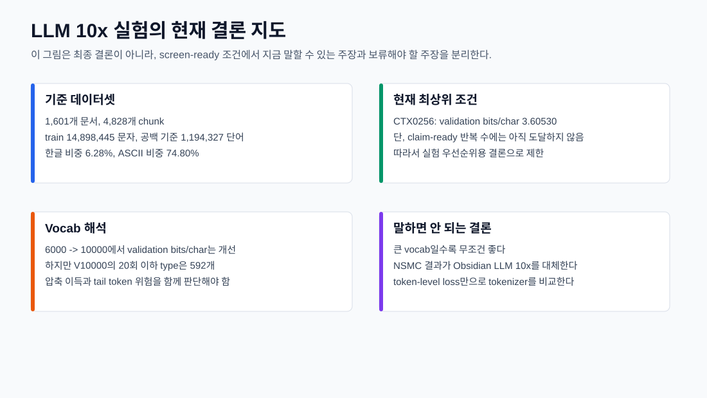
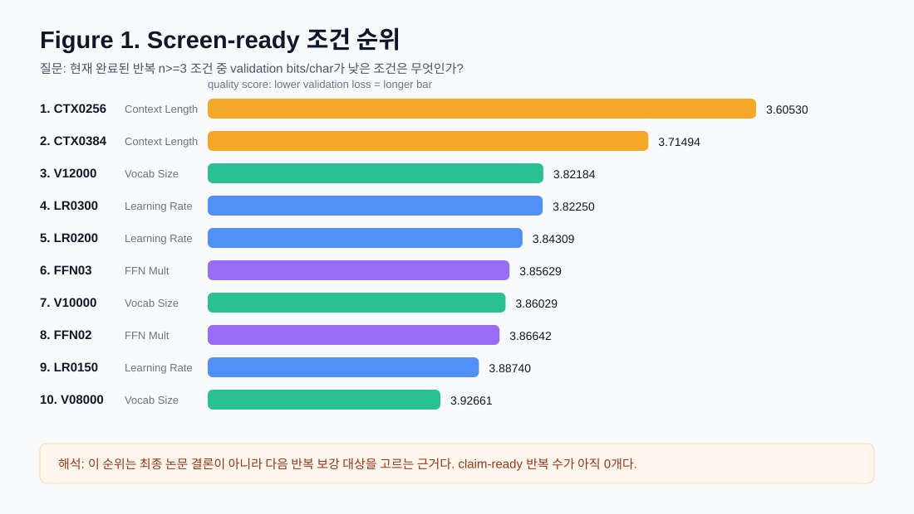
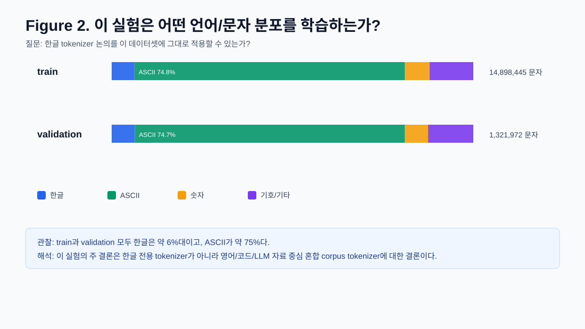
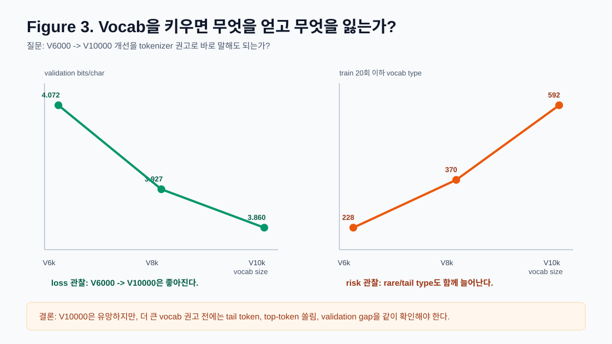
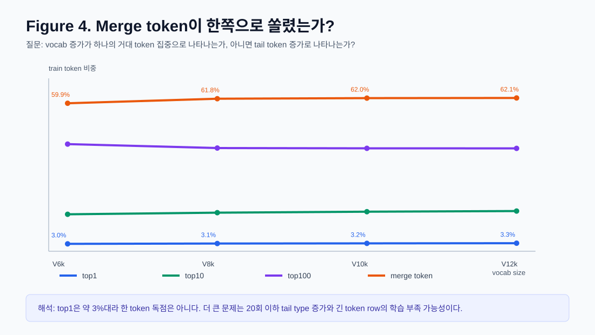

# LLM 10x Screen-Ready 중간 보고서

- generated_at_utc: `2026-06-03T16:07:28+00:00`
- completed_physical_runs: `66` / `354`
- pending_physical_runs: `288`
- screen_ready_conditions: `20`
- claim_ready_conditions: `0`
- result_ledger_status: `PASS`
- all_results_jsonl: `/Users/woonyong/workspace/Krafton-Jungle/SW_AI-W13-gpt/docs/llm_10x/all_run_results.jsonl`

## 범위

이 문서는 중간 선별용 보고서입니다. 실제 실행이 3회 이상 완료된 조건을 screen-ready로 보고 그래프를 만들었습니다. 아직 claim-ready 깊이에 도달한 조건은 없으므로, 아래 결과는 최종 통계 주장용이 아니라 다음 실험 우선순위를 정하기 위한 근거입니다.

현재 최소 2개 이상의 screen-ready 조건이 있어 축 방향성을 볼 수 있는 항목은 다음과 같습니다.
- Learning Rate: `12` screen-ready conditions
- Vocab Size: `4` screen-ready conditions
- Context Length: `2` screen-ready conditions
- FFN Mult: `2` screen-ready conditions

## 기준 데이터셋과 규모

이 보고서는 `obsidian_llm_10x`를 기준으로 합니다. 하나의 LM 학습 데이터셋이지만, 원천은 `6`개 source 묶음에서 온 `1,601`개 문서와 `4,828`개 chunk입니다. `NSMC`는 이 screen-ready 실험의 학습 기준이 아니라, 별도 한글 stress test 후보로만 봐야 합니다.
- LM 파일 문자 수는 기존 NSMC 파일 대비 약 `10.81배`입니다.

| split | 파일 | 문자 | 공백 제외 문자 | 공백 기준 단어 | 고유 공백 단어 | word-like 단위 | 고유 word-like | 한글/공백제외 | ASCII/공백제외 |
| --- | --- | ---: | ---: | ---: | ---: | ---: | ---: | ---: | ---: |
| train | `data/obsidian_llm_10x_lm_train.txt` | 14,898,445 | 13,191,881 | 1,194,327 | 157,834 | 1,558,469 | 205,777 | 6.28% | 74.80% |
| val | `data/obsidian_llm_10x_lm_val.txt` | 1,321,972 | 1,162,752 | 110,512 | 30,203 | 141,204 | 28,540 | 6.36% | 74.69% |

## 발표/논문용 Figure 요약

아래 figure들은 원시 dashboard가 아니라 발표 본문에 바로 쓸 수 있도록 `질문 -> 읽는 법 -> 핵심 해석` 순서로 구성했습니다.

### Figure 0. 결론 지도

- 질문: 지금 이 실험에서 말할 수 있는 주장과 보류해야 하는 주장은 무엇인가?
- 읽는 법: 왼쪽은 데이터셋 규모, 오른쪽은 현재 결론의 강도와 제한이다.
- 핵심: 이 보고서는 최종 통계 결론이 아니라 screen-ready 중간 의사결정 문서다.

### Figure 1. Screen-ready 조건 순위

- 질문: 완료된 조건 중 validation bits/char가 가장 낮은 후보는 무엇인가?
- 읽는 법: 막대가 길수록 validation bits/char가 낮다. 낮을수록 좋다.
- 핵심: CTX0256, LR0300, FFN03, V10000이 현재 상위 후보지만 claim-ready 반복 수에는 아직 도달하지 않았다.

### Figure 2. 데이터셋 문자 구성

- 질문: 이 실험을 한글 중심 tokenizer 실험으로 해석해도 되는가?
- 읽는 법: train/validation의 공백 제외 문자 구성을 비교한다.
- 핵심: 한글은 약 6%대이고 ASCII가 약 75%이므로, 한글 전용 결론이 아니라 혼합 corpus 결론이다.

### Figure 3. Vocab 압축 이득과 tail 비용

- 질문: V6000 -> V10000 개선을 큰 vocab 권고로 바로 말해도 되는가?
- 읽는 법: 왼쪽은 validation bits/char, 오른쪽은 train 20회 이하 vocab type이다.
- 핵심: loss는 개선되지만 rare/tail type도 증가한다. 따라서 V10000은 유망 후보이지 최종 권고가 아니다.

### Figure 4. Token 쏠림과 분포

- 질문: vocab 증가 문제가 한 token 독점인지, tail token 증가인지 어떻게 구분하는가?
- 읽는 법: top1/top10/top100/merge token 비중을 vocab별로 본다.
- 핵심: top1 독점보다는 tail token과 긴 merge token의 학습 부족 가능성이 더 중요한 위험이다.

## 현재 상위 Screen-Ready 조건

| 순위 | 조건 | 축 그룹 | 축 | 값 | n | 검증 bits/char 중앙값 | IQR | 중앙 실행 시간(분) | 중앙 warm tok/s |
| ---: | --- | --- | --- | ---: | ---: | ---: | ---: | ---: | ---: |
| 1 | CTX0256 | Context Length | context_length | 256 | 3 | 3.60530 | 0.02262 | 4.81 | 2298 |
| 2 | CTX0384 | Context Length | context_length | 384 | 3 | 3.71494 | 0.03440 | 5.12 | 2159 |
| 3 | V12000 | Vocab Size | vocab_size | 12000 | 3 | 3.82184 | 0.06769 | 6.79 | 1628 |
| 4 | LR0300 | Learning Rate | learning_rate | 0.0003 | 3 | 3.82250 | 0.06671 | 4.76 | 2323 |
| 5 | LR0200 | Learning Rate | learning_rate | 0.0002 | 3 | 3.84309 | 0.05119 | 5.40 | 2048 |
| 6 | FFN03 | FFN Mult | ffn_mult | 3 | 3 | 3.85629 | 0.02897 | 3.72 | 2976 |
| 7 | V10000 | Vocab Size | vocab_size | 10000 | 3 | 3.86029 | 0.03921 | 5.98 | 1885 |
| 8 | FFN02 | FFN Mult | ffn_mult | 2 | 3 | 3.86642 | 0.08625 | 3.81 | 2899 |
| 9 | LR0150 | Learning Rate | learning_rate | 0.00015 | 3 | 3.88740 | 0.05822 | 6.15 | 1800 |
| 10 | V08000 | Vocab Size | vocab_size | 8000 | 3 | 3.92661 | 0.05091 | 4.76 | 2431 |
| 11 | LR0500 | Learning Rate | learning_rate | 0.0005 | 3 | 3.93704 | 0.05462 | 5.46 | 2025 |
| 12 | LR0100 | Learning Rate | learning_rate | 0.0001 | 3 | 3.97997 | 0.04899 | 5.47 | 2023 |
| 13 | LR0700 | Learning Rate | learning_rate | 0.0007 | 3 | 3.99320 | 0.07960 | 4.75 | 2328 |
| 14 | LR1500 | Learning Rate | learning_rate | 0.0015 | 3 | 4.03809 | 0.11272 | 6.10 | 1812 |
| 15 | LR1000 | Learning Rate | learning_rate | 0.001 | 3 | 4.04166 | 0.12894 | 4.82 | 2293 |

## 축별 보고

### Learning Rate

- 현재 최상위 screen-ready 조건: `LR0300` (learning_rate=0.0003), 검증 bits/char 중앙값 `3.82250`.
- 현재 커버 범위: `5e-05`부터 `0.003`까지, screen-ready 조건 `12`개.
- 해석: learning rate는 현재 `2e-4`부터 `3e-4` 구간이 우선 후보입니다. 다만 다른 축과 상호작용할 수 있으므로 최종값은 상위 후보 재반복에서 확인해야 합니다.

### Vocab Size

- 현재 최상위 screen-ready 조건: `V12000` (vocab_size=12000), 검증 bits/char 중앙값 `3.82184`.
- 현재 커버 범위: `6000`부터 `12000`까지, screen-ready 조건 `4`개.
- 해석: vocab 축은 loss 그래프만 보면 V10000이 좋아 보이지만, tokenizer 진단에서는 tail type 증가가 동시에 나타납니다. 본문 Figure 3과 Figure 4를 기준으로 읽어야 합니다.

### Context Length

- 현재 최상위 screen-ready 조건: `CTX0256` (context_length=256), 검증 bits/char 중앙값 `3.60530`.
- 현재 커버 범위: `256`부터 `384`까지, screen-ready 조건 `2`개.
- 해석: 현재 `0.1 epoch` 짧은 예산에서는 짧은 context가 유리합니다. 이는 긴 context가 본질적으로 나쁘다는 뜻이 아니라, 제한된 step에서 학습 밀도가 더 높다는 신호일 수 있습니다.

### FFN Mult

- 현재 최상위 screen-ready 조건: `FFN03` (ffn_mult=3), 검증 bits/char 중앙값 `3.85629`.
- 현재 커버 범위: `2`부터 `3`까지, screen-ready 조건 `2`개.
- 해석: `ffn_mult=3`은 효율 후보입니다. 하지만 `ffn_mult=4` 기본값과 더 큰 조건의 screen-ready 반복이 필요합니다.

## Vocab Size Tokenizer 진단

아래 표는 screen-ready vocab 조건과 주변 cache를 직접 읽은 것입니다. 현재 3회 이상 학습 결과가 있는 vocab 조건은 `6000, 8000, 10000, 12000`입니다. 따라서 loss 그래프만으로 tokenizer 권고를 확정하지 않고, 실제 token 사용 분포를 함께 봅니다.

| vocab | merge rule | train token | val token | train 문자/token | val 문자/token | train 사용 type | train 미사용 type | train 20회 이하 type | merge 20회 이하 type | merge token 비중 | top1 | top10 | top100 | 한글 vocab type | 한글 token 비중 | merge 길이 p95/max |
| ---: | ---: | ---: | ---: | ---: | ---: | ---: | ---: | ---: | ---: | ---: | ---: | ---: | ---: | ---: | ---: | --- |
| 4,000 | 3,740 | 7,822,591 | 684,512 | 1.905 | 1.931 | 3,905 | 95 | 148 | 60 | 55.55% | 2.77% | 13.97% | 46.99% | 580 | 7.03% | 6.0 / 32 |
| 6,000 | 5,740 | 7,252,032 | 633,917 | 2.054 | 2.085 | 5,884 | 116 | 228 | 139 | 59.92% | 2.99% | 14.97% | 43.38% | 963 | 7.31% | 7.0 / 64 |
| 8,000 | 7,740 | 6,936,122 | 606,369 | 2.148 | 2.180 | 7,859 | 141 | 370 | 281 | 61.76% | 3.12% | 15.62% | 41.77% | 1,387 | 7.19% | 8.0 / 64 |
| 10,000 | 9,740 | 6,752,961 | 589,219 | 2.206 | 2.244 | 9,817 | 183 | 592 | 503 | 61.98% | 3.20% | 16.01% | 41.67% | 1,908 | 7.02% | 8.0 / 128 |
| 12,000 | 11,740 | 6,633,675 | 577,924 | 2.246 | 2.287 | 11,722 | 278 | 1,010 | 920 | 62.07% | 3.26% | 16.28% | 41.66% | 2,349 | 6.94% | 8.0 / 128 |

- 압축 이득: `V6000 -> V10000`에서 train token은 `7,252,032`개에서 `6,752,961`개로 줄어 약 `6.88%` 감소합니다. val 문자/token도 `2.085`에서 `2.244`로 늘어납니다.
- tail 비용: 같은 구간에서 train 미사용 vocab type은 `116`개에서 `183`개로, train 20회 이하 vocab type은 `228`개에서 `592`개로 늘어납니다. 이는 embedding/LM head row 일부가 충분히 update되지 않을 수 있다는 신호입니다.
- 쏠림 판단: top1 비중은 `2.99%`에서 `3.20%`, top10 비중은 `14.97%`에서 `16.01%`로 조금 늘지만, top100 비중은 `43.38%`에서 `41.67%`입니다. 현재 수치만 보면 한 token이 전체를 독점한다기보다, 개행/경로 문자/숫자/구두점 같은 구조 token이 상위권을 차지합니다.

### Top Token 예시: V10000

| rank | id | token | train 등장 | train 비중 |
| ---: | ---: | --- | ---: | ---: |
| 1 | 202 | `\n` | 216,374 | 3.20% |
| 2 | 66 | `_` | 175,978 | 2.61% |
| 3 | 18 | `/` | 153,444 | 2.27% |
| 4 | 23 | `4` | 94,175 | 1.39% |
| 5 | 17 | `.` | 93,245 | 1.38% |
| 6 | 27 | `8` | 74,413 | 1.10% |
| 7 | 14 | `+` | 72,795 | 1.08% |
| 8 | 15 | `,` | 70,216 | 1.04% |
| 9 | 16 | `-` | 66,567 | 0.99% |
| 10 | 19 | `0` | 64,046 | 0.95% |

### 한글 Token 예시

| rank | id | token | train 등장 | train 비중 |
| ---: | ---: | --- | ---: | ---: |
| 1 | 357 | `를` | 8,965 | 0.13% |
| 2 | 353 | `가` | 8,670 | 0.13% |
| 3 | 316 | `는` | 8,198 | 0.12% |
| 4 | 390 | `의` | 7,801 | 0.12% |
| 5 | 314 | `이` | 7,744 | 0.11% |
| 6 | 411 | `을` | 6,835 | 0.10% |
| 7 | 337 | `로` | 6,296 | 0.09% |
| 8 | 430 | `은` | 5,312 | 0.08% |
| 9 | 344 | `에` | 5,306 | 0.08% |
| 10 | 469 | `에서` | 4,868 | 0.07% |

한글 token 비중은 약 7%대로, train corpus의 한글/공백제외 문자 비중과 비슷합니다. 즉 이 실험은 한글 중심 실험이 아니라 영어/코드/LLM 자료 중심의 혼합 corpus 실험입니다. 한글 인식 BPE 권고는 이 표에 더해 한글 전용 validation 또는 Obsidian 한글 subset 결과를 별도로 붙여야 합니다.

## 중간 해석

- Learning rate: 현재 screen-ready 기준 sweet spot은 `2e-4`부터 `3e-4` 근처이며, 지금까지는 `3e-4`가 가장 좋습니다.
- Context length: 현재 `0.1 epoch` 예산에서는 짧은 context가 앞서며, 특히 `CTX0256`이 강합니다. 다만 이는 예산 민감 신호로 봐야 하고, 긴 context 자체가 나쁘다는 최종 결론은 아닙니다.
- Vocab size: `6000 -> 8000 -> 10000`은 검증 bits/char만 보면 개선되지만, 동시에 미사용 type과 20회 이하 tail type도 증가합니다. 따라서 현재 결론은 `V10000 유망`이지 `큰 vocab일수록 좋음`이 아닙니다.
- FFN multiplier: `ffn_mult=3`이 `2`보다 약간 앞서며 효율 후보로 좋습니다. 다만 기본값과 더 큰 FFN 조건은 아직 실행이 필요합니다.

## 다음 의사결정

큐는 백그라운드에서 계속 실행하면 됩니다. 더 빠른 실행 가능한 결론이 목표라면, 모든 탐색 조건 완료를 기다리기보다 현재 상위 후보를 n=10으로 보강하는 쪽이 좋습니다.
