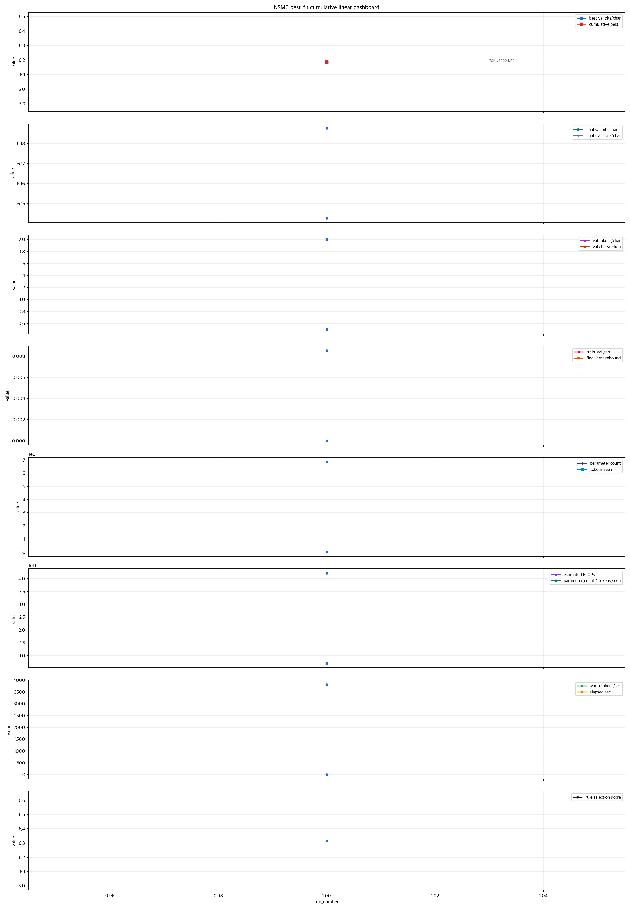
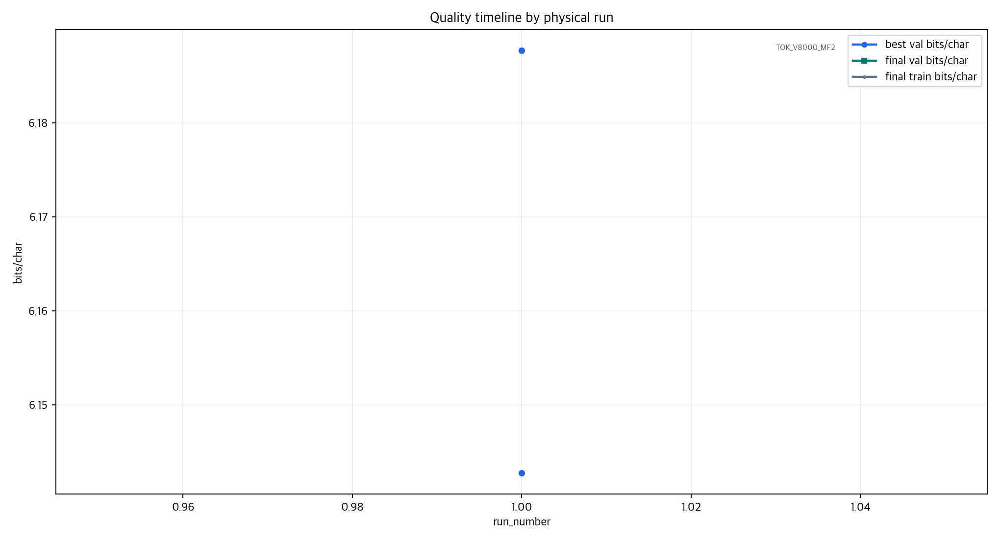
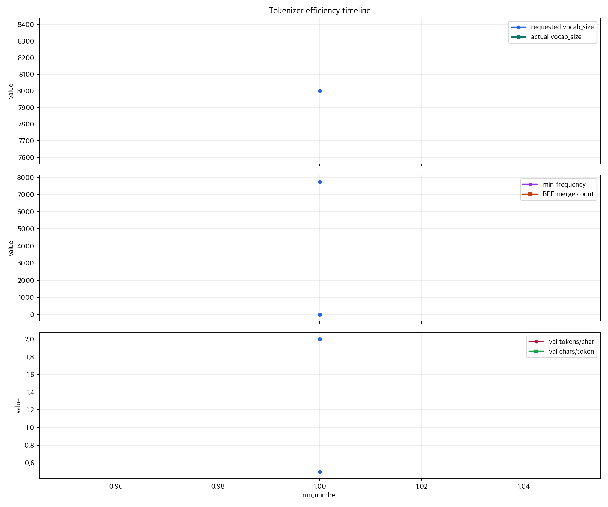
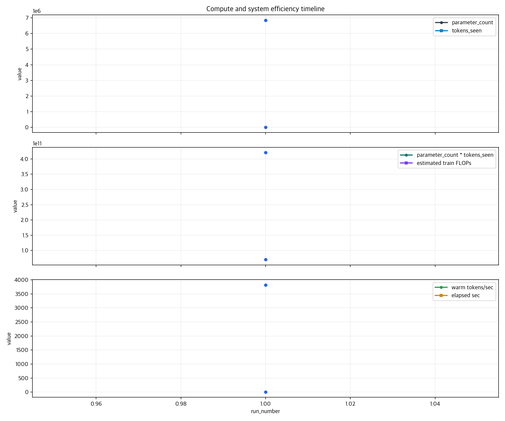
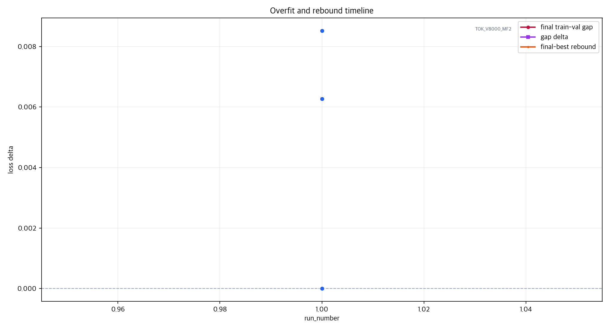
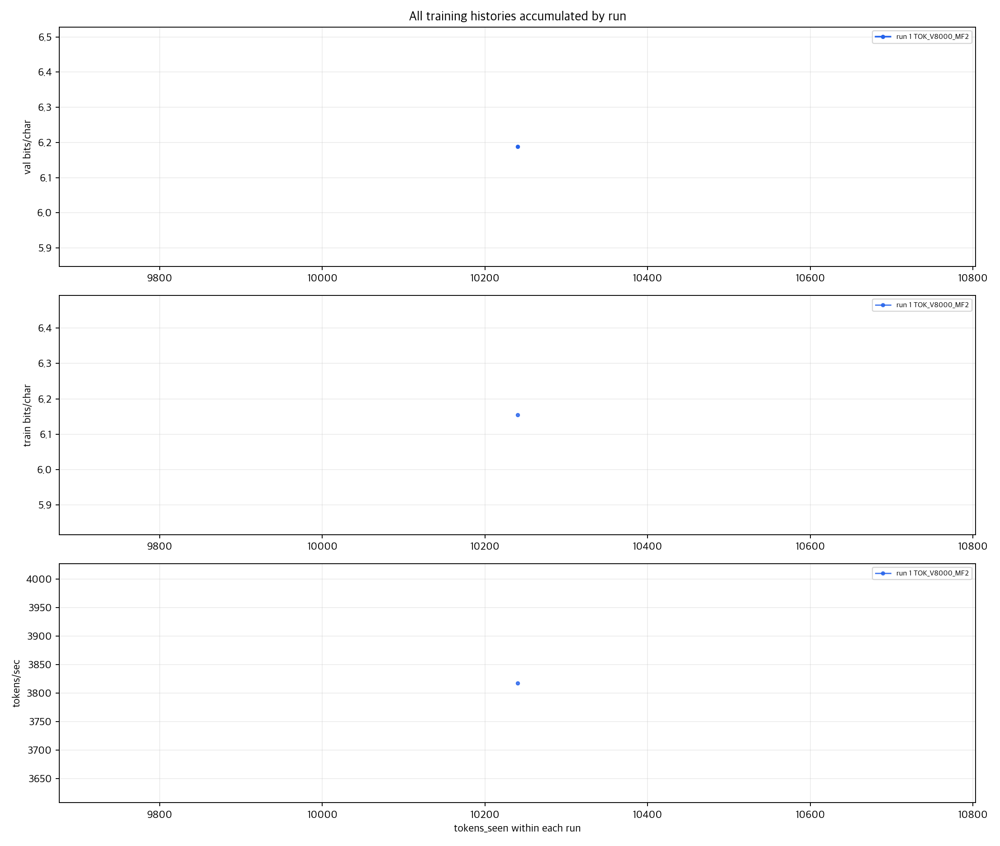
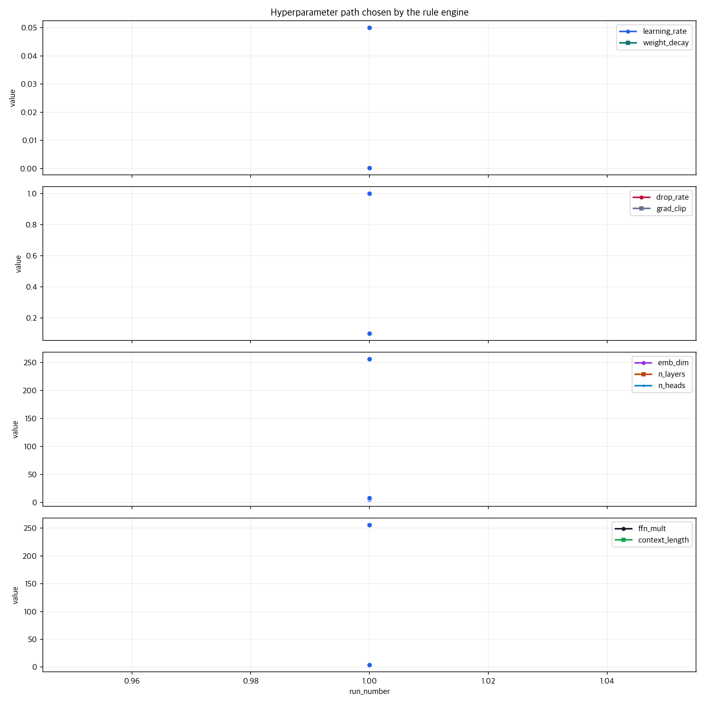

# NSMC Best-Fit Linear Graph Index

이 폴더는 `docs/nsmc_bestfit/all_run_results.jsonl`에 누적된 모든 완료 실행을 `run_number` 순서의 선형 그래프로 다시 그린다.

- completed runs: `1`
- latest run: `1`
- primary view: `00_all_metrics_linear_dashboard.png`

## 00_all_metrics_linear_dashboard

## 01_quality_timeline

## 02_tokenizer_timeline

## 03_compute_timeline

## 04_generalization_timeline

## 05_training_histories

## 06_hyperparameter_path

