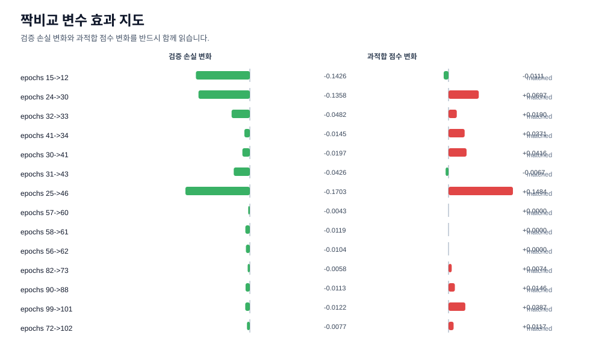
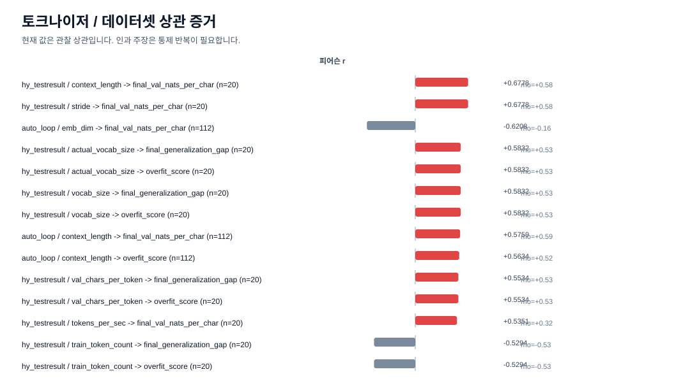

# mini GPT 학습 대시보드

자동화가 갱신하는 시각 지표 모음입니다.

## 해석 원칙

- loss만 있는 결과는 결론으로 쓰지 않는다.
- 모든 채택 판단은 train/validation loss, generalization gap, overfit_score 그래프를 함께 본다.
- vocab/BPE/tokenizer가 달라진 비교는 token-level loss 대신 `nats_per_char`와 `bits_per_char`를 같이 본다.
- 한 번에 여러 변수가 바뀐 run은 후보 발견용이고, 인과 해석은 matched-pair 비교에서만 한다.

## 현재 요약

- 최신 run: `112` / 학습 상태=`generalizing` / 위험도=`low`
- 최신 epochs: `2.692308` / 실제 업데이트 수=`105.0` / epoch당 step=`39.0`
- 최신 검증 손실(`final_val_loss`): `5.525625`
- 최신 일반화 gap: `0.014458`
- 최신 과적합 점수(`overfit_score`): `0.057627`
- 현재 best 후보: run `102` / 선택 점수=`5.537431` / 검증 손실=`5.534507`

## 전체 추세

## 최신 run 상세

## 변수 효과 지도

## 상관 증거

## 최근 10회

| run | 학습 상태 | 위험도 | epochs | step 수 | 학습 손실 | 검증 손실 | gap | 과적합 |
| --- | --- | --- | --- | --- | --- | --- | --- | --- |
| 103 | generalizing | low | 2.564103 | 100.0 | 5.52003 | 5.528694 | 0.008664 | 0.040245 |
| 104 | overfit_risk | high | 2.564103 | 100.0 | 5.482966 | 5.533458 | 0.050492 | 0.216414 |
| 105 | generalizing | low | 2.12766 | 100.0 | 5.531899 | 5.547993 | 0.016093 | 0.016093 |
| 106 | generalizing | medium | 2.12766 | 100.0 | 5.526402 | 5.539271 | 0.012869 | 0.09433 |
| 107 | overfit_risk | high | 2.435897 | 95.0 | 5.493781 | 5.537663 | 0.043881 | 0.196583 |
| 108 | generalizing | low | 2.564103 | 100.0 | 5.532469 | 5.536325 | 0.003856 | 0.022365 |
| 109 | generalizing | low | 2.692308 | 105.0 | 5.520353 | 5.533208 | 0.012854 | 0.04936 |
| 110 | generalizing | low | 2.692308 | 105.0 | 5.523157 | 5.533954 | 0.010798 | 0.045152 |
| 111 | generalizing | low | 2.692308 | 106.0 | 5.509305 | 5.525291 | 0.015986 | 0.062211 |
| 112 | generalizing | low | 2.692308 | 105.0 | 5.511166 | 5.525625 | 0.014458 | 0.057627 |

## 파일

- `metrics_summary.csv`: 시각화와 해석을 위한 정규화된 지표
- `visuals/loss_overfit_trends.svg`: 전체 loss/gap/overfit 추세
- `visuals/latest_run_metrics.svg`: 최신 run의 loss와 과적합 신호
- `visuals/effect_map_pairs.svg`: 짝비교 기준 변수 효과 지도
- `visuals/correlation_evidence.svg`: tokenizer/dataset/model/training 축의 관찰 상관 그래프
- `effect_map.md`: 변수별 loss/과적합 trade-off 해석
- `tokenizer_profile.md`: BPE/vocab/dataset tokenization 해석
- `correlation_report.md`: BPE, dataset, model, training 축의 상관 증거와 통제 실험 설계
- `research_questions.md`: 다음 실험을 이해 가능한 질문으로 정리
