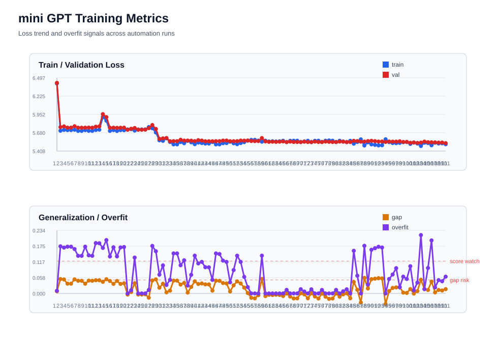
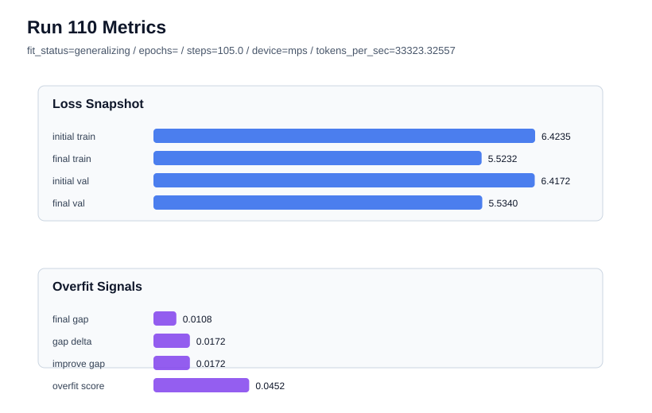

# mini GPT 학습 대시보드

자동화가 갱신하는 시각 지표 모음입니다.

## 현재 요약

- 최신 run: `111` / status=`generalizing` / risk=`low`
- 최신 epochs: `2.692308` / effective steps=`106.0` / steps_per_epoch=`39.0`
- 최신 final_val_loss: `5.525291`
- 최신 generalization gap: `0.015986`
- 최신 overfit_score: `0.062211`
- 현재 best 후보: run `102` / score=`5.537431` / val=`5.534507`

## 전체 추세

## 최신 run 상세

## 최근 10회

| run | status | risk | epochs | steps | train | val | gap | overfit |
| --- | --- | --- | --- | --- | --- | --- | --- | --- |
| 102 | generalizing | low | 2.564103 | 100.0 | 5.53504 | 5.534507 | -0.000533 | 0.011694 |
| 103 | generalizing | low | 2.564103 | 100.0 | 5.52003 | 5.528694 | 0.008664 | 0.040245 |
| 104 | overfit_risk | high | 2.564103 | 100.0 | 5.482966 | 5.533458 | 0.050492 | 0.216414 |
| 105 | generalizing | low | 2.12766 | 100.0 | 5.531899 | 5.547993 | 0.016093 | 0.016093 |
| 106 | generalizing | medium | 2.12766 | 100.0 | 5.526402 | 5.539271 | 0.012869 | 0.09433 |
| 107 | overfit_risk | high | 2.435897 | 95.0 | 5.493781 | 5.537663 | 0.043881 | 0.196583 |
| 108 | generalizing | low | 2.564103 | 100.0 | 5.532469 | 5.536325 | 0.003856 | 0.022365 |
| 109 | generalizing | low | 2.692308 | 105.0 | 5.520353 | 5.533208 | 0.012854 | 0.04936 |
| 110 | generalizing | low | 2.692308 | 105.0 | 5.523157 | 5.533954 | 0.010798 | 0.045152 |
| 111 | generalizing | low | 2.692308 | 106.0 | 5.509305 | 5.525291 | 0.015986 | 0.062211 |

## 파일

- `metrics_summary.csv`: 시각화와 해석을 위한 정규화된 지표
- `visuals/loss_overfit_trends.svg`: 전체 loss/gap/overfit 추세
- `visuals/latest_run_metrics.svg`: 최신 run의 loss와 과적합 신호
