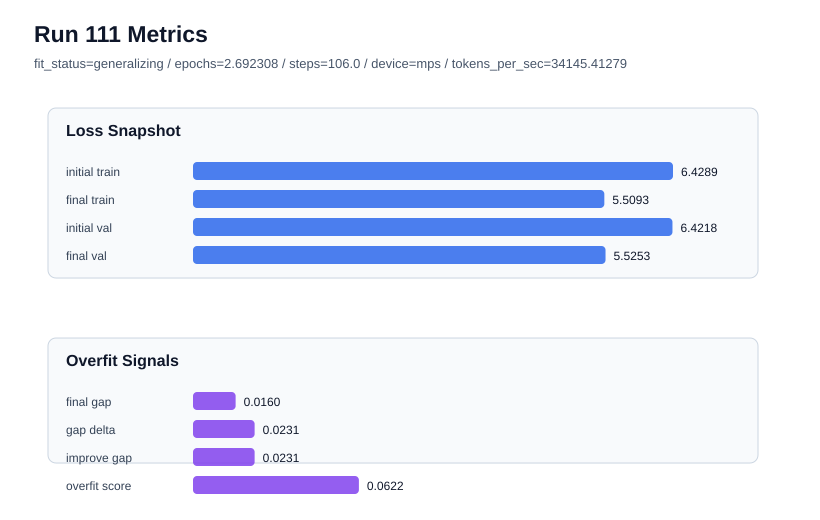

# run 111 실험 보고서

## 이번 가설

For the strong low-risk seed202 mish stride24 candidate, increasing the training horizon from 2.564103 epochs to 2.692308 epochs will test whether the small +0.128205 epoch refinement that helped seed808 and seed151 also transfers without pushing overfit into the medium-risk band.

## 왜 이 가설을 세웠는가

Run103 gave the strongest raw validation among the max_steps100 lineage, which is now represented as 2.564103 epochs on this dataset: final_val_loss=5.528694, final_generalization_gap=0.008664, and overfit_score=0.040245. Runs109 and 110 showed that the 105-update horizon, now 2.692308 epochs, improved seed808 and seed151 while staying generalizing and low-risk. The highest-information follow-up is therefore an epoch-based transfer check on seed202, preserving the same 413184-parameter mish Transformer, stride24 windowing, optimizer, regularization, and hardware-light MPS runtime.

## 가설 작성 주체

llm_plan:docs/train/next_plan.json

## 바꾼 변수

```json
{
  "seed": 202,
  "epochs": 2.692308,
  "effective_max_steps": 105
}
```

## 고정한 변수

vocab_size, context_length, stride, batch_size, learning_rate, weight_decay, grad_clip, emb_dim, n_heads, n_layers, drop_rate, qkv_bias, ffn_mult, norm_first, norm_eps, activation_name, ffn_dropout_position, attention_impl, tie_embeddings, init_std

## 기대 결과

If the 2.692308-epoch horizon is a transferable low-risk refinement, seed202 should improve below or near run103's final_val_loss=5.528694 while keeping final_generalization_gap below 0.02 and overfit_score below 0.08. If validation stalls or overfit_score rises above 0.10, the longer epoch horizon should remain seed-specific rather than replacing the 2.564103-epoch default.

## 실험 설정

```json
{
  "run_id": 111,
  "hypothesis": "For the strong low-risk seed202 mish stride24 candidate, increasing the training horizon from 2.564103 epochs to 2.692308 epochs will test whether the small +0.128205 epoch refinement that helped seed808 and seed151 also transfers without pushing overfit into the medium-risk band.",
  "seed": 202,
  "vocab_size": 600,
  "min_frequency": 2,
  "context_length": 48,
  "stride": 24,
  "batch_size": 8,
  "epochs": 2.692308,
  "max_steps": 105,
  "eval_batches": 4,
  "train_ratio": 0.9,
  "learning_rate": 0.0003,
  "weight_decay": 0.01,
  "grad_clip": 1.0,
  "emb_dim": 128,
  "n_heads": 4,
  "n_layers": 2,
  "drop_rate": 0.12,
  "qkv_bias": false,
  "ffn_mult": 3,
  "norm_first": false,
  "norm_eps": 1e-05,
  "activation_name": "mish",
  "ffn_dropout_position": "none",
  "attention_impl": "sdpa",
  "tie_embeddings": true,
  "init_std": 0.02
}
```

## 학습 길이

| 항목 | 값 |
| --- | --- |
| epochs | 2.692308 |
| steps_per_epoch | 39 |
| effective max_steps | 106 |

## 실행 환경

```json
{
  "timestamp": "2026-06-03T04:35:49+00:00",
  "hostname": "woonyong-MacBookPro.local",
  "platform": "macOS-26.3.1-arm64-arm-64bit-Mach-O",
  "machine": "arm64",
  "python": "3.13.13",
  "torch": "2.12.0",
  "cpu_count": 10,
  "memory_gb": 24.0,
  "cuda_available": false,
  "cuda_device_count": 0,
  "mps_available": true,
  "resolved_device": "mps",
  "profile": "mps_balanced"
}
```

- corpus: `src/learning/the-verdict.txt`
- artifact_dir: `docs/train/runs/run_111_artifacts`

## 실제 결과

| 지표 | 값 |
| --- | --- |
| initial_train_loss | 6.428932785987854 |
| initial_val_loss | 6.421806971232097 |
| final_train_loss | 5.509305000305176 |
| final_val_loss | 5.525291442871094 |
| final_generalization_gap | 0.01598644256591797 |
| generalization_gap_delta | 0.023112257321675322 |
| train_val_improvement_gap | 0.023112257321675322 |
| overfit_score | 0.062210957209268614 |
| fit_status | generalizing |
| epochs | 2.692308 |
| steps_per_epoch | 39 |
| effective max_steps | 106 |
| parameter_count | 413184 |
| tokens_per_sec | 34145.4127903661 |
| elapsed_sec | 1.186455124989152 |
| device | mps |

## 시각 지표




- 대시보드: `../dashboard.md`
- 지표 요약 CSV: `../metrics_summary.csv`

## 과적합 판단

일반화 개선 신호. final gap=0.0160, overfit_score=0.0622. seed 반복으로 재현성을 확인할 만하다.

## 결론

현재 best 후보: run 102 / val=5.534507115681966 / status=generalizing

## 다음 실험 제안

- 성공 시: If seed202 also improves at 2.692308 epochs while staying low-risk, promote mish stride24 at about 2.69 epochs as the candidate for low-risk seeds and validate with one fresh seed.
- 과적합 시: If seed202 overfits or loses validation at 2.692308 epochs, keep 2.564103 epochs as the default and treat the longer horizon as seed-specific to 151 and 808.
